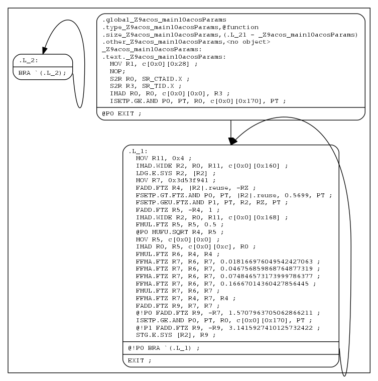
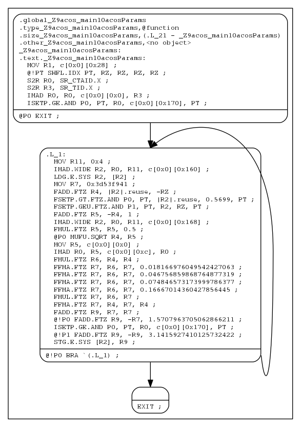

# [3. nvdisasm](https://docs.nvidia.com/cuda/cuda-binary-utilities#nvdisasm)[](https://docs.nvidia.com/cuda/cuda-binary-utilities/#nvdisasm "Permalink to this headline")

`nvdisasm` extracts information from standalone cubin files and presents them in human readable format. The output of `nvdisasm` includes CUDA assembly code for each kernel, listing of ELF data sections and other CUDA specific sections. Output style and options are controlled through `nvdisasm` command-line options. `nvdisasm` also does control flow analysis to annotate jump/branch targets and makes the output easier to read.

> **Note**
>
> `nvdisasm` requires complete relocation information to do control flow analysis. If this information is missing from the CUDA binary, either use the `nvdisasm` option `-ndf` to turn off control flow analysis, or use the `ptxas` and `nvlink` option `-preserve-relocs` to re-generate the cubin file.

For a list of CUDA assembly instruction set of each GPU architecture, see [Instruction Set Reference](https://docs.nvidia.com/cuda/cuda-binary-utilities/#instruction-set-ref).

## [3.1. Usage](https://docs.nvidia.com/cuda/cuda-binary-utilities#nvdisasm-usage)[](https://docs.nvidia.com/cuda/cuda-binary-utilities/#nvdisasm-usage "Permalink to this headline")

`nvdisasm` accepts a single input file each time it’s run. The basic usage is as following:

```text
nvdisasm [options] <input cubin file>
```

Here’s a sample output of `nvdisasm`:

```text
    .elftype        @"ET_EXEC"

//--------------------- .nv.info                  --------------------------
    .section        .nv.info,"",@"SHT_CUDA_INFO"
    .align  4

......

//--------------------- .text._Z9acos_main10acosParams --------------------------
    .section    .text._Z9acos_main10acosParams,"ax",@progbits
    .sectioninfo    @"SHI_REGISTERS=14"
    .align    128
        .global     _Z9acos_main10acosParams
        .type       _Z9acos_main10acosParams,@function
        .size       _Z9acos_main10acosParams,(.L_21 - _Z9acos_main10acosParams)
        .other      _Z9acos_main10acosParams,@"STO_CUDA_ENTRY STV_DEFAULT"
_Z9acos_main10acosParams:
.text._Z9acos_main10acosParams:
        /*0000*/               MOV R1, c[0x0][0x28] ;
        /*0010*/               NOP;
        /*0020*/               S2R R0, SR_CTAID.X ;
        /*0030*/               S2R R3, SR_TID.X ;
        /*0040*/               IMAD R0, R0, c[0x0][0x0], R3 ;
        /*0050*/               ISETP.GE.AND P0, PT, R0, c[0x0][0x170], PT ;
        /*0060*/           @P0 EXIT ;
.L_1:
        /*0070*/               MOV R11, 0x4 ;
        /*0080*/               IMAD.WIDE R2, R0, R11, c[0x0][0x160] ;
        /*0090*/               LDG.E.SYS R2, [R2] ;
        /*00a0*/               MOV R7, 0x3d53f941 ;
        /*00b0*/               FADD.FTZ R4, |R2|.reuse, -RZ ;
        /*00c0*/               FSETP.GT.FTZ.AND P0, PT, |R2|.reuse, 0.5699, PT ;
        /*00d0*/               FSETP.GEU.FTZ.AND P1, PT, R2, RZ, PT ;
        /*00e0*/               FADD.FTZ R5, -R4, 1 ;
        /*00f0*/               IMAD.WIDE R2, R0, R11, c[0x0][0x168] ;
        /*0100*/               FMUL.FTZ R5, R5, 0.5 ;
        /*0110*/           @P0 MUFU.SQRT R4, R5 ;
        /*0120*/               MOV R5, c[0x0][0x0] ;
        /*0130*/               IMAD R0, R5, c[0x0][0xc], R0 ;
        /*0140*/               FMUL.FTZ R6, R4, R4 ;
        /*0150*/               FFMA.FTZ R7, R6, R7, 0.018166976049542427063 ;
        /*0160*/               FFMA.FTZ R7, R6, R7, 0.046756859868764877319 ;
        /*0170*/               FFMA.FTZ R7, R6, R7, 0.074846573173999786377 ;
        /*0180*/               FFMA.FTZ R7, R6, R7, 0.16667014360427856445 ;
        /*0190*/               FMUL.FTZ R7, R6, R7 ;
        /*01a0*/               FFMA.FTZ R7, R4, R7, R4 ;
        /*01b0*/               FADD.FTZ R9, R7, R7 ;
        /*01c0*/          @!P0 FADD.FTZ R9, -R7, 1.5707963705062866211 ;
        /*01d0*/               ISETP.GE.AND P0, PT, R0, c[0x0][0x170], PT ;
        /*01e0*/          @!P1 FADD.FTZ R9, -R9, 3.1415927410125732422 ;
        /*01f0*/               STG.E.SYS [R2], R9 ;
        /*0200*/          @!P0 BRA `(.L_1) ;
        /*0210*/               EXIT ;
.L_2:
        /*0220*/               BRA `(.L_2);
.L_21:
```

To get the control flow graph of a kernel, use the following:

```text
nvdisasm -cfg <input cubin file>
```

`nvdisasm` is capable of generating control flow of CUDA assembly in the format of DOT graph description language. The output of the control flow from nvdisasm can be directly imported to a DOT graph visualization tool such as [Graphviz](http://www.graphviz.org).

Here’s how you can generate a PNG image (`cfg.png`) of the control flow of the above cubin (`a.cubin`) with `nvdisasm` and Graphviz:

```text
nvdisasm -cfg a.cubin | dot -ocfg.png -Tpng
```

Here’s the generated graph:



Control Flow Graph

To generate a PNG image (`bbcfg.png`) of the basic block control flow of the above cubin (`a.cubin`) with `nvdisasm` and Graphviz:

```text
nvdisasm -bbcfg a.cubin | dot -obbcfg.png -Tpng
```

Here’s the generated graph:



Basic Block Control Flow Graph

`nvdisasm` is capable of showing the register (general and predicate) liveness range information. For each line of CUDA assembly, `nvdisasm` displays whether a given device register was assigned, accessed, live or re-assigned. It also shows the total number of registers used. This is useful if the user is interested in the life range of any particular register, or register usage in general.

Here’s a sample output (output is pruned for brevity):

```text
                                                      // +-----------------+------+
                                                      // |      GPR        | PRED |
                                                      // |                 |      |
                                                      // |                 |      |
                                                      // |    000000000011 |      |
                                                      // |  # 012345678901 | # 01 |
                                                      // +-----------------+------+
    .global acos                                      // |                 |      |
    .type   acos,@function                            // |                 |      |
    .size   acos,(.L_21 - acos)                       // |                 |      |
    .other  acos,@"STO_CUDA_ENTRY STV_DEFAULT"        // |                 |      |
acos:                                                 // |                 |      |
.text.acos:                                           // |                 |      |
    MOV R1, c[0x0][0x28] ;                            // |  1  ^           |      |
    NOP;                                              // |  1  ^           |      |
    S2R R0, SR_CTAID.X ;                              // |  2 ^:           |      |
    S2R R3, SR_TID.X ;                                // |  3 :: ^         |      |
    IMAD R0, R0, c[0x0][0x0], R3 ;                    // |  3 x: v         |      |
    ISETP.GE.AND P0, PT, R0, c[0x0][0x170], PT ;      // |  2 v:           | 1 ^  |
@P0 EXIT ;                                            // |  2 ::           | 1 v  |
.L_1:                                                 // |  2 ::           |      |
     MOV R11, 0x4 ;                                   // |  3 ::         ^ |      |
     IMAD.WIDE R2, R0, R11, c[0x0][0x160] ;           // |  5 v:^^       v |      |
     LDG.E.SYS R2, [R2] ;                             // |  4 ::^        : |      |
     MOV R7, 0x3d53f941 ;                             // |  5 :::    ^   : |      |
     FADD.FTZ R4, |R2|.reuse, -RZ ;                   // |  6 ::v ^  :   : |      |
     FSETP.GT.FTZ.AND P0, PT, |R2|.reuse, 0.5699, PT; // |  6 ::v :  :   : | 1 ^  |
     FSETP.GEU.FTZ.AND P1, PT, R2, RZ, PT ;           // |  6 ::v :  :   : | 2 :^ |
     FADD.FTZ R5, -R4, 1 ;                            // |  6 ::  v^ :   : | 2 :: |
     IMAD.WIDE R2, R0, R11, c[0x0][0x168] ;           // |  8 v:^^:: :   v | 2 :: |
     FMUL.FTZ R5, R5, 0.5 ;                           // |  5 ::  :x :     | 2 :: |
 @P0 MUFU.SQRT R4, R5 ;                               // |  5 ::  ^v :     | 2 v: |
     MOV R5, c[0x0][0x0] ;                            // |  5 ::  :^ :     | 2 :: |
     IMAD R0, R5, c[0x0][0xc], R0 ;                   // |  5 x:  :v :     | 2 :: |
     FMUL.FTZ R6, R4, R4 ;                            // |  5 ::  v ^:     | 2 :: |
     FFMA.FTZ R7, R6, R7, 0.018166976049542427063 ;   // |  5 ::  : vx     | 2 :: |
     FFMA.FTZ R7, R6, R7, 0.046756859868764877319 ;   // |  5 ::  : vx     | 2 :: |
     FFMA.FTZ R7, R6, R7, 0.074846573173999786377 ;   // |  5 ::  : vx     | 2 :: |
     FFMA.FTZ R7, R6, R7, 0.16667014360427856445 ;    // |  5 ::  : vx     | 2 :: |
     FMUL.FTZ R7, R6, R7 ;                            // |  5 ::  : vx     | 2 :: |
     FFMA.FTZ R7, R4, R7, R4 ;                        // |  4 ::  v  x     | 2 :: |
     FADD.FTZ R9, R7, R7 ;                            // |  4 ::     v ^   | 2 :: |
@!P0 FADD.FTZ R9, -R7, 1.5707963705062866211 ;        // |  4 ::     v ^   | 2 v: |
     ISETP.GE.AND P0, PT, R0, c[0x0][0x170], PT ;     // |  3 v:       :   | 2 ^: |
@!P1 FADD.FTZ R9, -R9, 3.1415927410125732422 ;        // |  3 ::       x   | 2 :v |
     STG.E.SYS [R2], R9 ;                             // |  3 ::       v   | 1 :  |
@!P0 BRA `(.L_1) ;                                    // |  2 ::           | 1 v  |
     EXIT ;                                           // |  1  :           |      |
.L_2:                                                 // +.................+......+
     BRA `(.L_2);                                     // |                 |      |
.L_21:                                                // +-----------------+------+
                                                      // Legend:
                                                      //     ^       : Register assignment
                                                      //     v       : Register usage
                                                      //     x       : Register usage and reassignment
                                                      //     :       : Register in use
                                                      //     <space> : Register not in use
                                                      //     #       : Number of occupied registers
```

`nvdisasm` is capable of showing line number information of the CUDA source file which can be useful for debugging.

To get the line-info of a kernel, use the following:

```text
nvdisasm -g <input cubin file>
```

Here’s a sample output of a kernel using `nvdisasm -g` command:

```text
//--------------------- .text._Z6kernali          --------------------------
        .section        .text._Z6kernali,"ax",@progbits
        .sectioninfo    @"SHI_REGISTERS=24"
        .align  128
        .global         _Z6kernali
        .type           _Z6kernali,@function
        .size           _Z6kernali,(.L_4 - _Z6kernali)
        .other          _Z6kernali,@"STO_CUDA_ENTRY STV_DEFAULT"
_Z6kernali:
.text._Z6kernali:
        /*0000*/                   MOV R1, c[0x0][0x28] ;
        /*0010*/                   NOP;
    //## File "/home/user/cuda/sample/sample.cu", line 25
        /*0020*/                   MOV R0, 0x160 ;
        /*0030*/                   LDC R0, c[0x0][R0] ;
        /*0040*/                   MOV R0, R0 ;
        /*0050*/                   MOV R2, R0 ;
    //## File "/home/user/cuda/sample/sample.cu", line 26
        /*0060*/                   MOV R4, R2 ;
        /*0070*/                   MOV R20, 32@lo((_Z6kernali + .L_1@srel)) ;
        /*0080*/                   MOV R21, 32@hi((_Z6kernali + .L_1@srel)) ;
        /*0090*/                   CALL.ABS.NOINC `(_Z3fooi) ;
.L_1:
        /*00a0*/                   MOV R0, R4 ;
        /*00b0*/                   MOV R4, R2 ;
        /*00c0*/                   MOV R2, R0 ;
        /*00d0*/                   MOV R20, 32@lo((_Z6kernali + .L_2@srel)) ;
        /*00e0*/                   MOV R21, 32@hi((_Z6kernali + .L_2@srel)) ;
        /*00f0*/                   CALL.ABS.NOINC `(_Z3bari) ;
.L_2:
        /*0100*/                   MOV R4, R4 ;
        /*0110*/                   IADD3 R4, R2, R4, RZ ;
        /*0120*/                   MOV R2, 32@lo(arr) ;
        /*0130*/                   MOV R3, 32@hi(arr) ;
        /*0140*/                   MOV R2, R2 ;
        /*0150*/                   MOV R3, R3 ;
        /*0160*/                   ST.E.SYS [R2], R4 ;
    //## File "/home/user/cuda/sample/sample.cu", line 27
        /*0170*/                   ERRBAR ;
        /*0180*/                   EXIT ;
.L_3:
        /*0190*/                   BRA `(.L_3);
.L_4:
```

`nvdisasm` is capable of showing line number information with additional function inlining info (if any). In absence of any function inlining the output is same as the one with `nvdisasm -g` command.

Here’s a sample output of a kernel using `nvdisasm -gi` command:

```text
//--------------------- .text._Z6kernali          --------------------------
    .section    .text._Z6kernali,"ax",@progbits
    .sectioninfo    @"SHI_REGISTERS=16"
    .align    128
        .global         _Z6kernali
        .type           _Z6kernali,@function
        .size           _Z6kernali,(.L_18 - _Z6kernali)
        .other          _Z6kernali,@"STO_CUDA_ENTRY STV_DEFAULT"
_Z6kernali:
.text._Z6kernali:
        /*0000*/                   IMAD.MOV.U32 R1, RZ, RZ, c[0x0][0x28] ;
    //## File "/home/user/cuda/inline.cu", line 17 inlined at "/home/user/cuda/inline.cu", line 23
    //## File "/home/user/cuda/inline.cu", line 23
        /*0010*/                   UMOV UR4, 32@lo(arr) ;
        /*0020*/                   UMOV UR5, 32@hi(arr) ;
        /*0030*/                   IMAD.U32 R2, RZ, RZ, UR4 ;
        /*0040*/                   MOV R3, UR5 ;
        /*0050*/                   ULDC.64 UR4, c[0x0][0x118] ;
    //## File "/home/user/cuda/inline.cu", line 10 inlined at "/home/user/cuda/inline.cu", line 17
    //## File "/home/user/cuda/inline.cu", line 17 inlined at "/home/user/cuda/inline.cu", line 23
    //## File "/home/user/cuda/inline.cu", line 23
        /*0060*/                   LDG.E R4, [R2.64] ;
        /*0070*/                   LDG.E R5, [R2.64+0x4] ;
    //## File "/home/user/cuda/inline.cu", line 17 inlined at "/home/user/cuda/inline.cu", line 23
    //## File "/home/user/cuda/inline.cu", line 23
        /*0080*/                   LDG.E R0, [R2.64+0x8] ;
    //## File "/home/user/cuda/inline.cu", line 23
        /*0090*/                   UMOV UR6, 32@lo(ans) ;
        /*00a0*/                   UMOV UR7, 32@hi(ans) ;
    //## File "/home/user/cuda/inline.cu", line 10 inlined at "/home/user/cuda/inline.cu", line 17
    //## File "/home/user/cuda/inline.cu", line 17 inlined at "/home/user/cuda/inline.cu", line 23
    //## File "/home/user/cuda/inline.cu", line 23
        /*00b0*/                   IADD3 R7, R4, c[0x0][0x160], RZ ;
    //## File "/home/user/cuda/inline.cu", line 23
        /*00c0*/                   IMAD.U32 R4, RZ, RZ, UR6 ;
    //## File "/home/user/cuda/inline.cu", line 10 inlined at "/home/user/cuda/inline.cu", line 17
    //## File "/home/user/cuda/inline.cu", line 17 inlined at "/home/user/cuda/inline.cu", line 23
    //## File "/home/user/cuda/inline.cu", line 23
        /*00d0*/                   IADD3 R9, R5, c[0x0][0x160], RZ ;
    //## File "/home/user/cuda/inline.cu", line 23
        /*00e0*/                   MOV R5, UR7 ;
    //## File "/home/user/cuda/inline.cu", line 10 inlined at "/home/user/cuda/inline.cu", line 17
    //## File "/home/user/cuda/inline.cu", line 17 inlined at "/home/user/cuda/inline.cu", line 23
    //## File "/home/user/cuda/inline.cu", line 23
        /*00f0*/                   IADD3 R11, R0.reuse, c[0x0][0x160], RZ ;
    //## File "/home/user/cuda/inline.cu", line 17 inlined at "/home/user/cuda/inline.cu", line 23
    //## File "/home/user/cuda/inline.cu", line 23
        /*0100*/                   IMAD.IADD R13, R0, 0x1, R7 ;
    //## File "/home/user/cuda/inline.cu", line 10 inlined at "/home/user/cuda/inline.cu", line 17
    //## File "/home/user/cuda/inline.cu", line 17 inlined at "/home/user/cuda/inline.cu", line 23
    //## File "/home/user/cuda/inline.cu", line 23
        /*0110*/                   STG.E [R2.64+0x4], R9 ;
        /*0120*/                   STG.E [R2.64], R7 ;
        /*0130*/                   STG.E [R2.64+0x8], R11 ;
    //## File "/home/user/cuda/inline.cu", line 23
        /*0140*/                   STG.E [R4.64], R13 ;
    //## File "/home/user/cuda/inline.cu", line 24
        /*0150*/                   EXIT ;
.L_3:
        /*0160*/                   BRA (.L_3);
.L_18:
```

`nvdisasm` can generate disassembly in JSON format.

For details on the JSON format, see [Appendix](https://docs.nvidia.com/cuda/cuda-binary-utilities/#appendix).

To get disassembly in JSON format, use the following:

```text
nvdisasm -json <input cubin file>
```

The output from `nvdisasm -json` will be in minified format. The sample below is after beautifying it:

```text
[
    {
        "ELF": {
            "layout-id": 4,
            "ei_osabi": 51,
            "ei_abiversion": 7
        },
        "SM": {
            "version": {
                "major": 9,
                "minor": 0
            }
        },
        "SchemaVersion": {
            "major": 12,
            "minor": 8,
            "revision": 0
        },
        "Producer": "nvdisasm V12.8.14 Build r570_00.r12.8/compiler.35033008_0",
        "Description": ""
    },
    [
        {
            "function-name": "foo",
            "start": 0,
            "length": 96,
            "other-attributes": [],
            "sass-instructions": [
                {
                    "opcode": "LDC",
                    "operands": "R1,c[0x0][0x28]"
                },
                {
                    "opcode": "MOV",
                    "operands": "R6,0x60"
                },
                {
                    "opcode": "ISETP.NE.U32.AND",
                    "operands": "P0,PT,R1,0x1,PT"
                },
                {
                    "opcode": "CALL.REL.NOINC",
                    "operands": "`(bar)",
                    "other-attributes": {
                        "control-flow": "True"
                    }
                },
                {
                    "opcode": "MOV",
                    "operands": "R8,R7"
                },
                {
                    "opcode": "EXIT",
                    "other-attributes": {
                        "control-flow": "True"
                    }
                }
            ]
        },
        {
            "function-name": "bar",
            "start": 96,
            "length": 32,
            "other-attributes": [],
            "sass-instructions": [
                {
                    "opcode": "STS.128",
                    "operands": "[UR5+0x400],RZ"
                },
                {
                    "opcode": "RET.REL.NODEC",
                    "operands": "R18,`(foo)",
                    "other-attributes": {
                        "control-flow": "True"
                    }
                }
            ]
        }
    ]
]
```

## [3.2. Command-line Options](https://docs.nvidia.com/cuda/cuda-binary-utilities#id5)[](https://docs.nvidia.com/cuda/cuda-binary-utilities/#id5 "Permalink to this headline")

[Table 3](https://docs.nvidia.com/cuda/cuda-binary-utilities/#nvdisasm-options-table) contains the supported command-line options of `nvdisasm`, along with a description of what each option does. Each option has a long name and a short name, which can be used interchangeably.

| Option (long) | Option (short) | Description |
| --- | --- | --- |
| `--base-address <value>` | `-base` | Specify the logical base address of the image to disassemble. This option is only valid when disassembling a raw instruction binary (see option `--binary`), and is ignored when disassembling an Elf file. Default value: 0. |
| `--binary <SMxy>` | `-b` | When this option is specified, the input file is assumed to contain a raw instruction binary, that is, a sequence of binary instruction encodings as they occur in instruction memory. The value of this option must be the asserted architecture of the raw binary. Allowed values for this option: `SM75`, `SM80`, `SM86`, `SM87`, `SM88`, `SM89`, `SM90`, `SM90a`, `SM100`, `SM100a`, `SM103`, `SM103a`, `SM110`, `SM110a`, `SM120`, `SM120a`, `SM121`, `SM121a`. |
| `--cuda-function-index <symbol index>,...` | `-fun` | Restrict the output to the CUDA functions represented by symbols with the given indices. The CUDA function for a given symbol is the enclosing section. This only restricts executable sections; all other sections will still be printed. |
| `--emit-json` | `-json` | Print disassembly in JSON format. This can be used along with the options `--binary <SMxy>` and `--cuda-function-index <symbol index>,...`. For details on the JSON format, see [Appendix](https://docs.nvidia.com/cuda/cuda-binary-utilities/#appendix). However this is not compatible with options `--print-life-ranges`, `--life-range-mode`, `--output-control-flow-graph` and `--output-control-flow-graph-with-basic-blocks`. |
| `--help` | `-h` | Print this help information on this tool. |
| `--life-range-mode` | `-lrm` | This option implies option `--print-life-ranges`, and determines how register live range info should be printed. `count`: Not at all, leaving only the # column (number of live registers); `wide`: Columns spaced out for readability (default); `narrow`: A one-character column for each register, economizing on table width Allowed values for this option: `count`, `narrow`, `wide`. |
| `--no-dataflow` | `-ndf` | Disable dataflow analyzer after disassembly. Dataflow analysis is normally enabled to perform branch stack analysis and annotate all instructions that jump via the GPU branch stack with inferred branch target labels. However, it may occasionally fail when certain restrictions on the input nvelf/cubin are not met. |
| `--no-vliw` | `-novliw` | Conventional mode; disassemble paired instructions in normal syntax, instead of VLIW syntax. |
| `--options-file <file>,...` | `-optf` | Include command line options from specified file. |
| `--output-control-flow-graph` | `-cfg` | When specified output the control flow graph, where each node is a hyperblock, in a format consumable by graphviz tools (such as dot). |
| `--output-control-flow-graph-with-basic-blocks` | `-bbcfg` | When specified output the control flow graph, where each node is a basicblock, in a format consumable by graphviz tools (such as dot). |
| `--print-code` | `-c` | Only print code sections. |
| `--print-instr-offsets-cfg` | `-poff` | When specified, print instruction offsets in the control flow graph. This should be used along with the option `--output-control-flow-graph` or `--output-control-flow-graph-with-basic-blocks`. |
| `--print-instruction-encoding` | `-hex` | When specified, print the encoding bytes after each disassembled operation. |
| `--print-life-ranges` | `-plr` | Print register life range information in a trailing column in the produced disassembly. |
| `--print-line-info` | `-g` | Annotate disassembly with source line information obtained from .debug_line section, if present. |
| `--print-line-info-inline` | `-gi` | Annotate disassembly with source line information obtained from .debug_line section along with function inlining info, if present. |
| `--print-line-info-ptx` | `-gp` | Annotate disassembly with source line information obtained from .nv_debug_line_sass section, if present. |
| `--print-raw` | `-raw` | Print the disassembly without any attempt to beautify it. |
| `--separate-functions` | `-sf` | Separate the code corresponding with function symbols by some new lines to let them stand out in the printed disassembly. |
| `--version` | `-V` | Print version information on this tool. |
