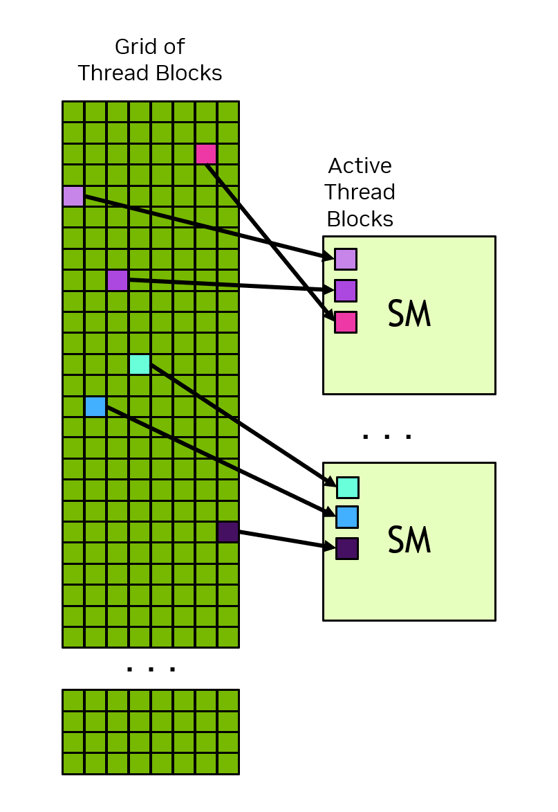

### [1.2.2.1. Thread Blocks and Grids](https://docs.nvidia.com/cuda/cuda-programming-guide/01-introduction#thread-blocks-and-grids)

When an application launches a kernel, it does so with many threads, often millions of threads. These threads are organized into blocks. A block of threads is referred to, perhaps unsurprisingly, as a _thread block_. Thread blocks are organized into a _grid_. All the thread blocks in a grid have the same size and dimensions. [Figure 3](https://docs.nvidia.com/cuda/cuda-programming-guide/01-introduction/#thread-hierarchy-grid-of-thread-blocks) shows an illustration of a grid of thread blocks.

Figure 3 Grid of Thread Blocks. Each arrow represents a thread (the number of arrows is not representative of actual number of threads).

Thread blocks and grids may be 1, 2, or 3 dimensional. These dimensions can simplify mapping of individual threads to units of work or data items.

When a kernel is launched, it is launched using a specific _execution configuration_ which specifies the grid and thread block dimensions. The execution configuration may also include optional parameters such as cluster size, stream, and SM configuration settings, which will be introduced in later sections.

Using built-in variables, each thread executing the kernel can determine its location within its containing block and the location of its block within the containing grid. A thread can also use these built-in variables to determine the dimensions of the thread blocks and the grid on which the kernel was launched. This gives each thread a unique identity among all the threads running the kernel. This identity is frequently used to determine what data or operations a thread is responsible for.

All threads of a thread block are executed in a single SM. This allows threads within a thread block to communicate and synchronize with each other efficiently. Threads within a thread block all have access to the on-chip shared memory, which can be used for exchanging information between threads of a thread block.

A grid may consist of millions of thread blocks, while the GPU executing the grid may have only tens or hundreds of SMs. All threads of a thread block are executed by a single SM and, in most cases [^[1]], run to completion on that SM. There is no guarantee of scheduling between thread blocks, so a thread block cannot rely on results from other thread blocks, as they may not be able to be scheduled until that thread block has completed. [Figure 4](https://docs.nvidia.com/cuda/cuda-programming-guide/01-introduction/#thread-block-scheduling) shows an example of how thread blocks from a grid are assigned to an SM.

Figure 4 Each SM has one or more active thread blocks. In this example, each SM has three thread blocks scheduled simultaneously. There are no guarantees about the order in which thread blocks from a grid are assigned to SMs.

The CUDA programming model enables arbitrarily large grids to run on GPUs of any size, whether it has only one SM or thousands of SMs. To achieve this, the CUDA programming model, with some exceptions, requires that there be no data dependencies between threads in different thread blocks. That is, a thread should not depend on results from or synchronize with a thread in a different thread block of the same grid. All the threads within a thread block run on the same SM at the same time. Different thread blocks within the grid are scheduled among the available SMs and may be executed in any order. In short, the CUDA programming model requires that it be possible to execute thread blocks in any order, in parallel or in series.
