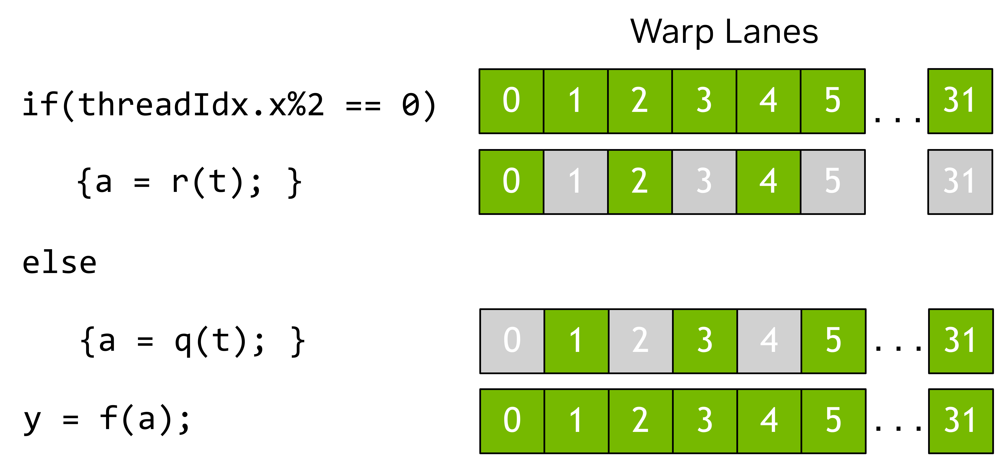

### [1.2.2.2. Warps and SIMT](https://docs.nvidia.com/cuda/cuda-programming-guide/01-introduction#warps-and-simt)

Within a thread block, threads are organized into groups of 32 threads called _warps_. A warp executes the kernel code in a _Single-Instruction Multiple-Threads_ (SIMT) paradigm. In SIMT, all threads in the warp are executing the same kernel code, but each thread may follow different branches through the code. That is, though all threads of the program execute the same code, threads do not need to follow the same execution path.

When threads are executed by a warp, they are assigned a warp lane. Warp lanes are numbered 0 to 31 and threads from a thread block are assigned to warps in a predictable fashion detailed in [Hardware Multithreading](https://docs.nvidia.com/cuda/cuda-programming-guide/03-advanced/advanced-kernel-programming.html#advanced-kernels-hardware-implementation-hardware-multithreading).

All threads in the warp execute the same instruction simultaneously. If some threads within a warp follow a control flow branch in execution while others do not, the threads which do not follow the branch will be masked off while the threads which follow the branch are executed. For example, if a conditional is only true for half the threads in a warp, the other half of the warp would be masked off while the active threads execute those instructions. This situation is illustrated in [Figure 7](https://docs.nvidia.com/cuda/cuda-programming-guide/01-introduction/#active-warp-lanes). When different threads in a warp follow different code paths, this is sometimes called warp divergence. It follows that utilization of the GPU is maximized when threads within a warp follow the same control flow path.

Figure 7 In this example, only threads with even thread index execute the body of the if statement, the others are masked off while the body is executed.

In the SIMT model, all threads in a warp progress through the kernel in lock step.  Hardware execution may differ. See the sections on [Independent Thread Execution](https://docs.nvidia.com/cuda/cuda-programming-guide/03-advanced/advanced-kernel-programming.html#advanced-kernels-independent-thread-scheduling) for more information on where this distinction is important. Exploiting knowledge of how warp execution is actually mapped to real hardware is discouraged. The CUDA programming model and SIMT say that all threads in a warp progress through the code together. Hardware may optimize masked lanes in ways that are transparent to the program so long as the programming model is followed. If the program violates this model, this can result in undefined behavior that can be different in different GPU hardware.

While it is not necessary to consider warps when writing CUDA code, understanding the warp execution model is helpful in understanding concepts such as [global memory coalescing](https://docs.nvidia.com/cuda/cuda-programming-guide/02-basics/writing-cuda-kernels.html#writing-cuda-kernels-coalesced-global-memory-access) and [shared memory bank access patterns](https://docs.nvidia.com/cuda/cuda-programming-guide/02-basics/writing-cuda-kernels.html#writing-cuda-kernels-shared-memory-access-patterns). Some advanced programming techniques use specialization of warps within a thread block to limit thread divergence and maximize utilization. This and other optimizations make use of the knowledge that threads are grouped into warps when executing.

One implication of warp execution is that thread blocks are best specified to have a total number of threads which is a multiple of 32. It is legal to use any number of threads, but when the total is not a multiple of 32, the last warp of the thread block will have some lanes that are unused throughout execution. This will likely lead to suboptimal functional units utilization and memory access for that warp.

> SIMT is often compared to Single Instruction Multiple Data (SIMD) parallelism, but there are some important differences. In SIMD, execution follows a single control flow path, while in SIMT, each thread is allowed to follow its own control flow path. Because of this, SIMT does not have a fixed data-width like SIMD. A more detailed discussion of SIMT can be found in [SIMT Execution Model](https://docs.nvidia.com/cuda/cuda-programming-guide/03-advanced/advanced-kernel-programming.html#advanced-kernels-hardware-implementation-simt-architecture).
