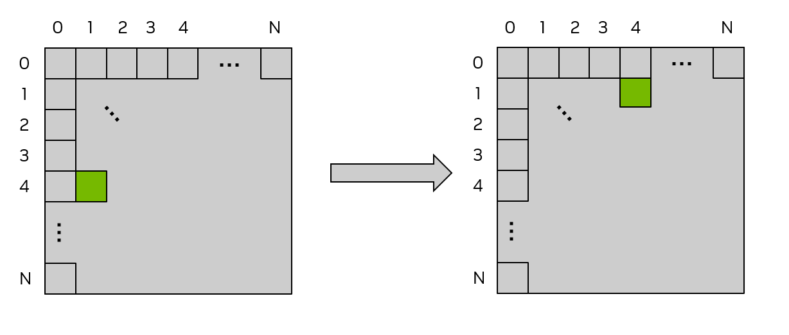

#### [2.2.4.1.1. Matrix Transpose Example Using Global Memory](https://docs.nvidia.com/cuda/cuda-programming-guide/02-basics#matrix-transpose-example-using-global-memory)[](https://docs.nvidia.com/cuda/cuda-programming-guide/02-basics/#matrix-transpose-example-using-global-memory "Permalink to this headline")

As a simple example, consider an out-of-place matrix transpose kernel that transposes a 32 bit float square matrix of size N x N, from matrix `a` to matrix `c`.  This example uses a 2d grid, and assumes a launch of 2d thread blocks of size 32 x 32 threads, that is, `blockDim.x = 32` and `blockDim.y = 32`, so each 2d thread block will operate on a 32 x 32 tile of the matrix.  Each thread operates on a unique element of the matrix, so no explicit synchronization of threads is necessary.  [Figure 12](https://docs.nvidia.com/cuda/cuda-programming-guide/02-basics/#writing-cuda-kernels-figure-global-transpose) illustrates this matrix transpose operation.   The kernel source code follows the figure.



Figure 12 Matrix Transpose using Global memory[](https://docs.nvidia.com/cuda/cuda-programming-guide/02-basics/#writing-cuda-kernels-figure-global-transpose "Link to this image")

> The labels on the top and left of each matrix are the 2d thread block indices and also can be considered the tile indices, where each small square indicates a tile of the matrix that will be operated on by a 2d thread block.  In this example, the tile size is 32 x 32 elements, so each of the small squares represents a 32 x 32 tile of the matrix.  The green shaded square shows the location of an example tile before and after the transpose operation.

```c++
/* macro to index a 1D memory array with 2D indices in row-major order */
/* ld is the leading dimension, i.e. the number of columns in the matrix     */

#define INDX( row, col, ld ) ( ( (row) * (ld) ) + (col) )

/* CUDA kernel for naive matrix transpose */

__global__ void naive_cuda_transpose(int m, float *a, float *c )
{
    int myCol = blockDim.x * blockIdx.x + threadIdx.x;
    int myRow = blockDim.y * blockIdx.y + threadIdx.y;

    if( myRow < m && myCol < m )
    {
        c[INDX( myCol, myRow, m )] = a[INDX( myRow, myCol, m )];
    } /* end if */
    return;
} /* end naive_cuda_transpose */
```

To determine whether this kernel is achieving coalesced memory access one needs to determine whether consecutive threads are accessing consecutive elements of memory.  In a 2d thread block, the `x` index moves the fastest, so consecutive values of `threadIdx.x` should be accessing consecutive elements of memory.  `threadIdx.x` appears in `myCol`, and one can observe that when `myCol` is the second argument to the `INDX` macro, consecutive threads are reading consecutive values of `a`, so the read of `a` is perfectly coalesced.

However, the writing of `c` is not coalesced, because consecutive values of `threadIdx.x` (again examine `myCol`) are writing elements to `c` that are `ld` (leading dimension) elements apart from each other.  This is observed because now `myCol` is the first argument to the `INDX` macro, and as the first argument to `INDX` increments by 1, the memory location changes by `ld`.  When `ld` is larger than 32 (which occurs whenever the matrix sizes are larger than 32), this is equivalent to the pathological case shown in [Figure 11](https://docs.nvidia.com/cuda/cuda-programming-guide/02-basics/#writing-cuda-kernels-128-byte-no-coalesced-access).

To alleviate these uncoalesced writes, the use of shared memory can be employed, which will be described in the next section.
