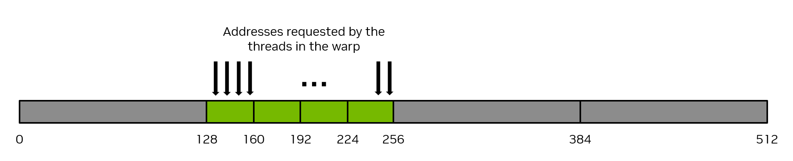

### [2.2.4.1. Coalesced Global Memory Access](https://docs.nvidia.com/cuda/cuda-programming-guide/02-basics#coalesced-global-memory-access)[](https://docs.nvidia.com/cuda/cuda-programming-guide/02-basics/#coalesced-global-memory-access "Permalink to this headline")

Global memory is accessed via 32-byte memory transactions.  When a CUDA thread requests a word of data from global memory, the relevant warp coalesces the memory requests from all the threads in that warp into the number of memory transactions necessary to satisfy the request, depending on the size of the word accessed by each thread and the distribution of the memory addresses across the threads.  For example, if a thread requests a 4-byte word, the actual memory transaction the warp will generate to global memory will be 32 bytes in total.  To use the memory system most efficiently, the warp should use all the memory that is fetched in a single memory transaction.  That is, if a thread is requesting a 4-byte word from global memory, and the transaction size is 32 bytes, if other threads in that warp can use other 4-byte words of data from that 32-byte request, this will result in the most efficient use of the memory system.

As a simple example, if consecutive threads in the warp request consecutive 4-byte words in memory, then the warp will request 128 bytes of memory total, and this 128 bytes required will be fetched in four 32-byte memory transactions.  This results in 100% utilization of the memory system.  That is, 100% of the memory traffic is utilized by the warp.  [Figure 10](https://docs.nvidia.com/cuda/cuda-programming-guide/02-basics/#writing-cuda-kernels-128-byte-coalesced-access) illustrates this example of perfectly coalesced memory access.



Figure 10 Coalesced memory access[](https://docs.nvidia.com/cuda/cuda-programming-guide/02-basics/#writing-cuda-kernels-128-byte-coalesced-access "Link to this image")

Conversely, the pathologically worst case scenario is when consecutive threads access data elements that are 32 bytes or more apart from each other in memory.  In this case, the warp will be forced to issue a 32-byte memory transaction for each thread, and the total number of bytes of memory traffic will be 32 bytes times 32 threads/warp = 1024 bytes.  However, the amount of memory used will be 128 bytes only (4 bytes for each thread in the warp), so the memory utilization will only be 128 / 1024 = 12.5%.  This is a very inefficient use of the memory system.  [Figure 11](https://docs.nvidia.com/cuda/cuda-programming-guide/02-basics/#writing-cuda-kernels-128-byte-no-coalesced-access) illustrates this example of uncoalesced memory access.


Figure 11 Uncoalesced memory access[](https://docs.nvidia.com/cuda/cuda-programming-guide/02-basics/#writing-cuda-kernels-128-byte-no-coalesced-access "Link to this image")

The most straightforward way to achieve coalesced memory access is for consecutive threads to access consecutive elements in memory.  For example, for a  kernel launched with 1d thread blocks, the following `VecAdd` kernel will achieve coalesced memory access.  Notice how thread `workIndex` accesses the three arrays, and consecutive threads (indicated by consecutive values of `workIndex`) access consecutive elements in the arrays.

```cuda
__global__ void vecAdd(float* A, float* B, float* C, int vectorLength)
{
    int workIndex = threadIdx.x + blockIdx.x*blockDim.x;
    if(workIndex < vectorLength)
    {
        C[workIndex] = A[workIndex] + B[workIndex];
```

There is no requirement that consecutive threads access consecutive elements of memory to achieve coalesced memory access, it is merely the typical way coalescing is achieved. Coalesced memory access occurs provided all the threads in the warp access elements from the same 32-byte segments of memory in some linear or permuted way.  Stated another way, the best way to achieve coalesced memory access is to maximize the ratio of bytes used to bytes transferred.

> **Note**
>
> Ensuring proper coalescing of global memory accesses is one of the most important performance considerations for writing performant CUDA kernels.  It is imperative that applications use the memory system as efficiently as possible.
