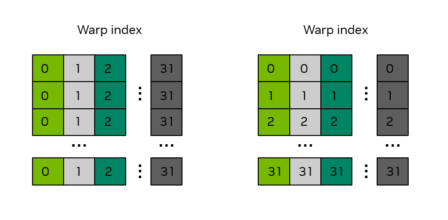
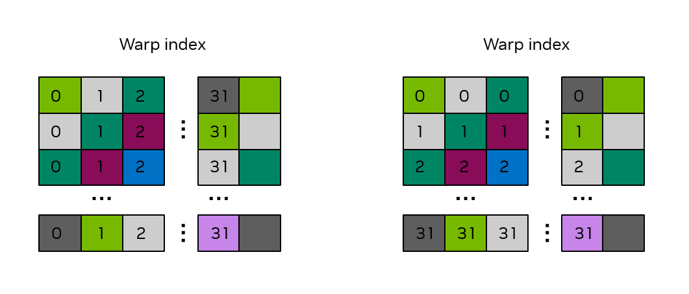

#### [2.2.4.2.2. Shared Memory Bank Conflicts](https://docs.nvidia.com/cuda/cuda-programming-guide/02-basics#shared-memory-bank-conflicts)[](https://docs.nvidia.com/cuda/cuda-programming-guide/02-basics/#shared-memory-bank-conflicts "Permalink to this headline")

In [Section 2.2.4.2](https://docs.nvidia.com/cuda/cuda-programming-guide/02-basics/#writing-cuda-kernels-shared-memory-access-patterns), the bank structure of shared memory was described.  In the previous matrix transpose example, the proper coalesced memory access to/from global memory was achieved, but no consideration was given to whether shared memory bank conflicts were present.  Consider the following 2d shared memory declaration,

```c++
__shared__ float smemArray[32][32];
```

Since a warp is 32 threads, each thread in the same warp will have a fixed value for `threadIdx.y` and will have `0 <= threadIdx.x < 32`.

The left panel of [Figure 15](https://docs.nvidia.com/cuda/cuda-programming-guide/02-basics/#writing-cuda-kernels-figure-bank-conflicts-shared-mem) illustrates the situation when the threads in a warp access the data in a column of `smemArray`.  Warp 0 is accessing memory locations `smemArray[0][0]` through `smemArray[31][0]`.  In C++ multi-dimensional array ordering, the last index moves the fastest, so consecutive threads in warp 0 are accessing memory locations that are 32 elements apart.  As illustrated in the figure, the colors denote the banks, and this access down the entire column by warp 0 results in a 32-way bank conflict.

The right panel of [Figure 15](https://docs.nvidia.com/cuda/cuda-programming-guide/02-basics/#writing-cuda-kernels-figure-bank-conflicts-shared-mem) illustrates the situation when the threads in a warp access the data across a row of `smemArray`.  Warp 0 is accessing memory locations `smemArray[0][0]` through `smemArray[0][31]`.  In this case, consecutive threads in warp 0 are accessing memory locations that are adjacent.  As illustrated in the figure, the colors denote the banks, and this access across the entire row by warp 0 results in no bank conflicts.  The ideal scenario is for each thread in a warp to access a shared memory location with a different color.



Figure 15 Bank structure in a 32 x 32 shared memory array.[](https://docs.nvidia.com/cuda/cuda-programming-guide/02-basics/#writing-cuda-kernels-figure-bank-conflicts-shared-mem "Link to this image")

The numbers in the boxes indicate the warp index.  The colors indicate which bank is associated with that shared memory location.

Returning to the example from [Section 2.2.4.2.1](https://docs.nvidia.com/cuda/cuda-programming-guide/02-basics/#writing-cuda-kernels-matrix-transpose-example-shared-memory), one can examine the usage of shared memory to determine whether bank conflicts are present.  The first usage of shared memory is when data from global memory is stored to shared memory:

```c++
smemArray[threadIdx.x][threadIdx.y] = a[INDX( tileRow + threadIdx.y, tileCol + threadIdx.x, m )];
```

Because C++ arrays are stored in row-major order, consecutive threads in the same warp, as indicated by consecutive values of `threadIdx.x`, will access `smemArray` with a stride of 32 elements, because `threadIdx.x` is the first index into the array.  This results in a 32-way bank conflict and is illustrated by the left panel of [Figure 15](https://docs.nvidia.com/cuda/cuda-programming-guide/02-basics/#writing-cuda-kernels-figure-bank-conflicts-shared-mem).

The second usage of shared memory is when data from shared memory is written back to global memory:

```c++
c[INDX( tileCol + threadIdx.y, tileRow + threadIdx.x, m )] = smemArray[threadIdx.y][threadIdx.x];
```

In this case, because `threadIdx.x` is the second index into the `smemArray` array, consecutive threads in the same warp will access `smemArray` with a stride of 1 element.  This results in no bank conflicts and is illustrated by the right panel of [Figure 15](https://docs.nvidia.com/cuda/cuda-programming-guide/02-basics/#writing-cuda-kernels-figure-bank-conflicts-shared-mem).

The matrix transpose kernel as illustrated in [Section 2.2.4.2.1](https://docs.nvidia.com/cuda/cuda-programming-guide/02-basics/#writing-cuda-kernels-matrix-transpose-example-shared-memory) has one access of shared memory that has no bank conflicts and one access that has a 32-way bank conflict.  A common fix to avoid bank conflicts is to pad the shared memory by adding one to the column dimension of the array as follows:

```c++
__shared__ float smemArray[THREADS_PER_BLOCK_X][THREADS_PER_BLOCK_Y+1];
```

This minor adjustment to the declaration of `smemArray` will eliminate the bank conflicts.  To illustrate this, consider [Figure 16](https://docs.nvidia.com/cuda/cuda-programming-guide/02-basics/#writing-cuda-kernels-figure-no-bank-conflicts-shared-mem) where the shared memory array has been declared with a size of 32 x 33.  One observes that whether the threads in the same warp access the shared memory array down an entire column or across an entire row, the bank conflicts have been eliminated, i.e., the threads in the same warp access locations with different colors.



Figure 16 Bank structure in a 32 x 33 shared memory array.[](https://docs.nvidia.com/cuda/cuda-programming-guide/02-basics/#writing-cuda-kernels-figure-no-bank-conflicts-shared-mem "Link to this image")

The numbers in the boxes indicate the warp index.  The colors indicate which bank is associated with that shared memory location.
