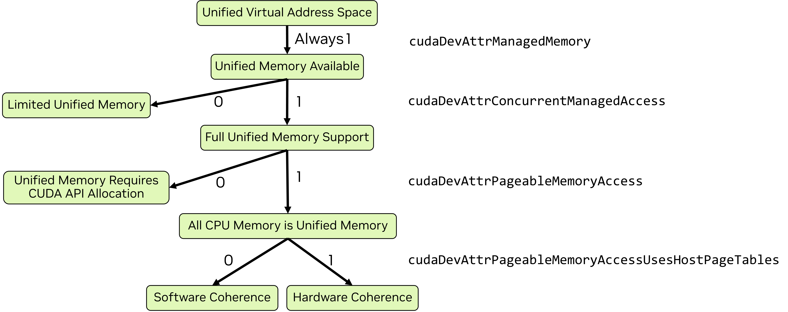

### [2.4.2.1. Unified Memory Paradigms](https://docs.nvidia.com/cuda/cuda-programming-guide/02-basics#unified-memory-paradigms)

The features and behavior of unified memory vary between operating systems, kernel versions on Linux, GPU hardware, and the GPU-CPU interconnect. The form of unified memory available can be determined by using `cudaDeviceGetAttribute` to query a few attributes:

- `cudaDevAttrConcurrentManagedAccess` - 1 for full unified memory support, 0 for limited support
- `cudaDevAttrPageableMemoryAccess` - 1 means all system memory is fully-supported unified memory, 0 means only memory explicitly allocated as managed memory is fully-supported unified memory
- `cudaDevAttrPageableMemoryAccessUsesHostPageTables` - Indicates the mechanism of CPU/GPU coherence: 1 is hardware, 0 is software.

[Figure 18](https://docs.nvidia.com/cuda/cuda-programming-guide/02-basics/#unified-memory-flow-chart) illustrates how to determine the unified memory paradigm visually and is followed by a [code sample](https://docs.nvidia.com/cuda/cuda-programming-guide/02-basics/#memory-unified-querying-code) implementing the same logic.

There are four paradigms of unified memory operation:

- [Full support for explicit managed memory allocations](https://docs.nvidia.com/cuda/cuda-programming-guide/02-basics/#memory-unified-memory-full)
- [Full support for all allocations with software coherence](https://docs.nvidia.com/cuda/cuda-programming-guide/02-basics/#memory-unified-memory-full)
- [Full support for all allocations with hardware coherence](https://docs.nvidia.com/cuda/cuda-programming-guide/02-basics/#memory-unified-address-translation-services)
- [Limited unified memory support](https://docs.nvidia.com/cuda/cuda-programming-guide/02-basics/#memory-limited-unified-memory-support)

When full support is available, it can either require explicit allocations, or all system memory may implicitly be unified memory. When all memory is implicitly unified, the coherence mechanism can either be software or hardware. Windows and some Tegra devices have limited support for unified memory.

Figure 18 All current GPUs use a unified virtual address space and have unified memory available. When `cudaDevAttrConcurrentManagedAccess` is 1, full unified memory support is available, otherwise only limited support is available. When full support is available, if `cudaDevAttrPageableMemoryAccess` is also 1, then all system memory is unified memory. Otherwise, only memory allocated with CUDA APIs (such as `cudaMallocManaged`) is unified memory. When all system memory is unified, `cudaDevAttrPageableMemoryAccessUsesHostPageTables` indicates whether coherence is provided by hardware (when value is 1) or software (when value is 0).

[Table 3](https://docs.nvidia.com/cuda/cuda-programming-guide/02-basics/#table-unified-memory-levels) shows the same information as [Figure 18](https://docs.nvidia.com/cuda/cuda-programming-guide/02-basics/#unified-memory-flow-chart) as a table with links to the relevant sections of this chapter and more complete documentation in a later section of this guide.

| Unified Memory Paradigm | Device Attributes | Full Documentation |
| --- | --- | --- |
| [Limited unified memory support](https://docs.nvidia.com/cuda/cuda-programming-guide/02-basics/#memory-limited-unified-memory-support) | \| `cudaDevAttrConcurrentManagedAccess` is 0 | \| [Unified Memory on Windows, WSL, and Tegra](https://docs.nvidia.com/cuda/cuda-programming-guide/04-special-topics/unified-memory.html#um-legacy-devices) \| [CUDA for Tegra Memory Management](https://docs.nvidia.com/cuda/cuda-for-tegra-appnote/index.html#memory-management) \| [Unified memory on Tegra](https://docs.nvidia.com/cuda/cuda-for-tegra-appnote/index.html#effective-usage-of-unified-memory-on-tegra) |
| [Full support for explicit managed memory allocations](https://docs.nvidia.com/cuda/cuda-programming-guide/02-basics/#memory-unified-memory-full) | \| `cudaDevAttrPageableMemoryAccess` is 0 \| and `cudaDevAttrConcurrentManagedAccess` is 1 | \| [Unified Memory on Devices with only CUDA Managed Memory Support](https://docs.nvidia.com/cuda/cuda-programming-guide/04-special-topics/unified-memory.html#um-no-pageable-systems) |
| [Full support for all allocations with software coherence](https://docs.nvidia.com/cuda/cuda-programming-guide/02-basics/#memory-unified-memory-full) | \| `cudaDevAttrPageableMemoryAccessUsesHostPageTables` is 0 \| and `cudaDevAttrPageableMemoryAccess` is 1 \| and `cudaDevAttrConcurrentManagedAccess` is 1 | \| [Unified Memory on Devices with Full CUDA Unified Memory Support](https://docs.nvidia.com/cuda/cuda-programming-guide/04-special-topics/unified-memory.html#um-pageable-systems) |
| [Full support for all allocations with hardware coherence](https://docs.nvidia.com/cuda/cuda-programming-guide/02-basics/#memory-unified-address-translation-services) | \| `cudaDevAttrPageableMemoryAccessUsesHostPageTables` is 1 \| and `cudaDevAttrPageableMemoryAccess` is 1 \| and `cudaDevAttrConcurrentManagedAccess` is 1 | \| [Unified Memory on Devices with Full CUDA Unified Memory Support](https://docs.nvidia.com/cuda/cuda-programming-guide/04-special-topics/unified-memory.html#um-pageable-systems) |
