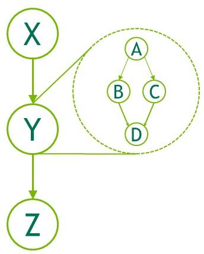

### [4.2.1.1. Node Types](https://docs.nvidia.com/cuda/cuda-programming-guide/04-special-topics#node-types)

A graph node can be one of:

- kernel
- CPU function call
- memory copy
- memset
- empty node
- waiting on a [CUDA Event](https://docs.nvidia.com/cuda/cuda-programming-guide/02-basics/asynchronous-execution.html#cuda-events)
- recording a [CUDA Event](https://docs.nvidia.com/cuda/cuda-programming-guide/02-basics/asynchronous-execution.html#cuda-events)
- signalling an [external semaphore](https://docs.nvidia.com/cuda/cuda-programming-guide/04-special-topics/graphics-interop.html#external-resource-interoperability)
- waiting on an [external semaphore](https://docs.nvidia.com/cuda/cuda-programming-guide/04-special-topics/graphics-interop.html#external-resource-interoperability)
- [conditional node](https://docs.nvidia.com/cuda/cuda-programming-guide/04-special-topics/#cuda-graphs-conditional-graph-nodes)
- [memory node](https://docs.nvidia.com/cuda/cuda-programming-guide/04-special-topics/#cuda-graphs-graph-memory-nodes)
- child graph: To execute a separate nested graph, as shown in the following figure.

Figure 21 Child Graph Example
