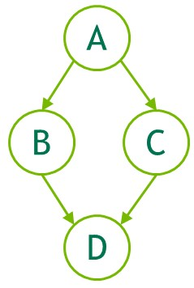

#### [4.2.2.1.1. Graph APIs](https://docs.nvidia.com/cuda/cuda-programming-guide/04-special-topics#graph-apis)[](https://docs.nvidia.com/cuda/cuda-programming-guide/04-special-topics/#graph-apis "Permalink to this headline")

The following is an example (omitting declarations and other boilerplate code) of creating the below graph.  Note the use of `cudaGraphCreate()` to create the graph and `cudaGraphAddNode()` to add the kernel nodes and their dependencies. [The CUDA Runtime API documentation](https://docs.nvidia.com/cuda/cuda-runtime-api/group__CUDART__GRAPH.html) lists all the functions available for adding nodes and dependencies.



Figure 22 Creating a Graph Using Graph APIs Example[](https://docs.nvidia.com/cuda/cuda-programming-guide/04-special-topics/#cuda-graphs-creating-a-graph-using-api-fig-creating-using-graph-apis "Link to this image")

```cuda
// Create the graph - it starts out empty
cudaGraphCreate(&graph, 0);

// Create the nodes and their dependencies
cudaGraphNode_t nodes[4];
cudaGraphNodeParams kParams = { cudaGraphNodeTypeKernel };
kParams.kernel.func         = (void *)kernelName;
kParams.kernel.gridDim.x    = kParams.kernel.gridDim.y  = kParams.kernel.gridDim.z  = 1;
kParams.kernel.blockDim.x   = kParams.kernel.blockDim.y = kParams.kernel.blockDim.z = 1;

cudaGraphAddNode(&nodes[0], graph, NULL, NULL, 0, &kParams);
cudaGraphAddNode(&nodes[1], graph, &nodes[0], NULL, 1, &kParams);
cudaGraphAddNode(&nodes[2], graph, &nodes[0], NULL, 1, &kParams);
cudaGraphAddNode(&nodes[3], graph, &nodes[1], NULL, 2, &kParams);
```

The example above shows four kernel nodes with dependencies between them to illustrate the creation of a very simple graph.  In a typical user application there would also need to be nodes added for memory operations, such as `cudaGraphAddMemcpyNode()` and the like.  For full reference of all graph API functions to add nodes, see [The CUDA Runtime API documentation](https://docs.nvidia.com/cuda/cuda-runtime-api/group__CUDART__GRAPH.html) .
