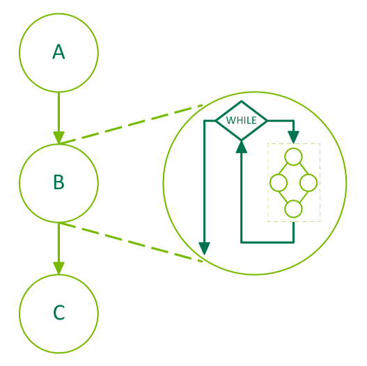

### [4.2.4.4. Conditional WHILE Nodes](https://docs.nvidia.com/cuda/cuda-programming-guide/04-special-topics#conditional-while-nodes)[](https://docs.nvidia.com/cuda/cuda-programming-guide/04-special-topics/#conditional-while-nodes "Permalink to this headline")

The body graph of a WHILE node will be executed as long as the condition is non-zero. The condition will be
evaluated when the node is executed and after completion of the body graph. The following diagram depicts
a 3 node graph where the middle node, B, is a conditional node:



Figure 25 Conditional WHILE Node[](https://docs.nvidia.com/cuda/cuda-programming-guide/04-special-topics/#id6 "Link to this image")

The following code illustrates the creation of a graph containing a WHILE conditional node. The handle
is created using _cudaGraphCondAssignDefault_ to avoid the need for an upstream kernel. The body of the
conditional is populated using the [graph API](https://docs.nvidia.com/cuda/cuda-programming-guide/04-special-topics/#cuda-graphs-creating-a-graph-using-graph-apis).

```cuda
__global__ void loopKernel(cudaGraphConditionalHandle handle, char *dPtr)
{
   // Decrement the value of dPtr and set the condition value to 0 once dPtr is 0
   if (--(*dPtr) == 0) {
      cudaGraphSetConditional(handle, 0);
   }
}

void graphSetup() {
    cudaGraph_t graph;
    cudaGraphExec_t graphExec;
    cudaGraphNode_t node;
    void *kernelArgs[2];

    // Allocate a byte of device memory to use as input
    char *dPtr;
    cudaMalloc((void **)&dPtr, 1);

    // Create the graph
    cudaGraphCreate(&graph, 0);

    // Create the conditional handle with a default value of 1
    cudaGraphConditionalHandle handle;
    cudaGraphConditionalHandleCreate(&handle, graph, 1, cudaGraphCondAssignDefault);

    // Create and add the WHILE conditional node
    cudaGraphNodeParams cParams = { cudaGraphNodeTypeConditional };
    cParams.conditional.handle = handle;
    cParams.conditional.type   = cudaGraphCondTypeWhile;
    cParams.conditional.size   = 1;
    cudaGraphAddNode(&node, graph, NULL, 0, &cParams);

    // Get the body graph of the conditional node
    cudaGraph_t bodyGraph = cParams.conditional.phGraph_out[0];

    // Populate the body graph of the conditional node
    cudaGraphNodeParams params = { cudaGraphNodeTypeKernel };
    params.kernel.func = (void *)loopKernel;
    params.kernel.gridDim.x = params.kernel.gridDim.y = params.kernel.gridDim.z = 1;
    params.kernel.blockDim.x = params.kernel.blockDim.y = params.kernel.blockDim.z = 1;
    params.kernel.kernelParams = kernelArgs;
    kernelArgs[0] = &handle;
    kernelArgs[1] = &dPtr;
    cudaGraphAddNode(&node, bodyGraph, NULL, 0, &params);

    // Initialize device memory, instantiate, and launch the graph
    cudaMemset(dPtr, 10, 1); // Set dPtr to 10; the loop will run until dPtr is 0
    cudaGraphInstantiate(&graphExec, graph, NULL, NULL, 0);
    cudaGraphLaunch(graphExec, 0);
    cudaDeviceSynchronize();

    // Clean up
    cudaGraphExecDestroy(graphExec);
    cudaGraphDestroy(graph);
    cudaFree(dPtr);
}
```
