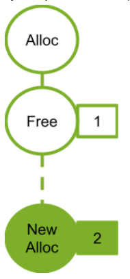

#### [4.2.5.3.1. Address Reuse within a Graph](https://docs.nvidia.com/cuda/cuda-programming-guide/04-special-topics#address-reuse-within-a-graph)

CUDA may reuse memory within a graph by assigning the same virtual address ranges to different allocations whose lifetimes do not overlap. Since virtual addresses may be reused, pointers to different allocations with disjoint lifetimes are not guaranteed to be unique.

The following figure shows adding a new allocation node (2) that can reuse the address freed by a dependent node (1).

Figure 28 Adding New Alloc Node 2

The following figure shows adding a new alloc node (4). The new alloc node is not dependent on the free node (2) so cannot reuse the address from the associated alloc node (2). If the alloc node (2) used the address freed by free node (1), the new alloc node 3 would need a new address.

Figure 29 Adding New Alloc Node 3
