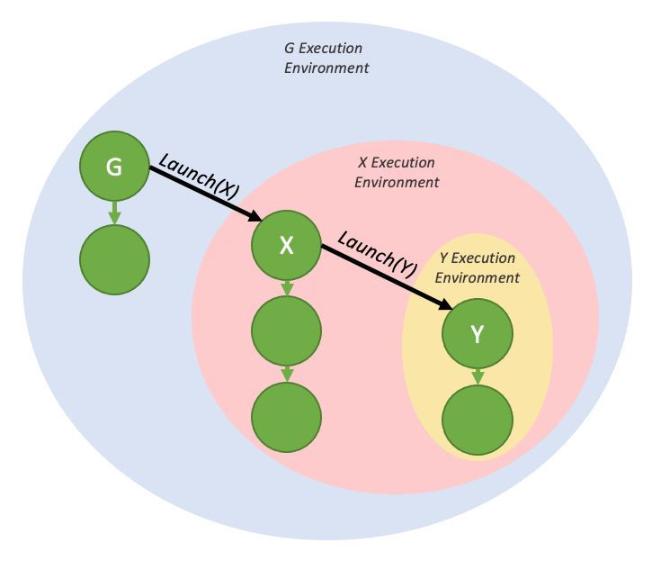

##### [4.2.6.2.1.1. Graph Execution Environments](https://docs.nvidia.com/cuda/cuda-programming-guide/04-special-topics#graph-execution-environments)

In order to fully understand the device-side synchronization model, it is first necessary to understand the concept of an execution environment.

When a graph is launched from the device, it is launched into its own execution environment. The execution environment of a given graph encapsulates all work in the graph as well as all generated fire and forget work. The graph can be considered complete when it has completed execution and when all generated child work is complete.

The below diagram shows the environment encapsulation that would be generated by the fire-and-forget sample code in the previous section.

Figure 32 Fire and forget launch, with execution environments

These environments are also hierarchical, so a graph environment can include multiple levels of child-environments from fire and forget launches.

Figure 33 Nested fire and forget environments

When a graph is launched from the host, there exists a stream environment that parents the execution environment of the launched graph. The stream environment encapsulates all work generated as part of the overall launch. The stream launch is complete (i.e. downstream dependent work may now run) when the overall stream environment is marked as complete.

Figure 34 The stream environment, visualized
