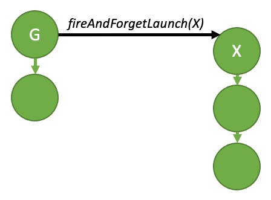

#### [4.2.6.2.1. Fire and Forget Launch](https://docs.nvidia.com/cuda/cuda-programming-guide/04-special-topics#fire-and-forget-launch)[](https://docs.nvidia.com/cuda/cuda-programming-guide/04-special-topics/#fire-and-forget-launch "Permalink to this headline")

As the name suggests, a fire and forget launch is submitted to the GPU immediately, and it runs independently of the launching graph. In a fire-and-forget scenario, the launching graph is the parent, and the launched graph is the child.



Figure 31 Fire and forget launch[](https://docs.nvidia.com/cuda/cuda-programming-guide/04-special-topics/#id13 "Link to this image")

The above diagram can be generated by the sample code below:

```cuda
__global__ void launchFireAndForgetGraph(cudaGraphExec_t graph) {
    cudaGraphLaunch(graph, cudaStreamGraphFireAndForget);
}

void graphSetup() {
    cudaGraphExec_t gExec1, gExec2;
    cudaGraph_t g1, g2;

    // Create, instantiate, and upload the device graph.
    create_graph(&g2);
    cudaGraphInstantiate(&gExec2, g2, cudaGraphInstantiateFlagDeviceLaunch);
    cudaGraphUpload(gExec2, stream);

    // Create and instantiate the launching graph.
    cudaStreamBeginCapture(stream, cudaStreamCaptureModeGlobal);
    launchFireAndForgetGraph<<<1, 1, 0, stream>>>(gExec2);
    cudaStreamEndCapture(stream, &g1);
    cudaGraphInstantiate(&gExec1, g1);

    // Launch the host graph, which will in turn launch the device graph.
    cudaGraphLaunch(gExec1, stream);
}
```

A graph can have up to 120 total fire-and-forget graphs during the course of its execution. This total resets between launches of the same parent graph.
