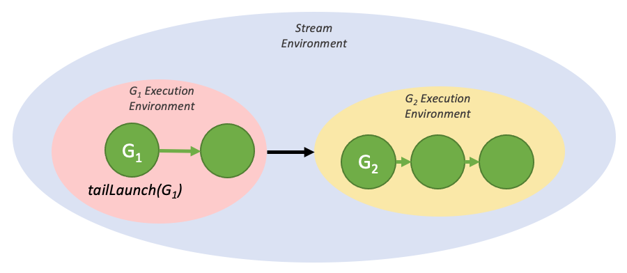
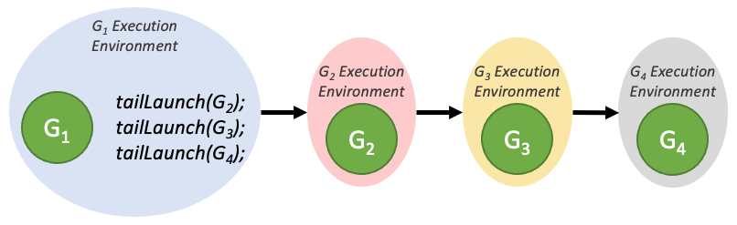

#### [4.2.6.2.2. Tail Launch](https://docs.nvidia.com/cuda/cuda-programming-guide/04-special-topics#tail-launch)[](https://docs.nvidia.com/cuda/cuda-programming-guide/04-special-topics/#tail-launch "Permalink to this headline")

Unlike on the host, it is not possible to synchronize with device graphs from the GPU via traditional methods such as `cudaDeviceSynchronize()` or `cudaStreamSynchronize()`. Rather, in order to enable serial work dependencies, a different launch mode - tail launch - is offered, to provide similar functionality.

A tail launch executes when a graph’s environment is considered complete - ie, when the graph and all its children are complete. When a graph completes, the environment of the next graph in the tail launch list will replace the completed environment as a child of the parent environment. Like fire-and-forget launches, a graph can have multiple graphs enqueued for tail launch.



Figure 35 A simple tail launch[](https://docs.nvidia.com/cuda/cuda-programming-guide/04-special-topics/#id17 "Link to this image")

The above execution flow can be generated by the code below:

```cuda
__global__ void launchTailGraph(cudaGraphExec_t graph) {
    cudaGraphLaunch(graph, cudaStreamGraphTailLaunch);
}

void graphSetup() {
    cudaGraphExec_t gExec1, gExec2;
    cudaGraph_t g1, g2;

    // Create, instantiate, and upload the device graph.
    create_graph(&g2);
    cudaGraphInstantiate(&gExec2, g2, cudaGraphInstantiateFlagDeviceLaunch);
    cudaGraphUpload(gExec2, stream);

    // Create and instantiate the launching graph.
    cudaStreamBeginCapture(stream, cudaStreamCaptureModeGlobal);
    launchTailGraph<<<1, 1, 0, stream>>>(gExec2);
    cudaStreamEndCapture(stream, &g1);
    cudaGraphInstantiate(&gExec1, g1);

    // Launch the host graph, which will in turn launch the device graph.
    cudaGraphLaunch(gExec1, stream);
}
```

Tail launches enqueued by a given graph will execute one at a time, in order of when they were enqueued. So the first enqueued graph will run first, and then the second, and so on.



Figure 36 Tail launch ordering[](https://docs.nvidia.com/cuda/cuda-programming-guide/04-special-topics/#id18 "Link to this image")

Tail launches enqueued by a tail graph will execute before tail launches enqueued by previous graphs in the tail launch list. These new tail launches will execute in the order they are enqueued.


Figure 37 Tail launch ordering when enqueued from multiple graphs[](https://docs.nvidia.com/cuda/cuda-programming-guide/04-special-topics/#id19 "Link to this image")

A graph can have up to 255 pending tail launches.
