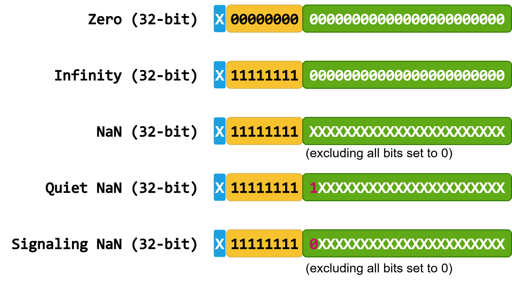

#### [4.2.6.2.3. Sibling Launch](https://docs.nvidia.com/cuda/cuda-programming-guide/04-special-topics#sibling-launch)[](https://docs.nvidia.com/cuda/cuda-programming-guide/04-special-topics/#sibling-launch "Permalink to this headline")

Sibling launch is a variation of fire-and-forget launch in which the graph is launched not as a child of the launching graph’s execution environment, but rather as a child of the launching graph’s parent environment. Sibling launch is equivalent to a fire-and-forget launch from the launching graph’s parent environment.



Figure 38 A simple sibling launch[](https://docs.nvidia.com/cuda/cuda-programming-guide/04-special-topics/#id20 "Link to this image")

The above diagram can be generated by the sample code below:

```cuda
__global__ void launchSiblingGraph(cudaGraphExec_t graph) {
    cudaGraphLaunch(graph, cudaStreamGraphFireAndForgetAsSibling);
}

void graphSetup() {
    cudaGraphExec_t gExec1, gExec2;
    cudaGraph_t g1, g2;

    // Create, instantiate, and upload the device graph.
    create_graph(&g2);
    cudaGraphInstantiate(&gExec2, g2, cudaGraphInstantiateFlagDeviceLaunch);
    cudaGraphUpload(gExec2, stream);

    // Create and instantiate the launching graph.
    cudaStreamBeginCapture(stream, cudaStreamCaptureModeGlobal);
    launchSiblingGraph<<<1, 1, 0, stream>>>(gExec2);
    cudaStreamEndCapture(stream, &g1);
    cudaGraphInstantiate(&gExec1, g1);

    // Launch the host graph, which will in turn launch the device graph.
    cudaGraphLaunch(gExec1, stream);
}
```

Since sibling launches are not launched into the launching graph’s execution environment, they will not gate tail launches enqueued by the launching graph.
