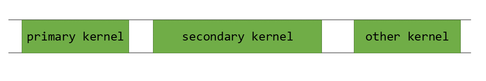

## [4.5.1. Background](https://docs.nvidia.com/cuda/cuda-programming-guide/04-special-topics#background)

A CUDA application utilizes the GPU by launching and executing multiple kernels on it.
A typical GPU activity timeline is shown in [Figure 39](https://docs.nvidia.com/cuda/cuda-programming-guide/04-special-topics/#gpu-activity).

Figure 39 GPU activity timeline

Here, `secondary_kernel` is launched after `primary_kernel` finishes its execution.
Serialized execution is usually necessary because `secondary_kernel` depends on result data
produced by `primary_kernel`. If `secondary_kernel` has no dependency on `primary_kernel`,
both of them can be launched concurrently by using [CUDA Streams](https://docs.nvidia.com/cuda/cuda-programming-guide/02-basics/asynchronous-execution.html#cuda-streams).
Even if `secondary_kernel` is dependent on `primary_kernel`, there is some potential for
concurrent execution. For example, almost all the kernels have
some sort of _preamble_ section during which tasks such as zeroing buffers or loading
constant values are performed.

Figure 40 Preamble section of `secondary_kernel`

[Figure 40](https://docs.nvidia.com/cuda/cuda-programming-guide/04-special-topics/#secondary-kernel-preamble) demonstrates the portion of `secondary_kernel` that could
be executed concurrently without impacting the application.
Note that concurrent launch also allows us to hide the launch latency of `secondary_kernel` behind
the execution of `primary_kernel`.

Figure 41 Concurrent execution of `primary_kernel` and `secondary_kernel`

The concurrent launch and execution of `secondary_kernel` shown in [Figure 41](https://docs.nvidia.com/cuda/cuda-programming-guide/04-special-topics/#preamble-overlap) is
achievable using _Programmatic Dependent Launch_.

_Programmatic Dependent Launch_ introduces changes to the CUDA kernel launch APIs as explained in following section.
These APIs require at least compute capability 9.0 to provide overlapping execution.
