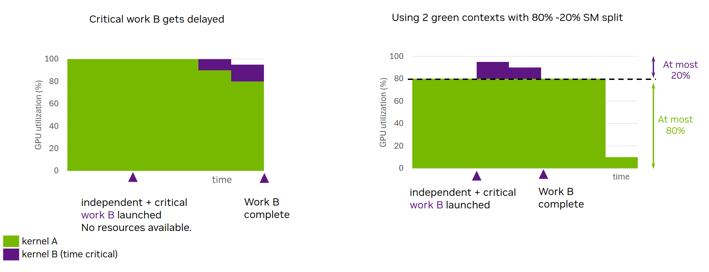

## [4.6.1. Motivation / When to Use](https://docs.nvidia.com/cuda/cuda-programming-guide/04-special-topics#motivation-when-to-use)

When launching a CUDA kernel, the user has no direct control over the number of SMs that kernel will execute on. One can only indirectly influence this
by changing the kernel’s launch geometry or anything that can affect the kernel’s maximum number of active thread blocks per SM.
Additionally, when multiple kernels execute in parallel on the GPU (kernels running on different CUDA streams or as part of a CUDA graph), they may
also contend for the same SM resources.

There are, however, use cases where the user needs to ensure there are always GPU resources available for latency-sensitive work to start, and thus complete, as soon as possible.
Green contexts provide a way towards that by partitioning SM resources, so a given green context can only use specific SMs (the ones provisioned during its creation).

[Figure 42](https://docs.nvidia.com/cuda/cuda-programming-guide/04-special-topics/#id2) illustrates such an example.  Assume an application where two independent kernels A and B run on two different non-blocking CUDA streams.
Kernel A is launched first and starts executing occupying all available SM resources. When, later in time, latency-sensitive kernel B is launched, no SM resources are available.
As a result, kernel B can only start executing once kernel A ramps down, i.e., once thread blocks from kernel A finish executing.
The first graph illustrates this scenario where critical work B gets delayed. The y-axis shows the percentage of SMs occupied and x-axis depicts time.

Figure 42 Motivation: GCs’ static resource partitioning enables latency-sensitive work B to start and complete sooner

Using green contexts, one could partition the GPU’s SMs, so that green context A, targeted by kernel A, has access to some SMs of the GPU, while green context B, targeted by kernel B, has access to the remaining SMs.
In this setting, kernel A can only use the SMs provisioned for green context A, irrespective of its launch configuration. As a result, when critical kernel B gets launched, it is guaranteed that there will be available SMs for it to start executing immediately, barring any other resource constraints. As the second graph in [Figure 42](https://docs.nvidia.com/cuda/cuda-programming-guide/04-special-topics/#id2) illustrates, even though the duration of kernel A may increase, latency-sensitive work B will no longer be delayed due to unavailable SMs. The figure shows that green context A is provisioned with an SM count equivalent to 80% SMs of the GPU for illustration purposes.

This behavior can be achieved without any code modifications to kernels A and B. One simply needs to ensure they are launched on CUDA streams belonging to the appropriate green contexts. The number of SMs each green context will have access to should be decided by the user during green context creation on a per case basis.

**Work Queues**:

Streaming multiprocessors are one resource type that can be provisioned for a green context.  Another resource type is work queues.
Think of a workqueue as a black-box resource abstraction, which can also influence GPU work execution concurrency, along with other factors.
If independent GPU work tasks (e.g., kernels submitted on different CUDA streams) map to the same workqueue, a false dependence between these tasks may be introduced,
which can lead to their serialized execution.
The user can influence the upper limit of work queues on the GPU via the `CUDA_DEVICE_MAX_CONNECTIONS` environment variable (see [Section 5.2](https://docs.nvidia.com/cuda/cuda-programming-guide/05-appendices/environment-variables.html#cuda-environment-variables), [Section 3.1](https://docs.nvidia.com/cuda/cuda-programming-guide/03-advanced/advanced-host-programming.html#advanced-apis-and-features)).

Building on top of the previous example, assume work B maps to the same workqueue as work A.
In that case, even if SM resources are available (green contexts case), work B may still need to wait for work A to complete in its entirety.
Similar to SMs, the user has no direct control over the specific work queues that may be used under the hood.
But green contexts allow the user to express the maximum concurrency they would expect in terms of expected number of concurrent stream-ordered workloads.
The driver can then use this value as a hint to try to prevent work from different execution contexts from using the same workqueue(s), thus preventing unwanted interference across execution contexts.

> **Attention**
>
> Even when different SM resources and work queues are provisioned per green context, concurrent execution of independent GPU work is not guaranteed.
> It is best to think of all the techniques described under the [Green Contexts](https://docs.nvidia.com/cuda/cuda-programming-guide/04-special-topics/#green-contexts) section as removing factors which can prevent concurrent execution (i.e., reducing potential interference).

**Green Contexts versus MIG or MPS**

For completeness, this section briefly compares green contexts with two other resource partitioning mechanisms:
[MIG (Multi-Instance GPU)](https://docs.nvidia.com/datacenter/tesla/mig-user-guide/index.html) and
[MPS (Multi-Process Service)](https://docs.nvidia.com/deploy/mps/index.html).

MIG statically partitions a MIG-supported GPU into multiple MIG instances (“smaller GPUs”).
This partitioning has to happen before the launch of an application, and different applications can use different MIG instances.
Using MIG can be beneficial for users whose applications consistently underutilize the available GPU resources; an issue
more pronounced as GPUs get bigger. With MIG, users can run these different applications on different MIG instances, thus improving GPU utilization.
MIG can be attractive for cloud service providers (CSPs) not only for the increased GPU utilization for such applications, but also
for the quality of service (QoS) and isolation it can provide across clients running on different MIG instances. Please refer to the MIG documentation linked above for more details.

But using MIG cannot address the problematic scenario described earlier, where critical work B is delayed because all SM resources are occupied by other GPU work from the same application.
This issue can still exist for an application running on a single MIG instance.
To address it, one can use green contexts alongside MIG. In that case, the SM resources available for partitioning would be the resources of the given MIG instance.

MPS primarily targets different processes (e.g., MPI programs), allowing them to run on the GPU at the same time without time-slicing.
It requires an MPS daemon to be running before the application is launched.
By default, MPS clients will contend for all available SM resources of the GPU or the MIG instance they are running on.
In this multiple client processes setting, MPS can support dynamic partitioning of SM resources, using the *active thread percentage* option, which places an upper limit on the percentage of SMs an MPS client process can use.
Unlike green contexts, the active thread percentage partitioning happens with MPS at the process level, and the percentage is typically specified by an environment variable before the application is launched.
The MPS active thread percentage signifies that a given client application cannot use more than *x%* of a GPU’s SMs, let that be N SMs. However, these SMs can be *any* N SMs of the GPU, which can also vary over time.
On the other hand, a green context provisioned with N SMs during its creation can only use these specific N SMs.

Starting with CUDA 13.1, MPS also supports static partitioning, if it is explicitly enabled when starting the MPS control daemon. With static partitioning, the user has to specify the static partition an MPS client process can use, when the application is launched. Dynamic sharing with active thread percentage is no longer applicable in that case.
A key difference between MPS in static partitioning mode and green contexts is that MPS targets different processes, while green contexts is applicable within a single process too.
Also, contrary to green contexts, MPS with static partitioning does not allow oversubscription of SM resources.

With MPS, programmatic partitioning of SM resources is also possible for a CUDA context created via the `cuCtxCreate` driver API, with execution affinity.
This programmatic partitioning allows different client CUDA contexts from one or more processes to each use up to a specified number of SMs.
As with the active thread percentage partitioning, these SMs can be *any* SMs of the GPU and can vary over time, unlike the green contexts case.
This option is possible even under the presence of static MPS partitioning.
Please note that creating a green context is much more lightweight in comparison to an MPS context, as many underlying structures are owned by the primary context and thus shared.
