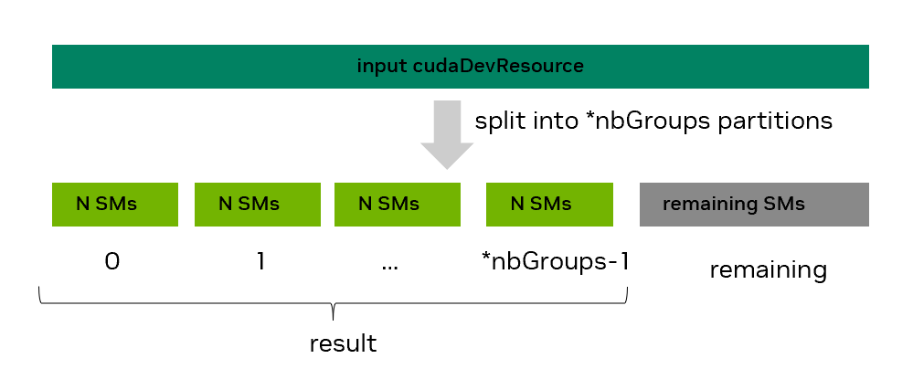

### [4.6.4.2. Step 2: Partition SM resources](https://docs.nvidia.com/cuda/cuda-programming-guide/04-special-topics#step-2-partition-sm-resources)[](https://docs.nvidia.com/cuda/cuda-programming-guide/04-special-topics/#step-2-partition-sm-resources "Permalink to this headline")

The second step in green context creation is to statically split the available `cudaDevResource` SM resources into one or more partitions, with potentially
some SMs left over in a *remaining* partition. This partitioning is possible using the  `cudaDevSmResourceSplitByCount()` or the `cudaDevSmResourceSplit()` API.
The `cudaDevSmResourceSplitByCount()` API can only create one or more _homogeneous_ partitions, plus a potential _remaining_ partition,
while the `cudaDevSmResourceSplit()` API can also create _heterogeneous_ partitions, plus the potential _remaining_ one.
The subsequent sections describe the functionality of both APIs in detail. Both APIs are only applicable to SM-type device resources.

**cudaDevSmResourceSplitByCount API**

The `cudaDevSmResourceSplitByCount` runtime API signature is:

```
cudaError_t cudaDevSmResourceSplitByCount(cudaDevResource* result, unsigned int* nbGroups, const cudaDevResource* input,
cudaDevResource* remaining, unsigned int useFlags, unsigned int minCount)
```

As [Figure 43](https://docs.nvidia.com/cuda/cuda-programming-guide/04-special-topics/#resource-split-by-count) highlights, the user requests to split the  `input` SM-type device resource into `*nbGroups` homogeneous groups with `minCount` SMs each.
However, the end result will contain a potentially updated `*nbGroups` number of homogeneous groups with `N` SMs each.
The potentially updated `*nbGroups` will be less than or equal to the originally requested group number, while `N` will be equal to or greater than `minCount`.
These adjustments may occur due to some granularity and alignment requirements, which are architecture specific.



Figure 43 SM resource split using the cudaDevSmResourceSplitByCount API[](https://docs.nvidia.com/cuda/cuda-programming-guide/04-special-topics/#resource-split-by-count "Link to this image")

[Table 30](https://docs.nvidia.com/cuda/cuda-programming-guide/05-appendices/compute-capabilities.html#compute-capabilities-table-device-and-streaming-multiprocessor-sm-information-per-compute-capability) lists the minimum SM partition size  and the SM co-scheduled
alignment for all the currently supported compute capabilities, for the default `useFlags=0` case.
One can also retrieve these values via the `minSmPartitionSize` and `smCoscheduledAlignment` fields of `cudaDevSmResource`, as shown in [Step 1: Get available GPU resources](https://docs.nvidia.com/cuda/cuda-programming-guide/04-special-topics/#green-contexts-creation-example-step1).
Some of these requirements can be lowered via a different `useFlags` value. [Table 14](https://docs.nvidia.com/cuda/cuda-programming-guide/04-special-topics/#split-functionality) provides some relevant examples highlighting
the difference between what is requested and the final result, along with an explanation. The table focuses on compute capability (CC 9.0),
where the minimum number of SMs per partition is 8 and the SM count has to be a multiple of 8, if `useFlags` is zero.

| `*nbGroups` | minCount | useFlags | `*nbGroups with N SMs` | Remaining SMs | Reason |
| --- | --- | --- | --- | --- | --- |
| 2 | 72 | 0 | 1 group of 72 SMs | 60 | cannot exceed 132 SMs |
| 6 | 11 | 0 | 6 groups of 16 SMs | 36 | multiple of 8 requirement |
| 6 | 11 | `CU_DEV_SM_RESOURCE_SPLIT_IGNORE_SM_COSCHEDULING` | 6 groups with 12 SMs each | 60 | lowered to multiple of 2 req. |
| 2 | 1 | 0 | 2 groups with 8 SMs each | 116 | min. 8 SMs requirement |

Here is a code snippet requesting to split the available SM resources into *five groups* of *8 SMs* each:

```c++
cudaDevResource avail_resources = {};
// Code that has populated avail_resources not shown

unsigned int min_SM_count = 8;
unsigned int actual_split_groups = 5; // may be updated

cudaDevResource actual_split_result[5] = {{}, {}, {}, {}, {}};
cudaDevResource remaining_partition = {};

CUDA_CHECK(cudaDevSmResourceSplitByCount(&actual_split_result[0],
                                         &actual_split_groups,
                                         &avail_resources,
                                         &remaining_partition,
                                         0 /*useFlags */,
                                         min_SM_count));

std::cout << "Split " << avail_resources.sm.smCount << " SMs into " << actual_split_groups << " groups " \
          << "with " << actual_split_result[0].sm.smCount << " each " \
          << "and a remaining group with " << remaining_partition.sm.smCount << " SMs" << std::endl;
```

Be aware that:

- one could use `result=nullptr` to query the number of groups that would be created
- one could set `remaining=nullptr`, if one does not care for the SMs of the remaining partition
- the *remaining* (leftover) partition does not have the same functional or performance guarantees as the homogeneous groups in *result*.
- `useFlags` is expected to be 0 in the default case, but values of `cudaDevSmResourceSplitIgnoreSmCoscheduling` and `cudaDevSmResourceSplitMaxPotentialClusterSize` are also supported
- any resulting `cudaDevResource` cannot be repartitioned without first creating a resource descriptor and a green context from it (i.e., steps 3 and 4 below)

Please refer to [cudaDevSmResourceSplitByCount](https://docs.nvidia.com/cuda/cuda-runtime-api/group__CUDART__EXECUTION__CONTEXT.html#group__CUDART__EXECUTION__CONTEXT_1g10ef763a79ff53245bec99b96a7abb73)  runtime API reference for more details.

**cudaDevSmResourceSplit API**

As mentioned earlier, a single `cudaDevSmResourceSplitByCount` API call can only create homogeneous partitions, i.e., partitions with the same number of SMs, plus the remaining partition.
This can be limiting for heterogeneous workloads, where work running on different green contexts has different SM count requirements.
To achieve heterogeneous partitions with the split-by-count API, one would usually need to re-partition an existing resource by repeating Steps 1-4 (multiple times). Or, in some cases, one may be able to create homogeneous partitions each with SM count equal to the GCD (greatest common divisor) of all the heterogeneous partitions as part of step-2 and then merge the required number of them together as part of step-3.
This last approach however is not recommended, as the CUDA driver may be able to create better partitions if larger sizes were requested up front.

The `cudaDevSmResourceSplit` API aims to address these limitations by allowing the user to create non-overlapping heterogeneous partitions in a single call.
The `cudaDevSmResourceSplit` runtime API signature is:

```
cudaError_t cudaDevSmResourceSplit(cudaDevResource* result, unsigned int nbGroups, const cudaDevResource* input,
cudaDevResource* remainder, unsigned int flags, cudaDevSmResourceGroupParams* groupParams)
```

This API will attempt to partition the `input` SM-type resource into `nbGroups` valid device resources (groups) placed in the `result` array based on the requirements specified for each one in the `groupParams` array. An optional remaining partition may also be created.
In a successful split, as shown in [Figure 44](https://docs.nvidia.com/cuda/cuda-programming-guide/04-special-topics/#resource-split), each resource in the `result` can have a different number of SMs, but never zero SMs.


Figure 44 SM resource split using the cudaDevSmResourceSplit API[](https://docs.nvidia.com/cuda/cuda-programming-guide/04-special-topics/#resource-split "Link to this image")

When requesting a heterogeneous split, one needs to specify the SM count (`smCount` field of  relevant `groupParams` entry) for each resource in `result`. This SM count should always be a multiple of two.
For the scenario in the previous image, `groupParams[0].smCount` would be `X`, `groupParams[1].smCount` `Y`, etc.
However, just specifying the SM count is not sufficient, if an application uses [Thread Block Clusters](https://docs.nvidia.com/cuda/cuda-programming-guide/01-introduction/programming-model.html#programming-model-thread-block-clusters).
Since all the thread blocks of a cluster are guaranteed to be co-scheduled, the user also needs to specify the maximum supported cluster size, if any, a given resource group should support. This is possible via the `coscheduledSmCount` field of the relevant `groupParams` entry.
For GPUs with compute capability 10.0 and on (CC 10.0+), clusters can also have a preferred dimension, which is a multiple of their default cluster dimension.
During a single kernel launch on supported systems, this larger preferred cluster dimension is used as much as possible, if at all, and the smaller default cluster dimension is used
otherwise. The user can express this preferred cluster dimension hint via the `preferredCoscheduledSmCount` field of the relevant `groupParams` entry.
Finally, there may be cases where the user may want to loosen the SM count requirements and pull in more available SMs in a given group; the user can express this backfill option by setting the `flags` field of the relevant `groupParams` entry to its non-default flag value.

To provide more flexibility, the `cudaDevSmResourceSplit` API also has a **discovery** mode, to be used when the exact SM count, for one or more groups, is not known ahead of time.
For example, a user may want to create a device resource that has as many SMs as possible, while meeting some co-scheduling requirements (e.g., allowing clusters of size four).
To exercise this discovery mode, the user can set the `smCount` field of the relevant `groupParams` entry (or entries) to zero.
After a successful `cudaDevSmResourceSplit` call, the `smCount` field of the `groupParams` will have been populated with a valid non-zero value; we refer to this as the **actual** `smCount` value.
If `result` was not null (so this was not a dry run), then the relevant group of `result` will also have its `smCount` set to the same value.
The order the `nbGroups` `groupParams` entries are specified matters,  as they are evaluated from left (index 0) to right (index nbGroups-1).

[Table 15](https://docs.nvidia.com/cuda/cuda-programming-guide/04-special-topics/#green-contexts-split-api-table) provides a high level view of the supported arguments for the `cudaDevSmResourceSplit` API.

| result | nbGroups | input | remainder | flags | smCount | coscheduledSmCount | preferredCoscheduledSmCount | flags |
| --- | --- | --- | --- | --- | --- | --- | --- | --- |
| nullptr for explorative dry run; not null ptr otherwise | number of groups | resource to split into nbGroups groups | nullptr if you do not want   a remainder group | 0 | 0 for discovery mode or other valid smCount | 0 (default) or valid coscheduled SM count | 0 (default) or valid preferred coscheduled SM count (hint) | 0 (default) or cudaDevSmResourceGroupBackfill |

Notes:

1. `cudaDevSmResourceSplit` API’s return value depends on `result`:

> - `result != nullptr`: the API will return `cudaSuccess` only when the split is successful and `nbGroups` valid `cudaDevResource` groups, meeting the specified requirements were created; otherwise, it will return an error. As different types of errors may return the same error code (e.g., `CUDA_ERROR_INVALID_RESOURCE_CONFIGURATION`), it is recommended to use the `CUDA_LOG_FILE` environment variable to get more informative error descriptions during development.
> - `result == nullptr`: the API may return `cudaSuccess` even if the resulting `smCount` of a group is zero, a case which would have returned an error with a non-nullptr `result`. Think of this mode as a dry-run test you can use while exploring what is supported, especially in *discovery* mode.

2. On a successful call with result != nullptr, the resulting `result[i]` device resource with i in `[0, nbGroups)` will be of type `cudaDevResourceTypeSm` and have a `result[i].sm.smCount` that will either be the non-zero user-specified `groupParams[i].smCount` value or the discovered one. In both cases, the `result[i].sm.smCount` will meet all the following constraints:

> - be a `multiple of 2` and
> - be in the `[2, input.sm.smCount]` range and
> - `(flags == 0) ? (multiple of actual group_params[i].coscheduledSmCount) : (>= groups_params[i].coscheduledSmCount)`

3. Specifying zero for any of the `coscheduledSmCount` and `preferredCoscheduledSmCount` fields indicates that the default values for these fields should be used; these can vary per GPU. These default values are both equal to the `smCoscheduledAlignment` of the SM resource retrieved via the `cudaDeviceGetDevResource` API for the given device (and not any SM resource). To review these default values, one can examine their updated values in the relevant `groupParams` entry after a successful `cudaDevSmResourceSplit` call with them initially set to 0; see below.

> ```c++
> int gpu_device_index = 0;
> cudaDevResource initial_GPU_SM_resources {};
> CUDA_CHECK(cudaDeviceGetDevResource(gpu_device_index, &initial_GPU_SM_resources, cudaDevResourceTypeSm));
> std::cout << "Default value will be equal to " << initial_GPU_SM_resources.sm.smCoscheduledAlignment << std::endl;
>
> int default_split_flags = 0;
> cudaDevSmResourceGroupParams group_params_tmp = {.smCount=0, .coscheduledSmCount=0, .preferredCoscheduledSmCount=0, .flags=0};
> CUDA_CHECK(cudaDevSmResourceSplit(nullptr, 1, &initial_GPU_SM_resources, nullptr /*remainder*/, default_split_flags, &group_params_tmp));
> std::cout << "coscheduledSmcount default value: " << group_params.coscheduledSmCount << std::endl;
> std::cout << "preferredCoscheduledSmcount default value: " << group_params.preferredCoscheduledSmCount << std::endl;
> ```

4. The remainder group, if present, will not have any constraints on its SM count or co-scheduling requirements. It will be up to the user to explore that.

Before providing more detailed information for the various `cudaDevSmResourceGroupParams` fields, [Table 16](https://docs.nvidia.com/cuda/cuda-programming-guide/04-special-topics/#green-contexts-split-api-use-cases-examples) shows what these values could be for some example use cases.
Assume an `initial_GPU_SM_resources` device resource has already been populated, as in the previous code snippet, and is the resource that will be split.
Every row in the table will have that same starting point.
For simplicity the table will only show the `nbGroups` value and the `groupParams` fields per use case that can be used in a code snippet like the one below.

```c++
int nbGroups = 2; // update as needed
unsigned int default_split_flags = 0;
cudaDevResource remainder {}; // update as needed
cudaDevResource result_use_case[2] = {{}, {}}; // Update depending on number of groups planned. Increase size if you plan to also use a workqueue resource
cudaDevSmResourceGroupParams group_params_use_case[2] = {{.smCount = X, .coscheduledSmCount=0, .preferredCoscheduledSmCount = 0, .flags = 0},
                                                         {.smCount = Y, .coscheduledSmCount=0, .preferredCoscheduledSmCount = 0, .flags = 0}}
CUDA_CHECK(cudaDevSmResourceSplit(&result_use_case[0], nbGroups, &initial_GPU_SM_resources, remainder, default_split_flags, &group_params_use_case[0]));
```

| # | Goal/Use Cases | nbGroups | remainder | smCount | coscheduledSmCount | preferredCoscheduledSmCount | flags |  |
| --- | --- | --- | --- | --- | --- | --- | --- | --- |
| 1 | Resource with 16 SMs. Do not care for remaining SMs. May use clusters. | 1 | nullptr | 16 | 0 | 0 | 0 | 0 |
|  |  |  |  |  |  |  |  |  |
| 2a | One resource with 16 SMs and one with everything else. Will not use clusters.   (Note: showing two options: in option (2a),the 2nd resource is the remainder; in option (2b), it is the result_use_case[1].) | 1 (2a) | not nullptr | 16 | 2 | 2 | 0 | 0 |
|  |  |  |  |  |  |  |  |  |
| 2b | 2 (2b) | nullptr | 16 | 2 | 2 | 0 | 0 |  |
| 0 | 2 | 2 | cudaDevSmResourceGroupBackfill | 1 |  |  |  |  |
|  |  |  |  |  |  |  |  |  |
|  |  |  |  |  |  |  |  |  |
| 3 | Two resources with 28 and 32 SMs respectively. Will use clusters of size 4. | 2 | nullptr | 28 | 4 | 4 | 0 | 0 |
| 32 | 4 | 4 | 0 | 1 |  |  |  |  |
|  |  |  |  |  |  |  |  |  |
|  |  |  |  |  |  |  |  |  |
| 4 | One resource with as many SMs as possible, which can run clusters of size 8, and one remainder. | 1 | not nullptr | 0 | 8 | 8 | 0 | 0 |
|  |  |  |  |  |  |  |  |  |
| 5 | One resource with as many SMs as possible, which can run clusters of size 4, and one with 8 SMs.   (Note: Order matters! Changing order of entries in groupParams array  could mean no SMs left for the 8-SM group) | 2 | nullptr | 8 | 2 | 2 | 0 | 0 |
| 0 | 4 | 4 | 0 | 1 |  |  |  |  |
|  |  |  |  |  |  |  |  |  |

**Detailed information about the various cudaDevSmResourceGroupParams struct fields**

`smCount`:

- Controls SM count for the corresponding group in result.
- **Values**:  0 (discovery mode) or valid non-zero value (non-discovery mode)
  - Valid non-zero `smCount` value requirements: `(multiple of 2) and in [2, input->sm.smCount] and ((flags == 0) ? multiple of actual coscheduledSmCount : greater than or equal to coscheduledSmCount)`
- **Use cases**: use discovery mode to explore what’s possible when SM count is not known/fixed; use non-discovery mode to request a specific number of SMs.
- Note: in discovery mode, actual SM count, after successful split call with non-nullptr result, will meet valid non-zero value requirements

`coscheduledSmCount`:

- Controls number of SMs grouped together (“co-scheduled”) to enable launch of different clusters on compute capability 9.0+. It can thus impact the number of SMs in a resulting group and the cluster sizes they can support.
- **Values**:  0 (default for current architecture) or  valid non-zero value
  - Valid non-zero value requirements: `(multiple of 2)` up to max limit
- **Use cases**: Use default or a manually chosen value for clusters, keeping in mind the max. portable cluster size on a given architecture. If your code does not use clusters, you can use the minimum supported value of 2 or the default value.
- Note: when the default value is used, the actual `coscheduledSmCount`, after a successful split call, will also meet valid non-zero value requirements. If flags is not zero, the resulting smCount will be >= coscheduledSmCount. Think of coscheduledSmCount as providing some guaranteed underlying “structure” to valid resulting groups (i.e., that group can run at least a single cluster of coscheduledSmCount size in the worst case). This type of structure guarantee does not apply to the remaining group; there it is up to the user to explore what cluster sizes can be launched.

`preferredCoscheduledSmCount`:

- Acts as a hint to the driver to try to merge groups of actual `coscheduledSmCount` SMs into larger groups of `preferredCoscheduledSmCount` if possible. Doing so can allow code to make use of preferred cluster dimensions feature available on devices with compute capability (CC) 10.0 and on). See [cudaLaunchAttributeValue::preferredClusterDim](https://docs.nvidia.com/cuda/cuda-runtime-api/unioncudaLaunchAttributeValue.html#unioncudaLaunchAttributeValue_1bf53f6cb9ba3e18833d99c51a2568df5).
- **Values**:  0 (default for current architecture) or  valid non-zero value
  - Valid non-zero value requirements: `(multiple of actual coscheduledSmCount)`
- **Use cases**: use a manually chosen value greater than 2 if you use preferred clusters and are on a device of compute capability 10.0 (Blackwell) or later. If you don’t use clusters, choose the same value as `coscheduledSmCount`: either select the minimum supported value of 2 or use 0 for both
- Note: when the default value is used, the actual `preferredCoscheduledSmCount`, after a successful split call, will also meet valid non-zero value requirement.

`flags`:

- Controls if the resulting SM count of a group will be a multiple of actual coscheduled SM count (default)  or if SMs can be backfilled into this group (backfill). In the backfill case, the resulting SM count (`result[i].sm.smCount`) will be greater than or equal to the specified `groupParams[i].smCount`.
- **Values**: 0 (default) or `cudaDevSmResourceGroupBackfill`
- **Use cases**: Use the zero (default), so the resulting group has the  guaranteed flexibility of supporting multiple clusters of coScheduledSmCount size. Use the backfill option, if you want to get as many SMs as possible in the group, with some of these SMs (the backfilled ones), not providing any coscheduling guarantee.
- Note: a group created with the backfill flag can still support clusters (e.g., it is guaranteed to support at least one coscheduledSmCount size).
