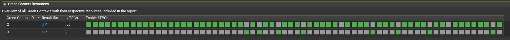

## [4.6.5. Green Contexts - Launching work](https://docs.nvidia.com/cuda/cuda-programming-guide/04-special-topics#green-contexts-launching-work)[](https://docs.nvidia.com/cuda/cuda-programming-guide/04-special-topics/#green-contexts-launching-work "Permalink to this headline")

To launch a kernel targeting a green context created using the prior steps, you first need to create a stream for that green context with the `cudaExecutionCtxStreamCreate` API.
Launching a kernel on that stream using `<<< >>>` or the `cudaLaunchKernel` API, will ensure that kernel can only use the resources (SMs, work queues) available to that stream via its execution context.
For example:

```c++
// Create green_ctx_stream CUDA stream for previously created green_ctx green context
cudaStream_t green_ctx_stream;
int priority = 0;
CUDA_CHECK(cudaExecutionCtxStreamCreate(&green_ctx_stream,
                                        green_ctx,
                                        cudaStreamDefault,
                                        priority));

// Kernel my_kernel will only use the resources (SMs, work queues, as applicable) available to green_ctx_stream's execution context
my_kernel<<<grid_dim, block_dim, 0, green_ctx_stream>>>();
CUDA_CHECK(cudaGetLastError());
```

The default stream creation flag passed to the stream creation API above is equivalent to `cudaStreamNonBlocking` given `green_ctx` is a green context.

**CUDA graphs**

For kernels launched as part of a CUDA graph (see [CUDA Graphs](https://docs.nvidia.com/cuda/cuda-programming-guide/04-special-topics/cuda-graphs.html#cuda-graphs)), there are a few more subtleties.
Unlike kernels, the CUDA stream a CUDA graph is launched on does **not** determine the SM resources used, as that stream is solely used for dependency tracking.

The execution context a kernel node (and other applicable node types) will execute on is set during node creation.
If the CUDA graph will be created using stream capture, then the execution context(s) of the stream(s) involved in the capture will determine the execution context(s) of the relevant graph nodes.
If the graph will be created using the graph APIs, then the user should explicitly set the execution context for each relevant node.
For example, to add a kernel node, the user should use the polymorphic  `cudaGraphAddNode` API with `cudaGraphNodeTypeKernel` type and explicitly specify the `.ctx` field of the
`cudaKernelNodeParamsV2` struct under `.kernel`. The `cudaGraphAddKernelNode` does not allow the user to specify an execution context and should thus be avoided.
Please note that it is possible for different graph nodes in a graph to belong to different execution contexts.

For verification purposes, one could use Nsight Systems in node tracing mode (`--cuda-graph-trace node`) to observe the green context(s) specific graph nodes will execute on.
Note that in the default _graph_ tracing mode, the entire graph will appear under the green context of the stream  it was launched on, but, as previously explained, this does not provide any information about the execution context(s) of the various graph nodes.

To verify programmatically, one could potentially use the CUDA driver API `cuGraphKernelNodeGetParams(graph_node, &node_params)` and compare the  `node_params.ctx` context handle field with the expected context handle for that graph node. Using the driver API is possible given `CUgraphNode` and `cudaGraphNode_t` can be used interchangeably, but the user would need to include the relevant `cuda.h` header
and link  with the driver directly (`-lcuda`).

**Thread Block Clusters**

Kernels with thread block clusters (see [Section 1.2.2.1.1](https://docs.nvidia.com/cuda/cuda-programming-guide/01-introduction/programming-model.html#programming-model-thread-block-clusters)) can also be launched on a green context stream, like any other kernel, and thus use that green context’s provisioned resources.
[Section 4.6.4.2](https://docs.nvidia.com/cuda/cuda-programming-guide/04-special-topics/#green-contexts-creation-example-step2) showed how to specify the number of SMs that need to be coscheduled when a device resource is split, to facilitate clusters.
But as with any kernel using clusters, the user should make use of the relevant occupancy APIs to determine the max potential cluster size for a kernel (via `cudaOccupancyMaxPotentialClusterSize`)
and, if needed, the maximum number of active clusters (`cudaOccupancyMaxActiveClusters`).
If the user specifies a green context stream as the `stream` field of the relevant `cudaLaunchConfig`, then
these occupancy APIs will take into consideration the SM resources provisioned for that green context.
This use case is especially relevant for libraries that may get a green context CUDA stream passed to them by the user, as well as in cases where the green context was created from a remaining device resource.

The code snippet below shows how these APIs can be used.

```c++
// Assume cudaStream_t gc_stream  has already been created and a __global__ void cluster_kernel exists.

// Uncomment to support non portable cluster size, if possible
// CUDA_CHECK(cudaFuncSetAttribute(cluster_kernel, cudaFuncAttributeNonPortableClusterSizeAllowed, 1))

cudaLaunchConfig_t config = {0};
config.gridDim          = grid_dim; // has to be a multiple of cluster dim.
config.blockDim         = block_dim;
config.dynamicSmemBytes = expected_dynamic_shared_mem;

cudaLaunchAttribute attribute[1];
attribute[0].id = cudaLaunchAttributeClusterDimension;
attribute[0].val.clusterDim.x = 1;
attribute[0].val.clusterDim.y = 1;
attribute[0].val.clusterDim.z = 1;
config.attrs = attribute;
config.numAttrs = 1;

config.stream=gc_stream; // Need to pass the CUDA stream that will be used for that kernel

int max_potential_cluster_size = 0;
// the next call will ignore cluster dims in launch config
CUDA_CHECK(cudaOccupancyMaxPotentialClusterSize(&max_potential_cluster_size, cluster_kernel, &config));
std::cout << "max potential cluster size is " << max_potential_cluster_size << " for CUDA stream gc_stream" << std::endl;

// Could choose to update launch config's clusterDim with max_potential_cluster_size.
// Doing so would result in a successful cudaLaunchKernelEx call for the same kernel and launch config.

int num_clusters= 0;
CUDA_CHECK(cudaOccupancyMaxActiveClusters(&num_clusters, cluster_kernel, &config));
std::cout << "Potential max. active clusters count is " << num_clusters << std::endl;
```

**Verify Green Contexts Use**

Beyond empirical observations of affected kernel execution times due to green context provisioning,
the user can leverage [Nsight Systems](https://developer.nvidia.com/nsight-systems) or [Nsight Compute](https://developer.nvidia.com/nsight-compute) CUDA developer tools to verify, to some extent, correct green contexts use.

For example, kernels launched on CUDA streams belonging to different green contexts will appear under different *Green Context* rows under the CUDA HW timeline section of an *Nsight Systems* report.
*Nsight Compute* provides a *Green Context Resources* overview in its Session page as well as updated *# SMs* under the *Launch Statistics* of the *Details* section.
The former provides a visual bitmask of provisioned resources. This is particularly useful if an application uses different green contexts, as the user can confirm expected overlap across
GCs (no overlap or expected non-zero overlap if SMs are oversubscribed).

[Figure 45](https://docs.nvidia.com/cuda/cuda-programming-guide/04-special-topics/#green-contexts-ncu-mask) depicts these resources for an example with two green contexts provisioned with 112 and 16 SMs respectively, with no SM overlap across them.
The provided view can help the user verify the provisioned SM resource count per green context. It also helps confirm that no SMs were oversubscribed, as
no box is marked green (provisioned for that GC) across both green contexts.



Figure 45 Green contexts resources section from Nsight Compute[](https://docs.nvidia.com/cuda/cuda-programming-guide/04-special-topics/#green-contexts-ncu-mask "Link to this image")

The *Launch Statistics* section also explicitly lists the number of SMs provisioned for this green context, which can thus be used by this kernel.
Please note that these are the SMs a given kernel can have access to during its execution, and not the actual number of SMs that kernel ran on. The same applies to the resources overview shown earlier.
The actual number of SMs used by the kernel can depend on various factors, including the kernel itself (launch geometry, etc.), other work running at the same time on the GPU, etc.
