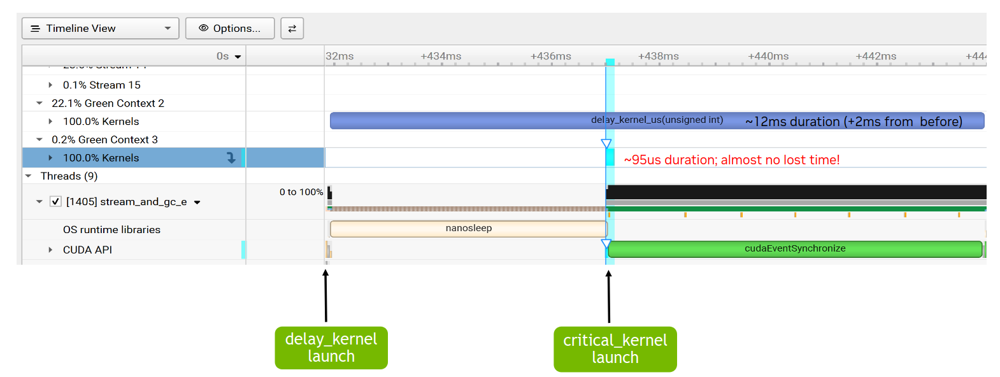

## [4.6.7. Green Contexts Example](https://docs.nvidia.com/cuda/cuda-programming-guide/04-special-topics#green-contexts-example)

This section illustrates how green contexts can enable critical work to start and complete sooner.
Similar to the scenario used in [Section 4.6.1](https://docs.nvidia.com/cuda/cuda-programming-guide/04-special-topics/#green-contexts-motivation), the application has two kernels that will run on two different non-blocking CUDA streams.
The timeline, from the CPU side, is as follows.
A long running kernel (*delay_kernel_us*), which takes multiple waves on the full GPU, is launched first on CUDA stream *strm1*. Then after a brief wait time (less than the kernel duration),
a shorter but critical kernel (*critical_kernel*) is launched on stream *strm2*.
The GPU durations and time from CPU launch to completion for both kernels are measured.

As a proxy for a long running kernel, a delay kernel is used where every thread block runs for a fixed number of microseconds and the number of thread blocks exceeds the GPU’s available SMs.

Initially, no green contexts are used, but the critical kernel is launched on a CUDA stream with a higher priority than the long running kernel.
Because of its high priority stream, the critical kernel can start executing as soon as some of the thread blocks of the long running kernel complete. However, it will still need to
wait for some potentially long-running thread blocks to complete, which will delay its execution start.

[Figure 46](https://docs.nvidia.com/cuda/cuda-programming-guide/04-special-topics/#green-contexts-nsys-example-no-gcs-with-prio) shows this scenario in an Nsight Systems report.
The long running kernel is launched on stream 13, while the short but critical kernel is launched on  stream 14, which has higher stream priority.
As highlighted on the image, the critical kernel waits for 0.9ms (in this case) before it can start executing. If the two streams had identical priorities, the critical kernel would execute much later.

Figure 46 Nsight Systems timeline without green contexts

To leverage the green contexts feature, two green contexts are created, each provisioned with a distinct non-overlapping set of SMs.
The exact SM split in this case for an H100 with 132 SMs was chosen, for illustration purposes, as 16 SMs for the critical kernel (Green Context 3) and 112 SMs for the long running kernel (Green Context 2).
As [Figure 47](https://docs.nvidia.com/cuda/cuda-programming-guide/04-special-topics/#green-contexts-nsys-example-w-gcs) shows, the critical kernel can now start almost instantaneously, as there are SMs only Green Context 3 can use.

The duration of the short kernel may increase, compared to its duration when running in isolation, as there is now a limit on the number of SMs it can use.
The same is also the case for the long running kernel, which can no longer use all the SMs of the GPU, but is constrained by its green context’s provisioned resources.
However, the key result is that the critical kernel work can now start and complete significantly sooner than before.
That is barring any other limitations, as parallel execution, as mentioned earlier, cannot be guaranteed.

Figure 47 Nsight Systems timeline with green contexts

In all cases, the exact SM split should be decided on a per case basis after experimentation.
