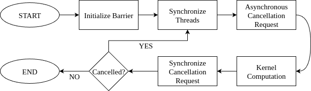

# [4.12. Work Stealing with Cluster Launch Control](https://docs.nvidia.com/cuda/cuda-programming-guide/04-special-topics#work-stealing-with-cluster-launch-control)

Dealing with problems of variable data and computation sizes is essential when developing CUDA applications. Traditionally, CUDA developers have used two main approaches to determine the number of kernel thread blocks to launch: _fixed work per thread block_ and _fixed number of thread blocks_. Both approaches have their advantages and disadvantages.

**Fixed Work per Thread Block:** In this approach, the number of thread blocks is determined by the problem size, while the amount of work done by each thread block remains constant.

Key advantages of this approach:

- _Load balancing between SMs_

When thread block run-times exhibit variability
and/or when the number of thread blocks is much larger than what
the GPU can execute simultaneously (resulting in a low-tail effect),
this approach allows the GPU scheduler to run more thread blocks
on some SMs than others.
- _Preemption_

The GPU scheduler can start executing a
[higher-priority kernel](https://docs.nvidia.com/cuda/cuda-programming-guide/02-basics/asynchronous-execution.html#async-execution-stream-priorities),
even if it is launched after a lower-priority kernel has
already begun executing, by scheduling its thread blocks
as thread blocks of the lower-priority kernel complete.
It can then resume execution of the lower-priority kernel once the higher-priority
kernel has finished executing.

**Fixed Number of Thread Blocks:** In this approach, often
implemented as a block-stride or grid-stride loop,
the number of thread blocks does not depend
on the problem size. Instead, the amount of work done by each thread block
is a function of the problem size. Typically, the number of thread blocks is
based on the number of SMs on the GPU where the kernel is executed
and the desired occupancy.

Key advantages of this approach:

- _Reduced thread block overheads_

This approach not only reduces amortized thread block launch latency
but also minimizes the computational overhead associated with shared
operations across all thread blocks.
These overheads can be significantly higher than launch latency overheads.

For example, in convolution kernels, a prologue for calculating
convolution coefficients – independent of the thread block index –
can be computed fewer times due to the fixed number of thread blocks,
thus reducing redundant computations.

**Cluster Launch Control** is a feature introduced in the NVIDIA Blackwell GPU architecture (compute capability 10.0) that aims to combine the benefits of the previous two approaches. It provides developers with more control over thread block scheduling by allowing them to cancel thread blocks or thread block clusters.
This mechanism enables work stealing. Work stealing is a dynamic load-balancing technique in parallel computing
where idle processors actively “steal” tasks from the work queues of busy
processors, rather than wait for work to be assigned.

Figure 51 Cluster Launch Control Flow

With cluster launch control, a thread block attempts to cancel the launch of
another thread block that has not started executing yet. If the cancellation request
succeeds, it “steals” the other thread block’s work by using its
index to perform the task. The cancellation will fail if there are no more
thread block indices available or for other reasons, such as a
higher-priority kernel being scheduled. In the latter case, if a thread block
exits after a cancellation failure, the scheduler can start executing the
higher-priority kernel, after which it will continue scheduling the remaining
thread blocks of the current kernel for execution. The
[figure](https://docs.nvidia.com/cuda/cuda-programming-guide/04-special-topics/#cluster-launch-control-diagram) above presents the execution
flow of this procedure.

The table below summarizes advantages and disadvantages of the three
approaches:

|  | **Fixed Work per Thread Block** | **Fixed Number of Thread Blocks** | **Cluster Launch Control** |
| --- | --- | --- | --- |
| Reduced overheads | **\(\(\textcolor{red}{\textbf{X}}\)\)** | **\(\(\textcolor{lime}{\textbf{V}}\)\)** | **\(\(\textcolor{lime}{\textbf{V}}\)\)** |
| Preemption | **\(\(\textcolor{lime}{\textbf{V}}\)\)** | **\(\(\textcolor{red}{\textbf{X}}\)\)** | **\(\(\textcolor{lime}{\textbf{V}}\)\)** |
| Load balancing | **\(\(\textcolor{lime}{\textbf{V}}\)\)** | **\(\(\textcolor{red}{\textbf{X}}\)\)** | **\(\(\textcolor{lime}{\textbf{V}}\)\)** |
