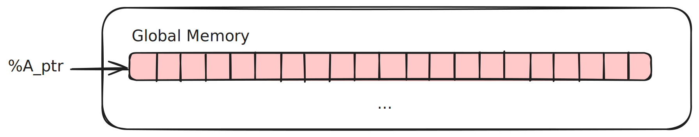
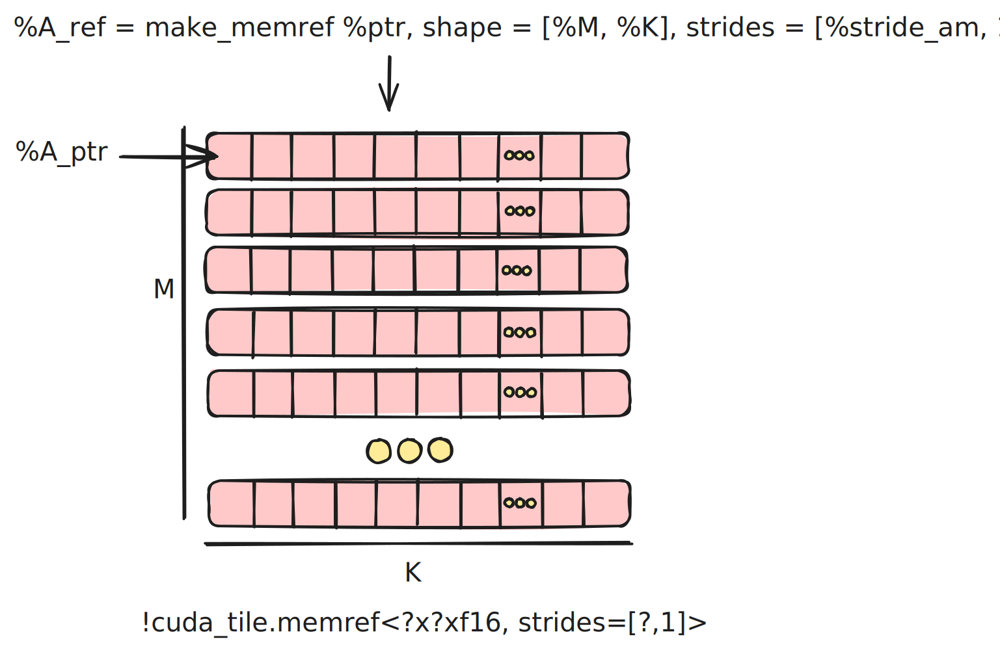

## [2.3. Structured Pointers](https://docs.nvidia.com/cuda/tile-ir/latest/sections#structured-pointers)

The previous examples have looked at how to define matrix multiplication using tensors of pointers and
scatter/gather style loads and stores, which take arbitrary tensors of pointers to operate on. These operations
give maximal expressivity to programmers but at the cost of potential performance.

These are valuable to understand; as we saw in the last section, you can build arbitrary tensors
of pointers then load and store to them flexibly.

For example, if a user created a complete disjoint tensor of pointers, it is challenging for a human or a
compiler to obtain meaningful performance from this program. In the worst case, each element will become
a completely disjoint memory operation, preventing vectorized or tensorized operations, or code which makes
use of cache or thread locality

This flexibility comes at a cost in both requiring more setup and manual computation to implement even relatively simple
algorithms like a tiled GEMM, and the potential of being inefficient. Due to the fact that load/store take arbitrary tensors
in the degenerate case it is quite possible that they get decomposed into a sequence of arbitrary loads and stores, which
do not make good use of memory locality or the underlying hardware.

**Tile IR** will do its best to obtain good performance with these stores, but optimal performance can more easily be achieved
by using a structured pointer, called a `tensor view` in **Tile IR**. tensor views allow us to simplify the programming model
of **Tile IR** and to improve the efficiency of user programs.

As we have seen in our previous examples, when a kernel is given a tensor it is a scalar base pointer
into global memory.

The base pointer to A points to an allocation that lives in global memory.

By formulating our previous problem with the correct sizes, we completely side stepped the complex
offset computation, and avoided dealing with imperfect tiling, or store/load masking.
See XX for more details about masking.

When constructing a `tensor view` we convert the raw pointer into a tensor using static or dynamic
shape and stride information.

In order to both simplify the programming model of **Tile IR** and to improve the efficiency of user programs
**Tile IR** also has a structured pointer type known as a *tensor view*. A *tensor view* can be constructed from raw
pointers via [cuda_tile.make_tensor_view](https://docs.nvidia.com/cuda/tile-ir/latest/sections/operations.html#op-cuda-tile-make-tensor-view) and attaches shape and stride information to the pointer and
effectively represents a typed pointer to a tensor.

When constructing a *tensor view*, we convert the raw pointer into a tensor using static or dynamic
shape and stride information, which is done via [cuda_tile.make_tensor_view](https://docs.nvidia.com/cuda/tile-ir/latest/sections/operations.html#op-cuda-tile-make-tensor-view). This op attaches shape and stride information to the pointer and
effectively converts a typed pointer to a tensor.

The base pointer to A points to an allocation that lives in global memory.

Structured pointers, or tensor views, encapsulate shape and stride information, enabling the compiler to optimize memory access and
simplifying the user’s code.
