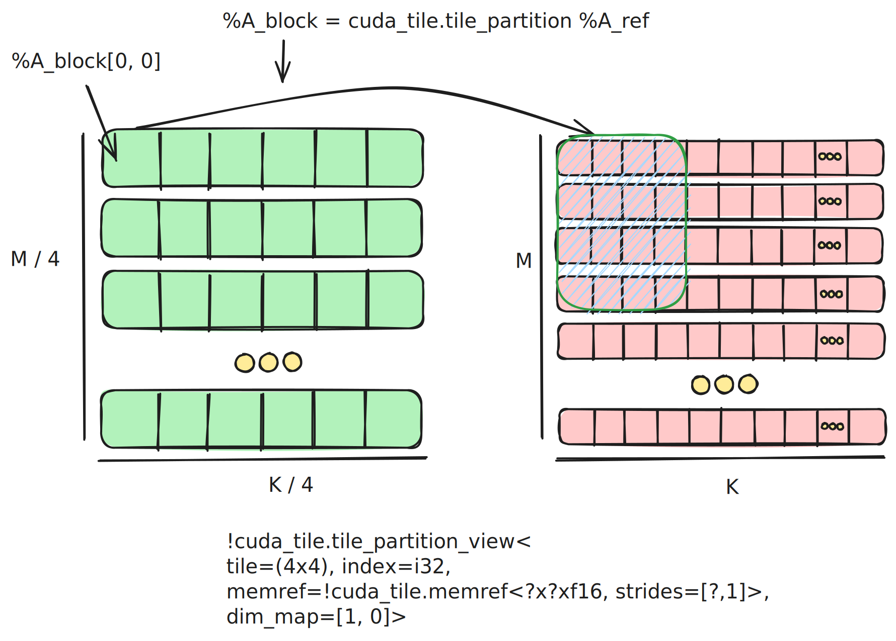

## [2.4. Tiling & Views](https://docs.nvidia.com/cuda/tile-ir/latest/sections#tiling-views)

Once you have constructed a tensor view, we can make use of [cuda_tile.make_partition_view](https://docs.nvidia.com/cuda/tile-ir/latest/sections/operations.html#op-cuda-tile-make-partition-view) to perform
tiling of the underlying tensor.

The base pointer to A points to an allocation that lives in global memory.

In the last section we simplified the problem by choosing tile dimensions that made the
problem perfectly square, in the same layout, using simple tiling and static input dimensions, etc.
We will relax those constraints to show more complex tile mappings as we explore views and partitions.
