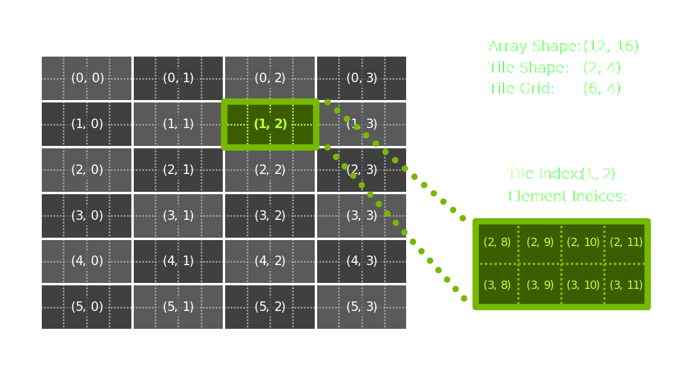
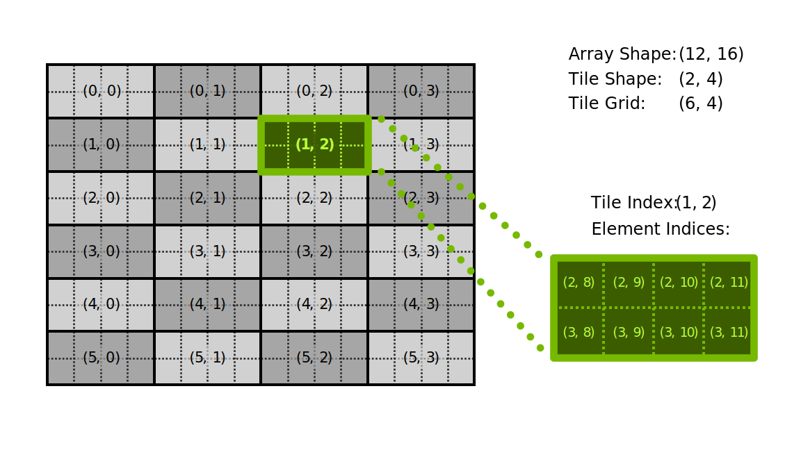
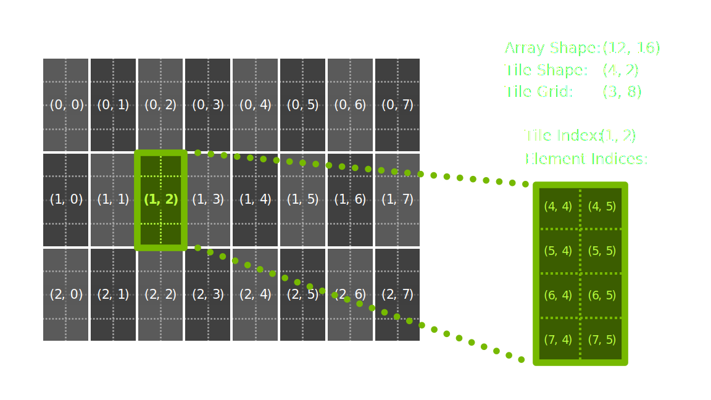
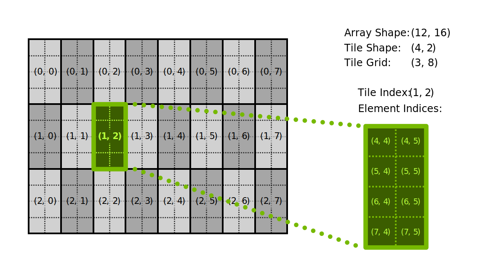

## [Element & Tile Space](https://docs.nvidia.com/cuda/cutile-python#element-tile-space)

The _element space_ of an array is the multidimensional space of elements contained in that array,
stored in memory according to a certain layout (row major, column major, etc).

The _tile space_ of an array is the multidimensional space of tiles into that array of a certain
tile shape.
A tile index `(i, j, ...)` with shape `S` refers to the elements of the array that belong to the
`(i+1)`-th, `(j+1)`-th, … tile.

When accessing the elements of an array using tile indices, the multidimensional memory layout of the array is used.
To access the tile space with a different memory layout, use the *order* parameter of load/store operations.
