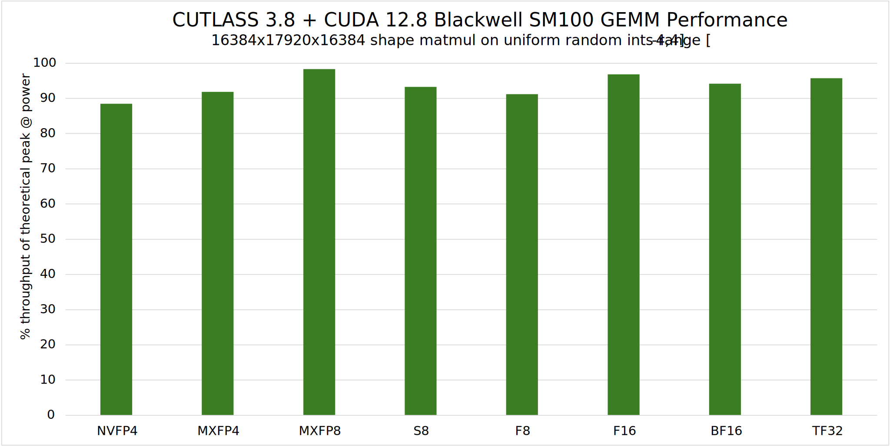
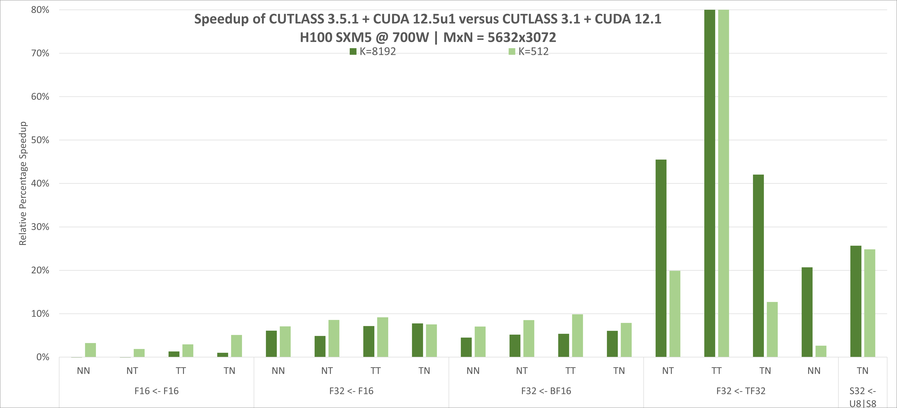
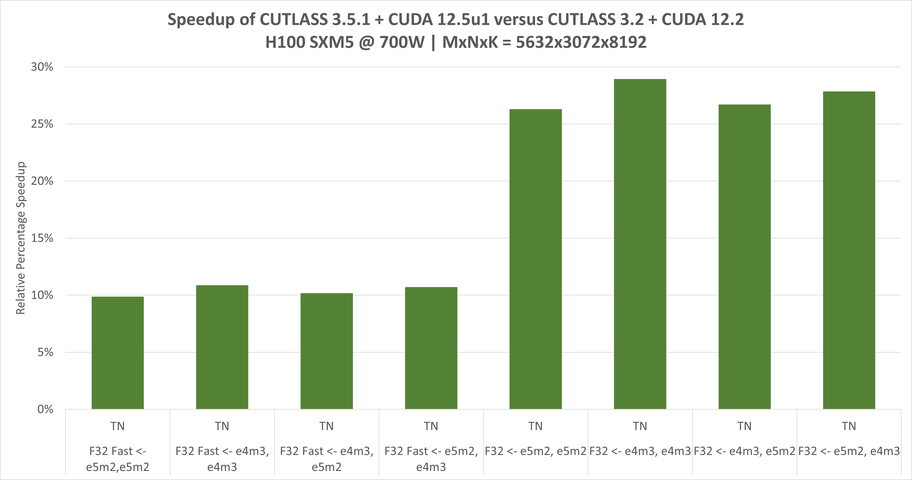

# [Performance](https://docs.nvidia.com/cutlass/latest#performance)

CUTLASS primitives are very efficient.  When used to construct device-wide GEMM kernels,
they exhibit nearly optimal utilization of peak theoretical throughput. The figure below
shows CUTLASS 3.8’s performance as a % of theoretical peak utilization
on various input and output data types when run on NVIDIA Blackwell SM100 architecture GPU.

The two figures below show the continual CUTLASS performance improvements
on an [NVIDIA H100](https://www.nvidia.com/en-us/data-center/h100/) (NVIDIA Hopper architecture) since
CUTLASS 3.1.
CUTLASS 3.5.1 was compiled with the [CUDA 12.5u1 Toolkit](https://developer.nvidia.com/cuda-downloads).
Tensor Core operations are implemented using CUDA’s
[mma](https://docs.nvidia.com/cuda/parallel-thread-execution/index.html#warp-level-matrix-instructions-mma) and
[wgmma](https://docs.nvidia.com/cuda/parallel-thread-execution/index.html#asynchronous-warpgroup-level-matrix-instructions) instructions.

