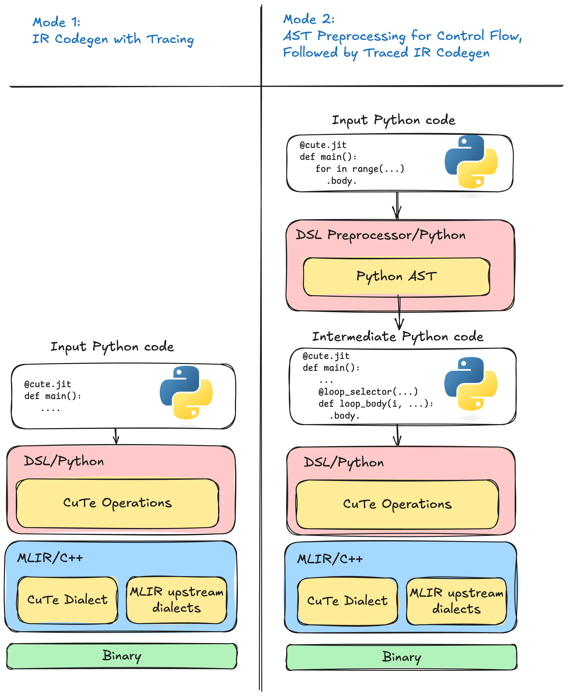

## [2. CuTe DSL Compilation Flow: Meta-Stage to Object-Stage](https://docs.nvidia.com/cutlass/latest/media/docs/pythonDSL/cute_dsl_general#dsl-compilation-flow-meta-stage-to-object-stage)

CuTe DSL bridges Python and GPU hardware through a three-stage pipeline.

Figure 1 _Left_: tracing mode records only the path that executed.
_Right_: preprocessor mode emits structured intermediate representation (IR) for every branch and loop
before tracing the arithmetic.

The default CuTe DSL compilation pipeline (mode 2): Python source flows through AST preprocessing
and interpreter-driven tracing to produce intermediate representation (IR), which is then lowered and
compiled to device code.

**Stage 1: Pre-Staging (Python AST)**

Before any code executes, the AST preprocessor rewrites the decorated function.
It inserts _callbacks_ around control-flow constructs—loops, branches, and
function boundaries—so that program structure is captured explicitly rather than
lost during execution.

**Stage 2: Meta-Stage (Python Interpreter)**

The rewritten function runs in the Python interpreter with proxy tensor
arguments.  As execution proceeds:

- Callbacks fire at control-flow boundaries, emitting structured intermediate representation (IR) (loops,
branches, etc.).
- Tensor operations are traced: each operator invocation records the
corresponding operation.
- Compile-time constants are _partially evaluated_—values known at JIT time
fold directly into the intermediate representation (IR), enabling aggressive specialization.

The result is a complete representation of the kernel, with both high-level
structure and low-level arithmetic intact.

**Stage 3: Object-Stage (Compiler Backend)**

The internal representation passes through a lowering pipeline:

1. High-level operations are progressively lowered toward hardware-specific
representations.
2. Optimization passes (tiling, vectorization, memory promotion) reshape the
code for the target architecture.
3. The final code is translated to PTX/SASS (for NVIDIA GPUs) and assembled
into a device binary.

At runtime, the compiled kernel is loaded and launched on the accelerator.
