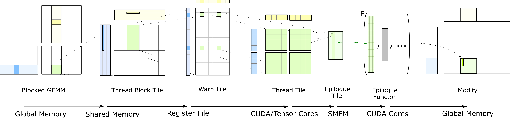

## [Hierarchical Structure](https://docs.nvidia.com/cutlass/latest/media/docs/cpp#hierarchical-structure)[](https://docs.nvidia.com/cutlass/latest/media/docs/cpp/#hierarchical-structure "Permalink to this headline")

The basic triple loop nest computing matrix multiply may be blocked and tiled to match
concurrency in hardware, memory locality, and parallel programming models. In CUTLASS,
GEMM is mapped to NVIDIA GPUs with the structure illustrated by the following loop nest.

```c++
for (int cta_n = 0; cta_n < GemmN; cta_n += CtaTileN) {                     // for each threadblock_y           } threadblock-level concurrency
  for (int cta_m = 0; cta_m < GemmM; cta_m += CtaTileM) {                   //    for each threadblock_x        }

    for (int cta_k = 0; cta_k < GemmK; cta_k += CtaTileK) {                 //       "GEMM mainloop" - no unrolling
                                                                            //                       - one iteration of this loop is one "stage"
                                                                            //
      for (int warp_n = 0; warp_n < CtaTileN; warp_n += WarpTileN) {        // for each warp_y                  } warp-level parallelism
        for (int warp_m = 0; warp_m < CtaTileM; warp_m += WarpTileM) {      //    for each warp_x               }
                                                                            //
          for (int warp_k = 0; warp_k < CtaTileK; warp_k += WarpTileK) {         //       fully unroll across CtaTileK
                                                                            //         - one iteration of this loop is one "k Group"
                                                                            //
            for (int mma_k = 0; mma_k < WarpTileK; mma_k += MmaK) {         // for each mma instruction         } instruction-level parallelism
              for (int mma_n = 0; mma_n < WarpTileN; mma_n += MmaN) {       //    for each mma instruction      }
                for (int mma_m = 0; mma_m < WarpTileM; mma_m += MmaM) {     //        for each mma instruction  }
                                                                            //
                  mma_instruction(d, a, b, c);                              //            TensorCore matrix computation

                }   // for mma_m
              }   // for mma_n
            }   // for mma_k

          }   // for warp_k
        }   // for warp_m
      }   // for warp_n

    }   // for cta_k
  }   // for cta_m
}   // for cta_n
```

This tiled loop nest targets concurrency among

- threadblocks,
- warps, and
- CUDA and Tensor Cores.

It takes advantage of memory locality within

- shared memory and
- registers.

The figure below illustrates the flow of data within this structure.
This is the hierarchical GEMM computation embodied by CUTLASS. Each stage depicts a
nested level of tiling which corresponds to a layer of concurrency within the CUDA execution model and to a
level within the memory hierarchy, becoming increasingly finer moving left to right.


