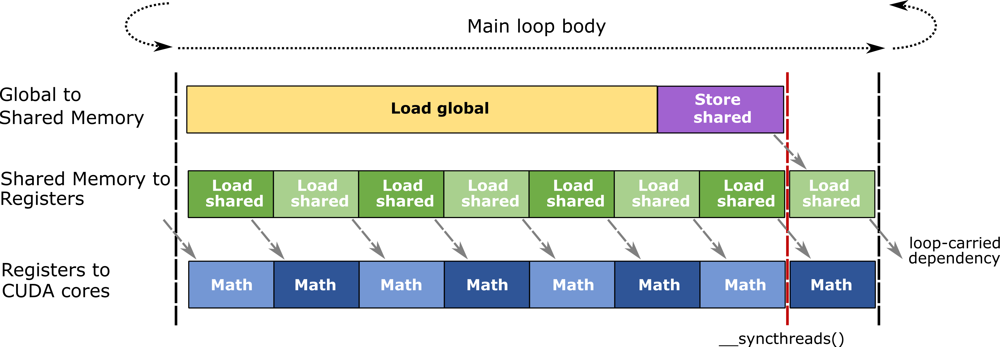

### [Pipelining](https://docs.nvidia.com/cutlass/latest/media/docs/cpp#pipelining)

The blocked structure demands a large storage allocation within the registers of each CUDA thread. The
accumulator elements typically occupy at least half a thread’s total register budget. Consequently,
occupancy – the number of concurrent threads, warps, and threadblocks – is relatively low compared
to other classes of GPU workloads. This limits the GPU’s ability to hide memory latency and other stalls
by context switching to other concurrent threads within an SM.

To mitigate the effects of memory latency, CUTLASS uses _software pipelining_ to overlap memory accesses
with other computation within a thread. CUTLASS accomplishes this by double buffering at the
following scopes.

- **Threadblock-scoped shared memory tiles:** two tiles are allocated in shared memory.
One is used to load data for the current matrix operation,
while the other tile is used to buffer data loaded from global memory
for the next mainloop iteration.
- **Warp-scoped matrix fragments:** two fragments are allocated within registers.
One fragment is passed to CUDA and TensorCores during the current matrix computation,
while the other is used to receive shared memory fetch returns
for the next warp-level matrix operation.

The following diagram illustrates the efficient, pipelined mainloop body used in CUTLASS GEMMs.

