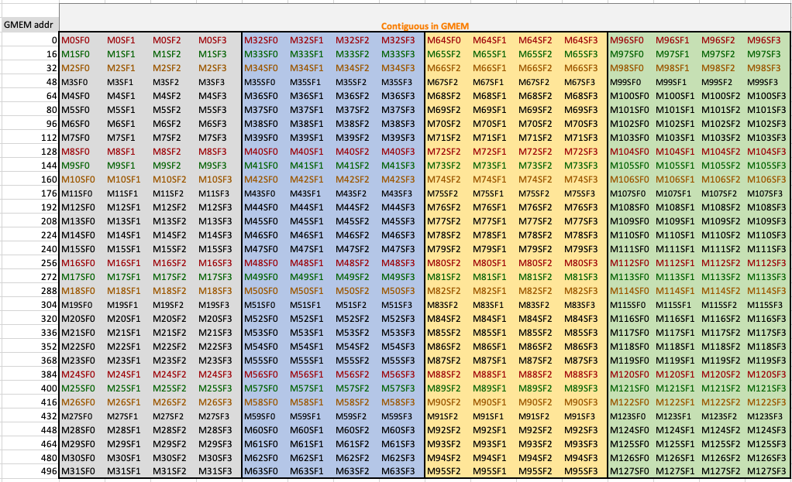
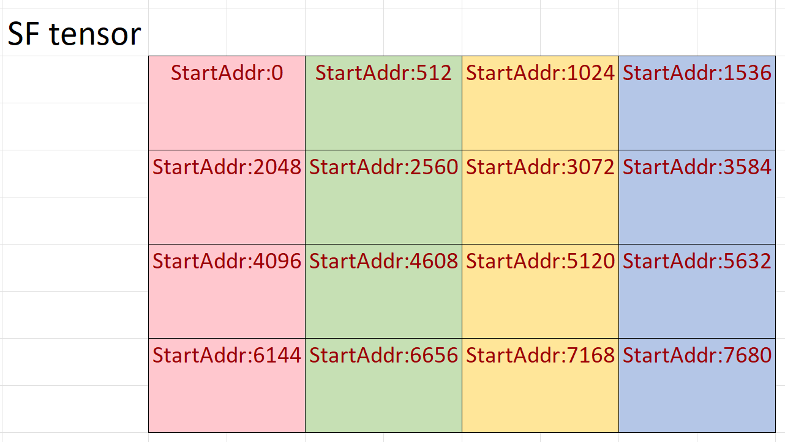

### [Scale Factor Layouts](https://docs.nvidia.com/cutlass/latest/media/docs/cpp#scale-factor-layouts)[](https://docs.nvidia.com/cutlass/latest/media/docs/cpp/#scale-factor-layouts "Permalink to this headline")

The scale factor layout consists of a 512B basic-block structure, as illustrated in the diagram below. Each block contains 128 M/N dimension and 4 scale factors (SF) along the K dimension.
The byte order of the basic storage chunk is row-major, meaning that M0SF0 to M0SF3, M32SF0 to M32SF3, M64SF0 to M64SF3, and M96SF0 to M96SF3 are stored consecutively in GMEM.



If the scale factor tensor exceeds M128xSF4, it indicates that there are multiple basic blocks along both the M and SFK dimensions. The arrangement of these basic blocks follows a K-major order. Here is a diagram illustrating the scenario where M equals 512 and the SFK is 16.



The creation of scale factor tensors’ layouts are tedious. CUTLASS provides `Sm1xxBlockScaledConfig` to create these layouts easily
(See [sm100_blockscaled_layout.hpp](https://github.com/NVIDIA/cutlass/tree/main/include/cutlass/detail/sm100_blockscaled_layout.hpp)).
The interface to create SFA and SFB tensor layouts is as follows:

```cpp
auto problem_shape = make_shape(M, N, K, L);
using SfConfig = Sm1xxBlockScaledConfig<SFVecSize>;

// SFA shape: ((32,4), ceil(M/128)), ((SFVecSize,4), ceil(K/4), L)
auto layout_sfa = SfConfig::tile_atom_to_shape_SFA(problem_shape);
// SFB shape: ((32,4), ceil(N/128)), ((SFVecSize,4), ceil(K/4), L)
auto layout_sfb = SfConfig::tile_atom_to_shape_SFB(problem_shape);

auto tensor_sfa = make_tensor(aptr, layout_sfa);
auto tensor_sfb = make_tensor(bptr, layout_sfb);
// Access SF for for element m,k of A tensor
auto val_a_mk = tensor_sfa(make_coord(m,k,0));
```
