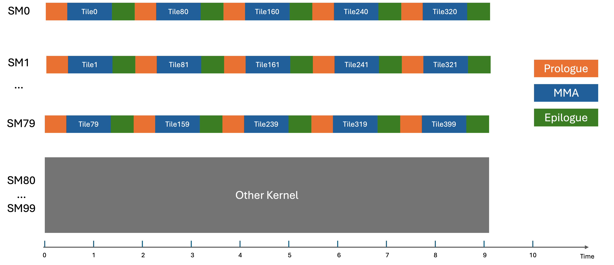

## [Overview](https://docs.nvidia.com/cutlass/latest/media/docs/cpp#overview)

A GEMM workload usually consists of three phases: prologue, mainloop and epilogue. Each SM will process multiple output tiles in series if the number of output tiles are much more than the number of SMs, completely exposing the overhead of prologue and epilogue.

Consider a GEMM that has `20x20x1` output tiles, running on a GPU with `100` SMs. There is another kernel occupying all the resources of `20` SMs so only `80` SMs can be used. Assume cluster shape is `1x1x1`. The following diagram shows how the schedule would look like for such a kernel.

