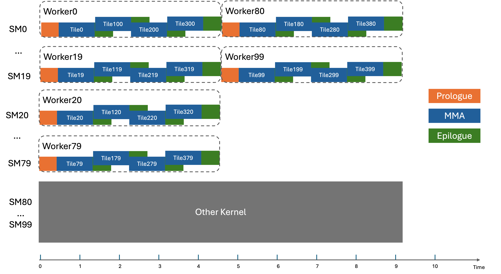

### [Static Scheduler](https://docs.nvidia.com/cutlass/latest/media/docs/cpp#static-scheduler)

CUTLASS has adopted a software technique named **persistent kernels**. Persistent clusters, or Workers, can stay on the GPU throughout kernel execution and process multiple tiles, hiding prologue and epilogue costs. The tile scheduler statically determines the next output tile to process with zero overhead.

However, static scheduler is susceptible to workload imbalance if the resources of some SMs are unavailable. The following diagram illustrates this issue.

