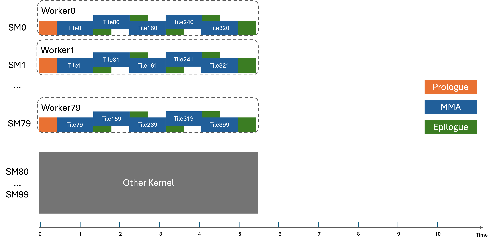

### [Dynamic Scheduler with Cluster Launch Control](https://docs.nvidia.com/cutlass/latest/media/docs/cpp#dynamic-scheduler-with-cluster-launch-control)

A fundamental limitation of persistent scheduling is that the number of SMs this kernel can utilize is unknown in real time. Some SMs might be occupied by another kernel and thus their resources are unavailable. This makes it challenging to load-balance work across SMs.

Blackwell introduces cluster launch control (CLC) for dynamic scheduling. (See https://docs.nvidia.com/cuda/parallel-thread-execution).  With this feature, the kernel launches a grid containing as many threadblocks as there are output tiles to compute in the kernel – just like one would in a non-persistent kernel. Here we define `ClcID` to be a coordinate from the 3D grid launched on GPU.

Cluster launch control follows the below rules:

1. A `ClcID` will be launched as a Worker when there are available resources.
2. A `ClcID` can be queried by an existing Worker via `clusterlaunchcontrol.try_cancel` instruction.
3. Every `ClcID` is guaranteed to be processed by either (1) or (2).
4. Each worker uses the `{blockIdx.x, blockIdx.y, blockIdx.z}` coordinate as the first output tile to process and uses the CLC query for subsequent processing of output tiles.
5. `clusterlaunchcontrol.try_cancel` instruction returns either a success signal with a `ClcID` or a decline signal. The most common reason of a decline is that all `ClcID`s have been processed.
6. Cluster launch control works on the granularity of clusters. For example, a 2x2 persistent worker cluster’s query will consume 2x2 `ClcID`s at once.

The following diagram shows how the schedule would look like with cluster launch control.

