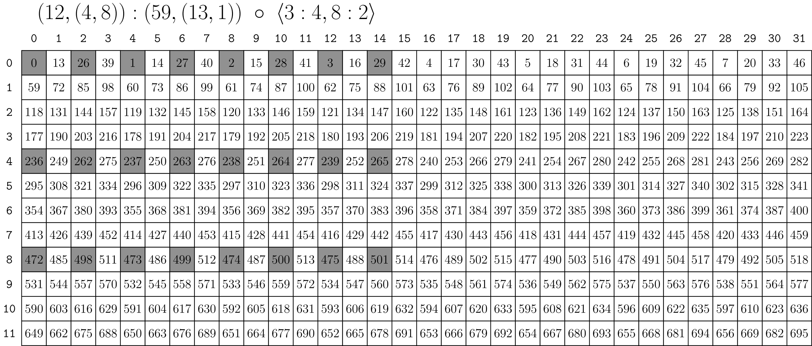

### [By-mode Composition](https://docs.nvidia.com/cutlass/latest/media/docs/cpp/cute#by-mode-composition)[](https://docs.nvidia.com/cutlass/latest/media/docs/cpp/cute/#by-mode-composition "Permalink to this headline")

Similar to by-mode `coalesce` and building up to a generic tiling operation, sometimes we do care about the shape of the `A` layout and would still like to apply `composition` to individual modes. For example, I have a 2-D `Layout` and would like some sublayout of the elements down the columns and another sublayout of elements across the rows.

For this reason, `composition` also works when its second parameter – the `B` – is a `Tiler`. In general, a tiler is a layout or a tuple-of-layouts (note the generalization on `IntTuple`), which can be used as follows

```cpp
// (12,(4,8)):(59,(13,1))
auto a = make_layout(make_shape (12,make_shape ( 4,8)),
                     make_stride(59,make_stride(13,1)));
// <3:4, 8:2>
auto tiler = make_tile(Layout<_3,_4>{},  // Apply 3:4 to mode-0
                       Layout<_8,_2>{}); // Apply 8:2 to mode-1

// (_3,(2,4)):(236,(26,1))
auto result = composition(a, tiler);
// Identical to
auto same_r = make_layout(composition(layout<0>(a), get<0>(tiler)),
                          composition(layout<1>(a), get<1>(tiler)));
```

We often use the `<LayoutA, LayoutB, ...>` notation to distinguish `Tiler`s from the concatenation-of-sublayouts notation `(LayoutA, LayoutB, ...)` that we used previously.

The `result` in the above code can be depicted as the 3x8 sublayout of the original layout highlighted in the figure below.


For convenience, CuTe also interprets `Shape`s as a tiler as well. A `Shape` is interpreted as tuple-of-layouts-with-stride-1:

```cpp
// (12,(4,8)):(59,(13,1))
auto a = make_layout(make_shape (12,make_shape ( 4,8)),
                     make_stride(59,make_stride(13,1)));
// (3, 8)
auto tiler = make_shape(Int<3>{}, Int<8>{});
// Equivalent to <3:1, 8:1>
// auto tiler = make_tile(Layout<_3,_1>{},  // Apply 3:1 to mode-0
//                        Layout<_8,_1>{}); // Apply 8:1 to mode-1

// (_3,(4,2)):(59,(13,1))
auto result = composition(a, tiler);
```

where `result` can be depicted as the 3x8 sublayout of the original layout highlighted in the figure below.

