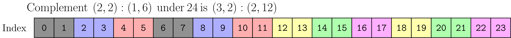

### [Complement Examples](https://docs.nvidia.com/cutlass/latest/media/docs/cpp/cute#complement-examples)

`complement` is most effective on static shapes and strides, so consider all integers below to be static. Similar examples for dynamic shapes and strides as well as IntTuple `cotarget` can be found in [the unit test](https://github.com/NVIDIA/cutlass/tree/main/test/unit/cute/core/complement.cpp).

- `complement(4:1, 24)` is `6:4`. Note that `(4,6):(1,4)` has cosize `24`. The layout `4:1` is effectively repeated 6 times with `6:4`.
- `complement(6:4, 24)` is `4:1`. Note that `(6,4):(4,1)` has cosize `24`. The “hole” in `6:4` is filled with `4:1`.
- `complement((4,6):(1,4), 24)` is `1:0`. Nothing needs to be appended.
- `complement(4:2, 24)` is `(2,3):(1,8)`. Note that `(4,(2,3)):(2,(1,8))` has cosize `24`. The “hole” in `4:2` is filled with `2:1` first, then everything is repeated 3 times with `3:8`.
- `complement((2,4):(1,6), 24)` is `3:2`. Note that `((2,4),3):((1,6),2)` has cosize `24` and produces unique indices.
- `complement((2,2):(1,6), 24)` is `(3,2):(2,12)`. Note that `((2,2),(3,2)):((1,6),(2,12))` has cosize `24` and produces unique indices.

As a visualization, the above figure depicts the codomain of the last example. The image of the original layout `(2,2):(1,6)` is colored in gray. The complement effectively “repeats” the original layout (displayed in the other colors) such that the codomain size of the result is `24`. The complement `(3,2):(2,12)` can be viewed as the “layout of the repetition.”
