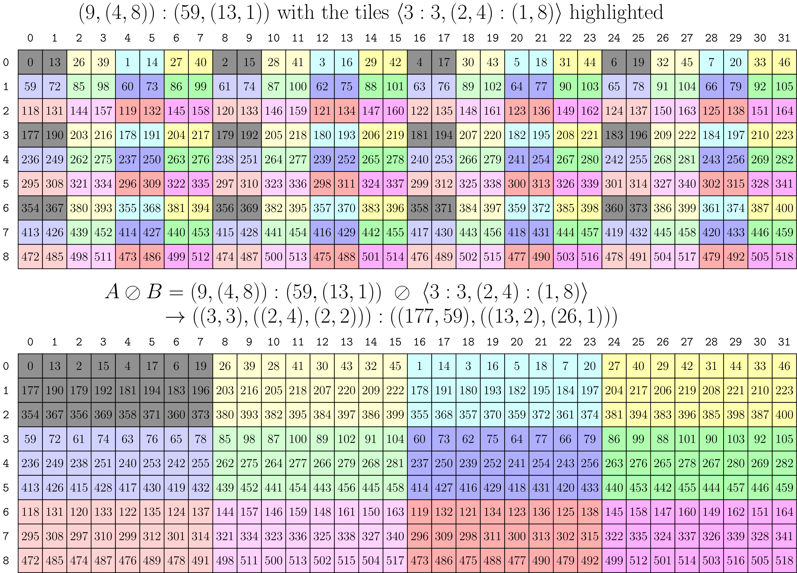

### [Logical Divide 1-D Example](https://docs.nvidia.com/cutlass/latest/media/docs/cpp/cute#logical-divide-1-d-example)

Consider tiling the 1-D layout `A = (4,2,3):(2,1,8)` with the tiler `B = 4:2`. Informally, this means that we have a 1-D vector of 24 elements in some storage order defined by `A` and we want to extract tiles of 4 elements strided by 2.

This is computed in the three steps described in the implementation above.

- Complement of `B = 4:2` under `size(A) = 24` is `B* = (2,3):(1,8)`.
- Concantenation of `(B,B*) = (4,(2,3)):(2,(1,8))`.
- Composition of `A = (4,2,3):(2,1,8)` with `(B,B*)` is then `((2,2),(2,3)):((4,1),(2,8))`.

The above figure depicts `A` as a 1-D layout with the elements pointed to by `B` highlighted in gray. The layout `B` describes our “tile” of data, and there are six of those tiles in `A` shown by each of the colors. After the divide, the first mode of the result is the tile of data and the second mode of the result iterates over each tile.
