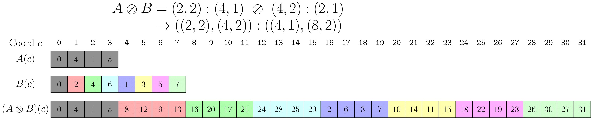

### [Logical Product 1-D Example](https://docs.nvidia.com/cutlass/latest/media/docs/cpp/cute#logical-product-1-d-example)

Consider reproducing the 1-D layout `A = (2,2):(4,1)` according to `B = 6:1`. Informally, this means that we have a 1-D layout of 4 elements defined by `A` and we want to reproduce it 6 times.

This is computed in the three steps described in the implementation above.

- Complement of `A = (2,2):(4,1)` under `6*4 = 24` is `A* = (2,3):(2,8)`.
- Composition of `A* = (2,3):(2,8)` with `B = 6:1` is then `(2,3):(2,8)`.
- Concatenation of `(A,A* o B) = ((2,2),(2,3)):((4,1),(2,8))`.

The above figure depicts `A` and `B` as a 1-D layouts. The layout `B` describes the number and order of repetitions of `A` and they are colored for clarity. After the product, the first mode of the result is the tile of data and the second mode of the result iterates over each tile.

Note that the result is identical to the result of the 1-D Logical Divide example.

Of course, we can change the number and order of the tiles in the product by changing `B`.

For example, in the above image with `B = (4,2):(2,1)`, there are 8 repeated tiles instead of 6 and the tiles are in a different order.
