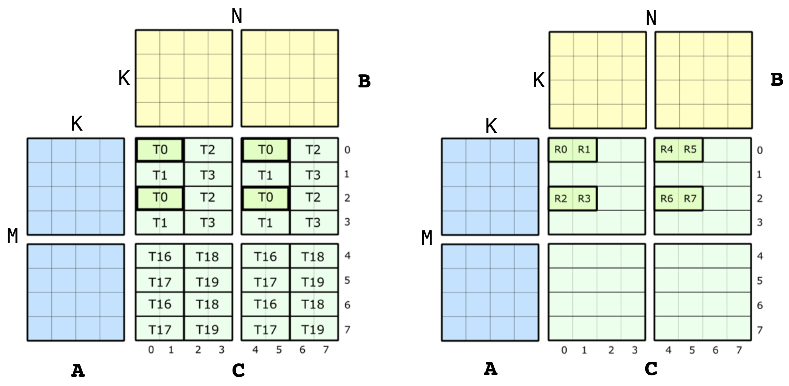

### [Accumulator Mapping](https://docs.nvidia.com/cutlass/latest/media/docs/cpp/cute#accumulator-mapping)[](https://docs.nvidia.com/cutlass/latest/media/docs/cpp/cute/#accumulator-mapping "Permalink to this headline")

Let us look at exactly how the 8 threads within a QP are mapped to the A, B and C matrices. For the C and D matrices, the above image is broken down a bit more below. On the left is shown the whole QP level view, and on the right is shown the values owned by just thread 0.



The metainformation of this single instruction level view is what we want to encode in CuTe. Specifically, the QP level view in this diagram corresponds to the four MMA traits for [SM70_F32F16F16F32](https://github.com/NVIDIA/cutlass/tree/main/include/cute/arch/mma_sm70.hpp). These structs contain the `Element` types, the `Shape_MNK`, and the `ThrID` mapping we constructed above. Now, let us take a look at the definition of `CLayout`, the thread-data layout of accumulators. The job of `CLayout` is to construct a mapping between the `(logical_thr_id, logical_val_id)` and `(m, n)` coordinate in the C matrix which can then be used to build up more complicated layouts and operations like the 16x16x4 WMMA.

We can start constructing a `CLayout` from the picture above. As with any CuTe layout, it is a pair of `Shape` and corresponding `Stride`. Let us just look at the shape for now. We know that the HMMA uses 8 threads each of which own 8 values. Therefore, the shape of our mapping must have a size of 8 along two modes. With this, we have

```cpp
  // (T8,V8) -> (m,n)
  using CLayout = Layout<Shape <_8, _8>,
                         Stride<_?, _?>;  // Stride to be filled in below
```

This is not to be confused with the logical 8x8 shape of the C matrix. This is 8-threads by 8-values. We now want to map those to (m,n) coordinates. Since CuTe layouts return indices rather than coordinates, we choose a column-major encoding of the (m,n) coordinates:

```console
(logical_thr_id, logical_val_id) -> (m, n) == m + n * M
```

With this in place, we can start thinking about how to construct the strides in `CLayout`. Let’s begin by looking at the strides between threads. Note that

- `(T0,V0)` is located at `(m,n) = (0,0) = 0`
- `(T1,V0)` is located at `(m,n) = (1,0) = 1`
- `(T2,V0)` is located at `(m,n) = (0,2) = 16`
- `(T3,V0)` is located at `(m,n) = (1,2) = 17`
- `(T4,V0)` is located at `(m,n) = (4,0) = 4`
- `(T5,V0)` is located at `(m,n) = (5,0) = 5`
- `(T6,V0)` is located at `(m,n) = (4,2) = 20`
- `(T7,V0)` is located at `(m,n) = (5,2) = 21`

where `T4`,`T5`,`T6`,`T7` are the 4th,5th,6th,7th logical thread id of the MMA corresponding to thread indices of 16,17,18,19 of the warp (recorded in the `ThrID` mapping!).

We note that the pattern can be transcribed to a layout. We can find the position of the 8 threads via

```cpp
  using CLayout = Layout<Shape <Shape <_2,  _2, _2>, _8>,
                         Stride<Stride<_1, _16, _4>, _?>;
```

With the exact same approach, we can construct the stride along the `logical value id` mode.

- `(T0,V0)` is located at `(m,n) = (0,0) = 0`
- `(T0,V1)` is located at `(m,n) = (0,1) = 8`
- `(T0,V2)` is located at `(m,n) = (2,0) = 2`
- `(T0,V3)` is located at `(m,n) = (2,1) = 10`
- `(T0,V4)` is located at `(m,n) = (0,4) = 32`
- `(T0,V5)` is located at `(m,n) = (0,5) = 40`
- `(T0,V6)` is located at `(m,n) = (2,4) = 34`
- `(T0,V7)` is located at `(m,n) = (2,5) = 42`

We note that this pattern can also be transcribed to a layout. We can find the position of the 8 values via

```cpp
  // (T8,V8) -> (m,n)
  using CLayout = Layout<Shape <Shape <_2, _2,_2>, Shape <_2,_2, _2>>,
                         Stride<Stride<_1,_16,_4>, Stride<_8,_2,_32>>>;
```

And that’s all! We can verify that each `(tid,vid)` coordinate in this layout is reliably mapped to the correct (encoded) `(m,n)` coordinate.

In the case of F16 accumulators, the layout is way less complex. Each row of accumulators `(m, :)` is held by a single thread, which makes the layout:

```cpp
  using CLayout = Layout<Shape <_8,_8>,
                         Stride<_1,_8>>;
```
