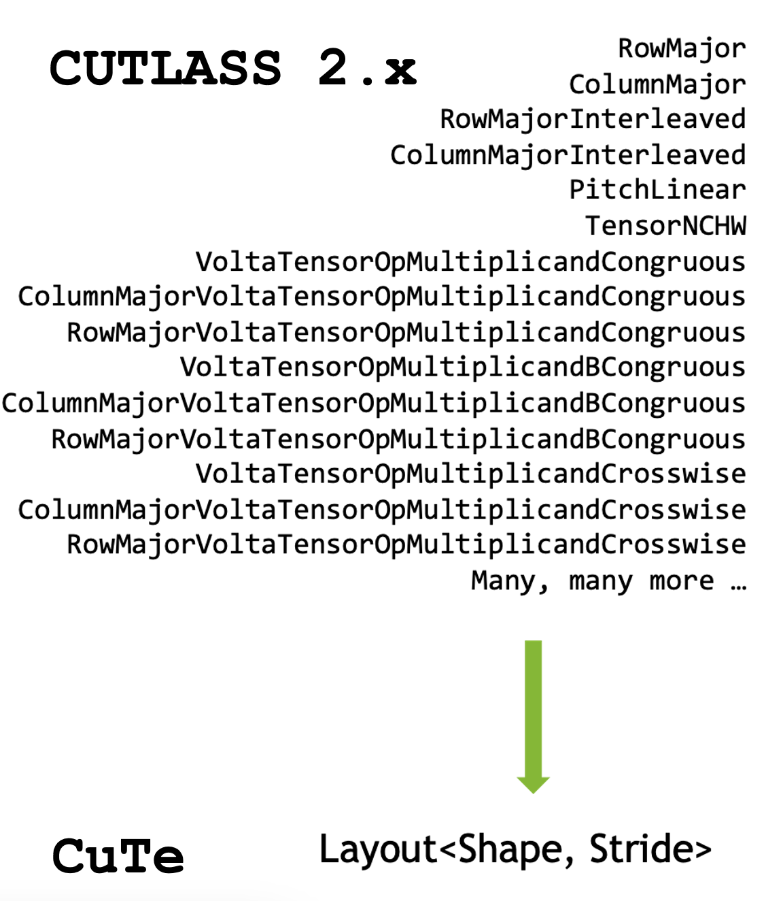

## [Adoption of CuTe Layout and Tensors](https://docs.nvidia.com/cutlass/latest/media/docs/cpp#adoption-of-cute-layout-and-tensors)

CUTLASS 3.0 introduces a new core library, CuTe, to describe and manipulate tensors of threads and data.
CuTe is a collection of C++ CUDA template abstractions for defining and operating on hierarchically multidimensional layouts of threads and data. CuTe provides `Layout` and `Tensor` objects that compactly packages the type, shape, memory space, and layout of data, while performing the complicated indexing for the user.

CUTLASS 3.0 adopts CuTe throughout the GEMM hierarchy in its templates, greatly simplifying the design,
improving code composability, and readability. More documentation specific to CuTe can be found in its [dedicated documentation directory](https://docs.nvidia.com/cutlass/latest/media/docs/cpp/cute/00_quickstart.html).

Programming massively parallel systems with various layers of logical thread and data hierarchies is not a trivial task.

- `cute::Layout`s always maintain logical consistency of their coordinates,
allowing us to check pre- and post-conditions at compile time for all static inner loops.
- Explicit thread to data mapping allows users and kernel authors to inspect and reason about operations
from a single point in the source code.
- Layouts provide a single point of performance tuning, as most optimizations can be done by careful
selection of thread and data layouts.
- Formalized algebra makes manipulation of and reasoning about thread->data mapping explicit in source code.
- Single vocabulary type (`cute::Layout`) subsumes every iterator and layout in CUTLASS 2.x CUTLASS 2.x uses many bespoke thread maps, iterators, and data layouts. Iterators are fundamentally 1-D, whereas most layouts we encounter in the GPU hierarchy are fundamentally n-D.
