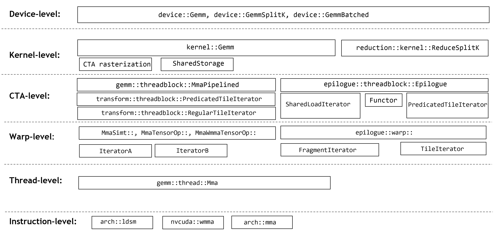

## [CUTLASS GEMM Components](https://docs.nvidia.com/cutlass/latest/media/docs/cpp#cutlass-gemm-components)

This loop nest is expressed in CUTLASS via the following components which are specialized for data type, layout, and
math instruction.

These components are described in the following sections.
