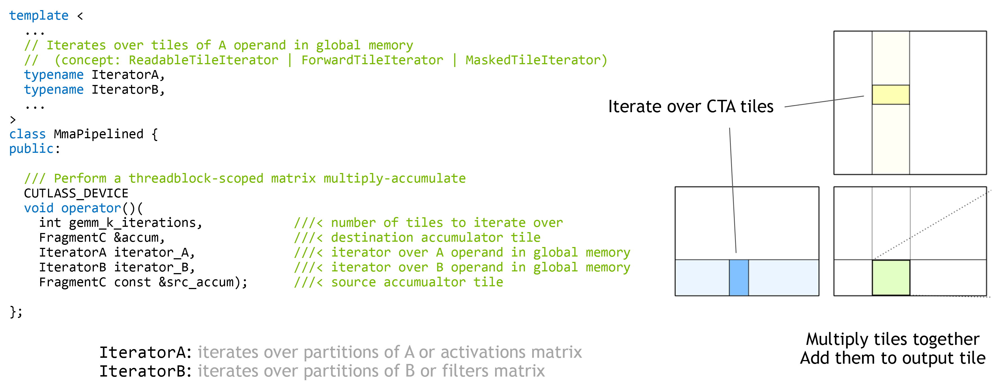

### [Threadblock-level GEMM API](https://docs.nvidia.com/cutlass/latest/media/docs/cpp#threadblock-level-gemm-api)[](https://docs.nvidia.com/cutlass/latest/media/docs/cpp/#threadblock-level-gemm-api "Permalink to this headline")

GEMMs at this scope are expected to efficiently load tiles of data from global memory into internal storage and then compute matrix
products with warp-level GEMM operators.

The threadblock-scoped matrix multiply operation is embodied by
[cutlass::gemm::threadblock::MmaPipelined](https://github.com/NVIDIA/cutlass/tree/main/include/cutlass/gemm/threadblock/mma_pipelined.h).
This is a class inspired by [std::transform_reduce()](https://en.cppreference.com/w/cpp/algorithm/transform_reduce)
which computes the accumulated matrix product of a range of tiles defined by tile iterators.



In the case of GEMM, the tile iterators are
[cutlass::transform::threadblock::PredicatedTileIterator](https://github.com/NVIDIA/cutlass/tree/main/include/cutlass/transform/threadblock/predicated_tile_iterator.h)
to traverse a sequence of tiles in global memory with appropriate predication to avoid out-of-bounds
memory accesses.

_Concept._ Threadblock-level matrix multiply accumulate operators are function objects satisfying the following concept.

```c++
struct Mma {
  /// Shape of warp-level matrix operation (concept: GemmShape)
  struct Shape;

  /// Data type of multiplicand A (concept: numeric type)
  struct ElementA;

  /// Layout of multiplicand A (concept: Layout)
  struct LayoutA;

  /// Data type of multiplicand B (concept: numeric type)
  struct ElementB;

  /// Layout of multiplicand B (concept: Layout)
  struct LayoutB;

  /// Data type of accumulator matrix C (concept: numeric type)
  struct ElementC;

  /// Layout of accumulator matrix C (concept: Layout)
  struct LayoutC;

  /// Iterator of A operand in shared memory - satisfies: ReadableRandomAccessTileIteratorConcept
  struct IteratorA;

  /// Fragment object loaded from IteratorA (concept: Array<ElementA, ..>)
  struct FragmentA;

  /// Iterator of B operand in shared memory - satisfies: ReadableRandomAccessTileIteratorConcept
  struct IteratorB;

  /// Fragment object loaded from IteratorB (concept: Array<ElementB, ..>)
  struct FragmentB;

  /// Iterator of C operand in shared memory -
  ///    satisfies: ReadableRandomAccessTileIteratorConcept | WriteableRandomAccessTileIteratorConcept
  struct IteratorC;

  /// Fragment object loaded from IteratorC (concept: Array<ElementC, ..>)
  struct FragmentC;

  /// Warp-level matrix multiply operator (concept: satisfies gemm::warp::Mma)
  struct Operator;

  //
  // Method
  //

  /// Computes a matrix product accumulated in D
  CUTLASS_DEVICE
  void operator()(
    FragmentC &D,
    IteratorA iter_A,
    IteratorB iter_B,
    FragmentC const &C);
};
```
