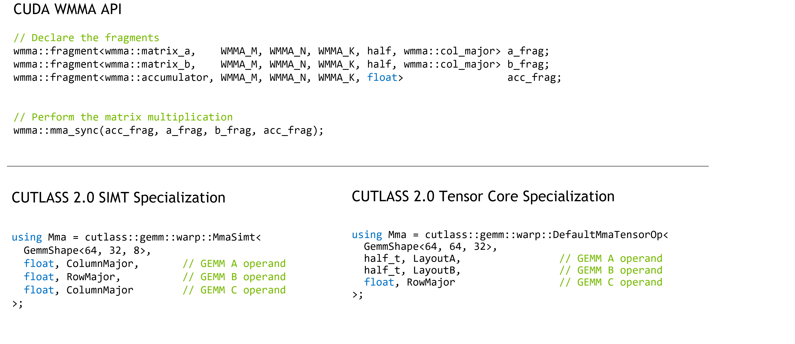
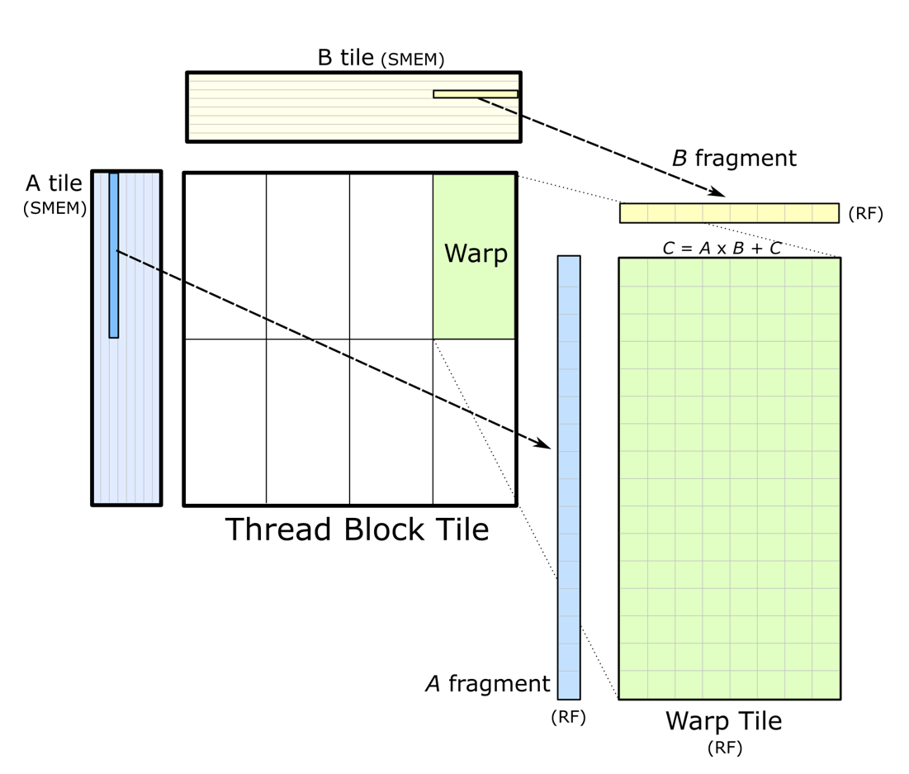

### [Warp-level Matrix Multiply API](https://docs.nvidia.com/cutlass/latest/media/docs/cpp#warp-level-matrix-multiply-api)[](https://docs.nvidia.com/cutlass/latest/media/docs/cpp/#warp-level-matrix-multiply-api "Permalink to this headline")

Warp-level GEMM operators load tiles from shared memory into registers and then compute matrix multiplies using either
Tensor Cores or CUDA Cores. The result is accumulated in a register tile. Iterators are defined for each
operand `A`, `B`, and `C`.

The warp-level GEMM API is a generalization of CUDA’s WMMA API to achieve the following objectives:

- native matrix multiply sizes of Tensor Cores
- permuted shared memory layouts to ensure conflict-free accesses
- pointer initilization outside of the mainloop
- efficient traversal

Defining a warp-level matrix multiply in CUTLASS is similar to WMMA as shown below.



The usage model is also similar. The following example computes a warp-level GEMM operation,
accumulating a series of matrix products in a register-backed array. The input to a warp-level
GEMM operation in CUTLASS _must_ be data in shared memory loaded by iterators or on
register-backed fragments.



```c++
#include "cutlass/gemm/warp/default_mma_tensor_op.h"

using LayoutA = cutlass::layout::ColumnMajorTensorOpMultiplicandCongruous<
    cutlass::sizeof_bits<Element>::value, 64>;

using LayoutB = cutlass::layout::RowMajorTensorOpMultiplicandCongruous<
    cutlass::sizeof_bits<Element>::value, 64>;

using WarpMma = typename cutlass::gemm::warp::DefaultMmaTensorOp<
    cutlass::gemm::GemmShape<64, 64, 8>,                            // Overall warp-level GEMM operation
    cutlass::gemm::GemmShape<16, 8, 8>,                             // Target instruction
    cutlass::half_t, LayoutA,                                       // operand A type and layout
    cutlass::half_t, LayoutB,                                       // operand B type and layout
    float,                                                          // accumulator type
    cutlass::layout::RowMajor>::Type;                               // accumulator layout

//
// Define a GEMM operation loading data from shared memory
//
int const kGemmK = 32;

__shared__ ElementA smem_buffer_A[WarpMma::Shape::kM * kGemmK];
__shared__ ElementB smem_buffer_B[WarpMma::Shape::kN * kGemmK];

//
// Construct iterators into SMEM tiles
//

// leading dimensions inferred from matrix problem size
int lda = WarpMma::Shape::kM;
int ldb = WarpMma::Shape::kN;

// iterators into shared memory
WarpMma::IteratorA warp_iterator_A({smem_buffer_A, lda});
WarpMma::IteratorB warp_iterator_B({smem_buffer_B, ldb});

// Fragments in registers storing the operands
FragmentA frag_A;
FragmentB frag_B;
FragmentC accum;

WarpMma mma;

accum.clear();

//
// Accumulated outer product
//

#pragma unroll 1
for (int k = 0; k < kGemmK; k += WarpMma::Shape::kK) {


  iter_A.load(frag_A);  // Load fragments from A and B matrices
  iter_B.load(frag_B);

  ++iter_A; ++iter_B;   // Advance along GEMM K to next tile in A
                        //   and B matrices

                        // Compute matrix product
  mma(accum, frag_A, frag_B, accum);
}
```

_Concept._ Warp-level Mma operations are function objects satisfying the following concept.

```c++
struct Mma {
  /// Shape of warp-level matrix operation (concept: GemmShape)
  struct Shape;

  /// Data type of multiplicand A (concept: numeric type)
  struct ElementA;

  /// Layout of multiplicand A (concept: Layout)
  struct LayoutA;

  /// Data type of multiplicand B (concept: numeric type)
  struct ElementB;

  /// Layout of multiplicand B (concept: Layout)
  struct LayoutB;

  /// Data type of accumulator matrix C (concept: numeric type)
  struct ElementC;

  /// Layout of accumulator matrix C (concept: Layout)
  struct LayoutC;

  /// Iterator of A operand in shared memory - satisfies: ReadableRandomAccessTileIteratorConcept
  struct IteratorA;

  /// Fragment object loaded from IteratorA (concept: Array<ElementA, ..>)
  struct FragmentA;

  /// Iterator of B operand in shared memory - satisfies: ReadableRandomAccessTileIteratorConcept
  struct IteratorB;

  /// Fragment object loaded from IteratorB (concept: Array<ElementB, ..>)
  struct FragmentB;

  /// Iterator of C operand in shared memory -
  ///     satisfies: ReadableRandomAccessTileIteratorConcept | WriteableRandomAccessTileIteratorConcept
  struct IteratorC;

  /// Fragment object loaded from IteratorC (concept: Array<ElementC, ..>)
  struct FragmentC;

  /// Indicates class of matrix operator (arch::OpClassSimt or arch::OpClassTensorOp)
  struct OperatorClass;

  //
  // Methods
  //

  /// Computes a matrix multiply-accumulate
  CUTLASS_DEVICE
  void operator()(
    FragmentC &D,
    IteratorA A,
    IteratorB B,
    FragmentC const &C);
};
```

_Tensor Core Operators._ Warp-level matrix multiply operators targeting Tensor Cores
may be defined with the following template arguments. The `Policy` type specifies implementation-level details which may
be used to affect performance or internal implementation of the warp-level operator.

```c++
namespace cutlass {
namespace gemm {
namespace warp {

/// Structure to compute the matrix product targeting CUDA cores and SIMT math instructions.
template <
  /// Size of the Gemm problem - concept: gemm::GemmShape<>
  typename Shape_,
  /// Data type of A elements
  typename ElementA_,
  /// Layout of A matrix (concept: MatrixLayout)
  typename LayoutA_,
  /// Data type of B elements
  typename ElementB_,
  /// Layout of B matrix (concept: MatrixLayout)
  typename LayoutB_,
  /// Element type of C matrix
  typename ElementC_,
  /// Layout of C matrix (concept: MatrixLayout)
  typename LayoutC_,
  /// Shape of the warp in units of thread (concept: MmaSimtPolicy)
  typename Policy_,
  /// Used for partial specialization
  typename Enable = bool
>
class MmaTensorOp {}

} // namespace warp
} // namespace gemm
} // namespace cutlass
```

_SIMT Math Instructions._  Warp-level matrix multiply operators targeting CUDA Cores
may be defined with the following template arguments. The `Policy` type specifies implementation-level details which may
be used to affect performance or internal implementation of the warp-level operator.

```c++
/// Structure to compute the matrix product targeting CUDA cores and SIMT math instructions.
template <
  /// Size of the Gemm problem - concept: gemm::GemmShape<>
  typename Shape_,
  /// Data type of A elements
  typename ElementA_,
  /// Layout of A matrix (concept: MatrixLayout)
  typename LayoutA_,
  /// Data type of B elements
  typename ElementB_,
  /// Layout of B matrix (concept: MatrixLayout)
  typename LayoutB_,
  /// Element type of C matrix
  typename ElementC_,
  /// Layout of C matrix (concept: MatrixLayout)
  typename LayoutC_,
  /// Shape of the warp in units of thread (concept: MmaSimtPolicy)
  typename Policy_,
  /// Used for partial specialization
  typename Enable = bool
>
class MmaSimt;
```
