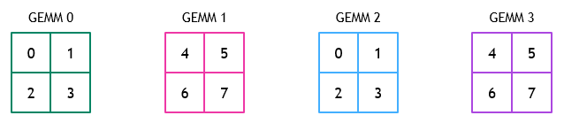
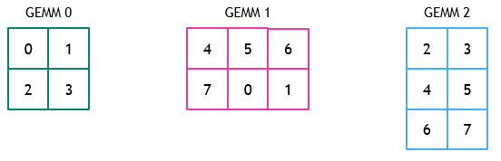

# [Grouped GEMM Scheduler](https://docs.nvidia.com/cutlass/latest/media/docs/cpp#grouped-gemm-scheduler)

The scheduler used by grouped GEMM assigns tiles in the group to threadblocks in a round-robin
fashion.

Consider, for example, the threadblock-to-tile mapping that occurs for a group of four GEMMs
each consisting of a grid of 2x2 tiles. Suppose that eight threadblocks are launched. The
figure below illustrates the threadblock ID assigned to each tile in each GEMM in the group.

A similar mapping for problems that do not have the same number of tiles
is shown below:

