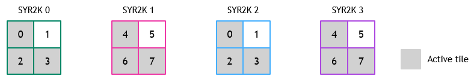

## [Inefficiency of grouped GEMM scheduler for grouped Rank2K problems](https://docs.nvidia.com/cutlass/latest/media/docs/cpp#inefficiency-of-grouped-gemm-scheduler-for-grouped-rank2k-problems)

The grouped GEMM scheduler assumes that every tile in every GEMM in the group will
ultimately affect the output of the problem. This is not the case for Rank2K
problems, for which matrix C is either upper or lower triangular. Using the default
grouped GEMM scheduler for such problems will thus lead to threadblocks frequently
being assigned to tiles that exit early (e.g., due to being assigned to a tile in the
upper-triangular portion of a lower-triangular problem). This further leads to load
imbalance among threadblocks, as the grouped GEMM scheduler assigns nearly the same
number of tiles to all threadblocks, regardless of how many tiles are truly active.

Consider an example of a group of four SYR2K problems, each with matrix C consisting
of a grid of 2x2 tiles.  Matrix C in each problem is lower triangular, indicated by
shaded tiles. Consider that eight threadblocks are launched to compute the grouped
problem. The default grouped GEMM scheduler will assign threadblocks to tiles in the following order:

In this case, threadblocks 1 and 5 are continuously assigned to inactive tiles. In
scenarios in which problems within the group have varying size, we have observed
this to still lead to significant load imbalance.
