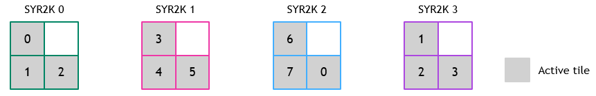
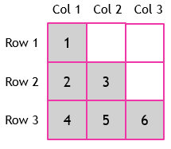

## [Specializing the scheduler for triangular problems](https://docs.nvidia.com/cutlass/latest/media/docs/cpp#specializing-the-scheduler-for-triangular-problems)

We seek to design a scheduler that more efficiently maps threadblocks to active tiles
for kernels that use triangular output matrices. The scheduler should ideally assign
threadblocks only to those tiles within lower-triangular portion of a
lower-triangular problem (and vice-versa for upper-triangular problems).

Using the example above, the resulting assignment of threadblocks to tiles from
such a scheduler might be:

Achieving this schedule requires mapping from a threadblock ID to tile coordinates
`(i, j)`.

We will illustrate this by mapping a lower-triangular matrix with a 3x3 grid. We
first calculate row and column indices assuming one-indexed rows, tiles, and
threadblock IDs, and then subtract one to convert to zero-indexed versions. Our
description borrows heavily from the mapping described [here](https://stackoverflow.com/a/40954159).

