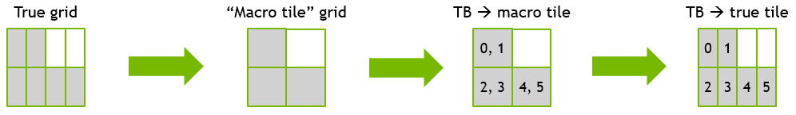

### [Accounting for non-square grids](https://docs.nvidia.com/cutlass/latest/media/docs/cpp#accounting-for-non-square-grids)[](https://docs.nvidia.com/cutlass/latest/media/docs/cpp/#accounting-for-non-square-grids "Permalink to this headline")

Though the overall output problem size for Rank2K problems is guaranteed to be square, the
grids used in computing may not be square due to using non-square threadblock shapes. For
example, a threadblock shape of 64x32 operating on a problem of output size 128x128 would
result in a grid of 2x4 tiles.

This case can be handled by noting that the output resembles a square grid of 2x2 “macro tiles”
each of which contains 2 “true tiles.” We can thus first map a threadblock ID to its “macro tile”
using the equations above, and then map it to the “true tile” within its “macro tile.” In the example
of a 2x4 grid, this mapping would look as follows:



A zero-indexed threadblock ID `t` is mapped to its “macro tile ID” `t_macro` as:

```console
t_macro = t // r
```

Where `r` is the ratio of the maximum dimension of the grid to the
minimum dimension of the grid (i.e., `r = 4 / 2 = 2` in the previous example).

One uses `t_macro` and the calculations above to find the row and column in the square matrix to
obtain `i_macro` and `j_macro` (zero-indexed). The mapping from `(i_macro, j_macro) --> (i, j)`
is simply the following:

```console
if (ThreadblockShape::M > ThreadblockShape::N):
    r = ThreadblockShape::M / ThreadblockShape::N
    i = i_macro
    j = (j_macro * r) + (t % r)
elif (ThreadblockShape::M < ThreadblockShape::N):
    r = ThreadblockShape::N / ThreadblockShape::M
    i = (i_macro * r) + (t % r)
    j = j_macro
else:
    i = i_macro
    j = j_macro
```
