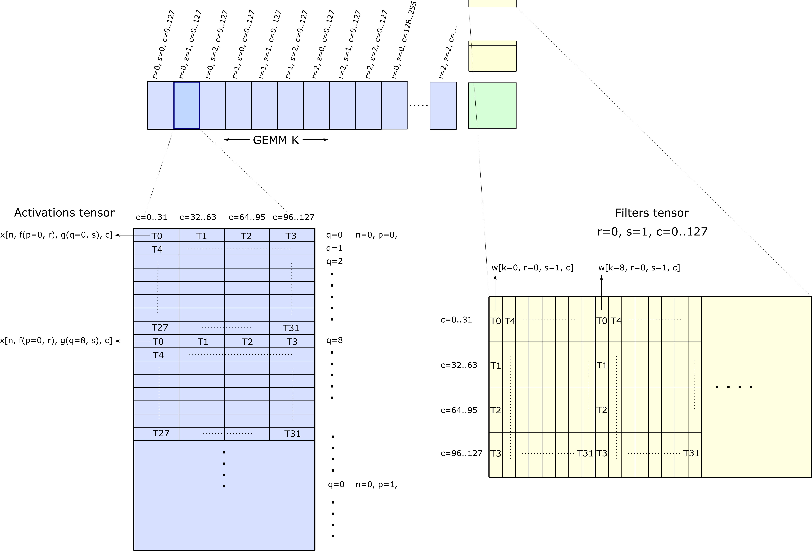

### [Loading Activations and Filters](https://docs.nvidia.com/cutlass/latest/media/docs/cpp#loading-activations-and-filters)[](https://docs.nvidia.com/cutlass/latest/media/docs/cpp/#loading-activations-and-filters "Permalink to this headline")

The Implicit GEMM Convolution algorithm partitions the GEMM _K_ dimension (of extent _CRS_) into
threadblock tiles and assigning each threadblock tile to one filter position and an interval
of channels. After iterating over all filter positions, the convolution algorithm advances to the
next interval of channels and proceeds from filter `r=0, s=0`.

The matrix product of one threadblock tile is computed per iteration of
the mainloop as described in the [CUTLASS GEMM implementation](https://docs.nvidia.com/cutlass/latest/media/docs/cpp/efficient_gemm.html). To
summarize, the threadblock tile of activations and filters are loaded from tensors in global memory
and stored to shared memory. Each thread within the threadblock loads one or more vectors and
collectively span the entire tile.

The following figure illustrates one particular iteration of the Implicit GEMM mainloop. Each
thread within the threadblock is mapped to several vectors of elements in the Activations and
Filters tensors. Each index in the GEMM _M_ dimension corresponds to a unique _(N,P,Q)_
index of the output tensor, and pointers may be computed based on this as well as
filter position _(r,s)_.



The CUTLASS component that embodies this functionality is [Conv2dFpropFilterTileAccessIteratorAnalytic](https://github.com/NVIDIA/cutlass/tree/main/include/cutlass/conv/threadblock/conv2d_fprop_activation_tile_access_iterator_analytic.h).
Its constructor computes the mapping of GEMM _M_ to _(N, P, Q)_, the `at()` method maps the linear offset into the Activations
tensor for each memory access the thread is to perform. Additionally, the method `valid()` computes the valided of the access
for each filter position and for each memory access to indicate whether the memory access will be within the bounds of the
tensor or out of bounds.

`operator++()` iterates over memory accesses performed by a thread in both contiguous and strided dimension.

```c++
// cutlass/conv/threadblock/conv2d_fprop_activation_tile_access_iterator_analytic.h

// Update iterator to thread's next contiguous, strided memory access
Conv2dFpropActivationTileAccessIteratorAnalytic &operator++() {
  ++iteration_contiguous_;
  if (iteration_contiguous_ < ThreadMap::Iterations::kContiguous) {
    return *this;
  }
  iteration_contiguous_ = 0;

  ++iteration_strided_;
  if (iteration_strided_ < ThreadMap::Iterations::kStrided) {
    return *this;
  }
  iteration_strided_ = 0;

  return *this;
}
```

After all accesses have been visited for the current threadblock tile, `advance()` updates the pointers to next tile.
Offsets added to each pointer follows the traversal of filter positions, performing one of the
following:

- advance from filter position _(r, s, c)_ to filter position _(r, s+1, c)_
- advance from filter position _(r, S-1, c)_ to filter position _(r+1, 0, c)_
- advance from filter position _(R-1, S-1, c)_ to filter position _(0, 0, c+32)_

This logic within method `advance()`’s body computes the above three updates for the activation GEMM-A tile.

```c++
// cutlass/conv/threadblock/conv2d_fprop_activation_tile_access_iterator_analytic.h

// Advance to the next access
void advance() {
  // moves to the next tile
  ++filter_s_;
  if (filter_s_ < problem_size_.S) {
    return;
  }
  filter_s_ = 0;

  ++filter_r_;
  if (filter_r_ < problem_size_.R) {
    return;
  }
  filter_r_ = 0;

  filter_c_ += Shape::kRow * problem_size_.split_k_slices;
}
```

Similar logic holds for [Conv2dFpropFilterTileAccessIteratorAnalytic](https://github.com/NVIDIA/cutlass/tree/main/include/cutlass/conv/threadblock/conv2d_fprop_filter_tile_access_iterator_analytic.h).

To reduce computational overhead in the mainloop body, the pointer offsets may be precomputed
in host code and provided to the CUDA kernel as a lookup table in its `Params` structure.
As shown in [Conv2dFpropFilterTileAccessIteratorOptimized](https://github.com/NVIDIA/cutlass/tree/main/include/cutlass/conv/threadblock/conv2d_fprop_activation_tile_access_iterator_optimized.h),
the logic to compute offsets from filter position has been extracted to the `Params` constructor.

```c++
// cutlass/conv/threadblock/conv2d_params.h
struct Conv2dFpropActivationIteratorOptimizedParams<layout::TensorNHWC> {
 ...
// next S
inc_next[0] = conv_sign * (int64_t(layout.stride()[0]) * problem_size.dilation_w) * element_size_bits / 8;

// next R
inc_next[1] = conv_sign * (
    int64_t(layout.stride()[1]) * problem_size.dilation_h
    - (problem_size.S - 1) * layout.stride()[0] * problem_size.dilation_w
  ) * element_size_bits / 8;

// next C
inc_next[2] = (
    threadblock_shape.column() * problem_size.split_k_slices
    - conv_sign * int64_t(problem_size.R - 1) * layout.stride()[1] * problem_size.dilation_h
    - conv_sign * int64_t(problem_size.S - 1) * layout.stride()[0] * problem_size.dilation_w
  ) * element_size_bits / 8;

 ...
}
```

This allows only a simple lookup from the _delta table_ performed in device code in `Conv2dFpropActivationTileAccessIteratorOptimized::advance()`.

```c++
// cutlass/conv/threadblock/conv2d_fprop_activation_tile_access_iterator_optimized.h
CUTLASS_HOST_DEVICE
void advance() {

  int next_idx = 0;

  // moves to the next tile
  ++filter_s_;
  if (filter_s_ == problem_size_.S) {
    filter_s_ = 0;
    ++filter_r_;

    if (filter_r_ < problem_size_.R) {
      next_idx = 1;
    }
    else {
      filter_r_ = 0;
      next_idx = 2;
    }
  }

  add_byte_offset_(params_.inc_next[next_idx]); // in addition to Conv2dFpropActivationTileAccessIteratorAnalytic::advance()

  if (next_idx == 2) {
    filter_c_ += params_.filter_c_delta;
  }
}
```
