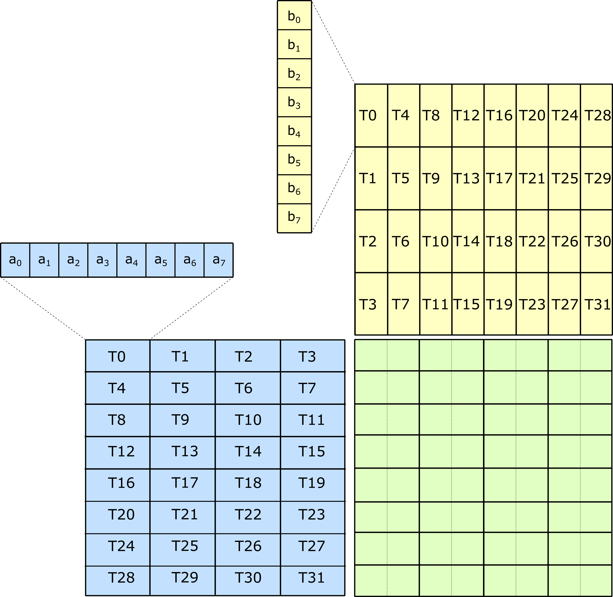
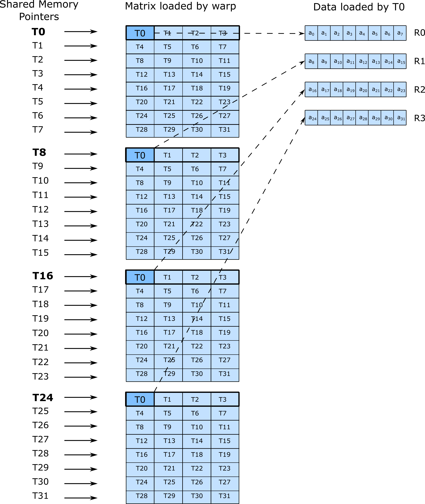
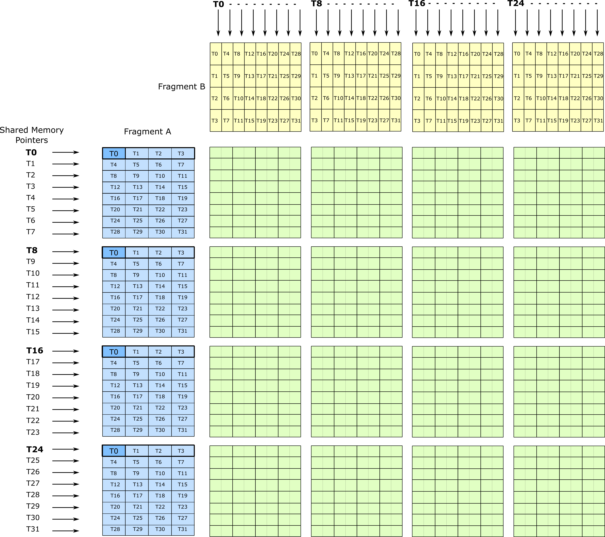

### [Making use of Tensor Cores](https://docs.nvidia.com/cutlass/latest/media/docs/cpp#making-use-of-tensor-cores)[](https://docs.nvidia.com/cutlass/latest/media/docs/cpp/#making-use-of-tensor-cores "Permalink to this headline")

Turing Tensor Cores compute matrix multiply-accumulate operations efficiently by sharing data among all
threads within a warp. The following operations are supported.

| **Shape** | **A** | **B** | **C** |
| --- | --- | --- | --- |
| 8x8x32 | int4b_t | int4b_t | int32_t |
| 8x8x16 | int8b_t | int8b_t | int32_t |
| 16x8x8 | half | half | half |
| 16x8x8 | half | half | float |

Functionally, the Turing 8x8x32 matrix multiply operation distributes the _A_, _B_, and _C_ matrix across 32
threads within a warp according to the following illustration.



This Tensor Core operation is accessible to the CUDA programmer via the PTX instruction
[`mma.sync`](https://docs.nvidia.com/cuda/parallel-thread-execution/index.html#warp-level-matrix-fragment-mma-8832).
CUTLASS wraps inline PTX with device-side intrinsics defined in [`cutlass/arch/mma_sm75.h`](https://github.com/NVIDIA/cutlass/tree/main/include/cutlass/arch/mma_sm75.h)
as in the following example.

```c++
unsigned A;   // eight packed 4-bit integer elements
unsigned B;   // eight packed 4-bit integer elements

int C[2];     // two 32-bit integer elements
int D[2];     // two 32-bit integer elements

asm volatile(
  "mma.sync.aligned.m8n8k32.row.col.s32.s4.s4.s32 {%0,%1}, {%2}, {%3}, {%4,%5};\n"
  : "=r"(D[0]), "=r"(D[1])
  : "r"(A), "r"(B), "r"(C[0]), "r"(C[1]));
```

To load data efficiently from Shared Memory into registers with the distribution among
warps matching the above, the Turing GPU architecture introduces
[`ldmatrix`](https://docs.nvidia.com/cuda/parallel-thread-execution/index.html#warp-level-matrix-instructions-ldmatrix).
`ldmatrix` is the ultimate warp-cooperative instruction, as all threads contribute addresses to up to 32 row vectors of
size 128-bits in length. These rows are fetched from Shared Memory and then distributed among groups of four threads
per row.

The arrangement of SMEM pointers and destination registers within threads is illustrated as follows. Thread 0 is highlighted
in the illustration to emphasize the mapping.



The size of the Turing Tensor Core operation computing matrix multiply-accumulate on INT4 data is 8-by-8-by-32
elements. `ldmatrix` fetches up to 32 rows (or columns) per operation. Sixteen Tensor Core operations may be issued
to implement a 32-by-32-by-32 matrix product and perfectly consume all data loaded by two `ldmatrix` instructions
as shown in the following figure. Larger tiles are possible by increasing the number of memory instructions
and issuing more Tensor Core operations, up to warp-level matrix operations of size 64-by-64-by-32. The limit is
the number of registers to hold the accumulator elements.


