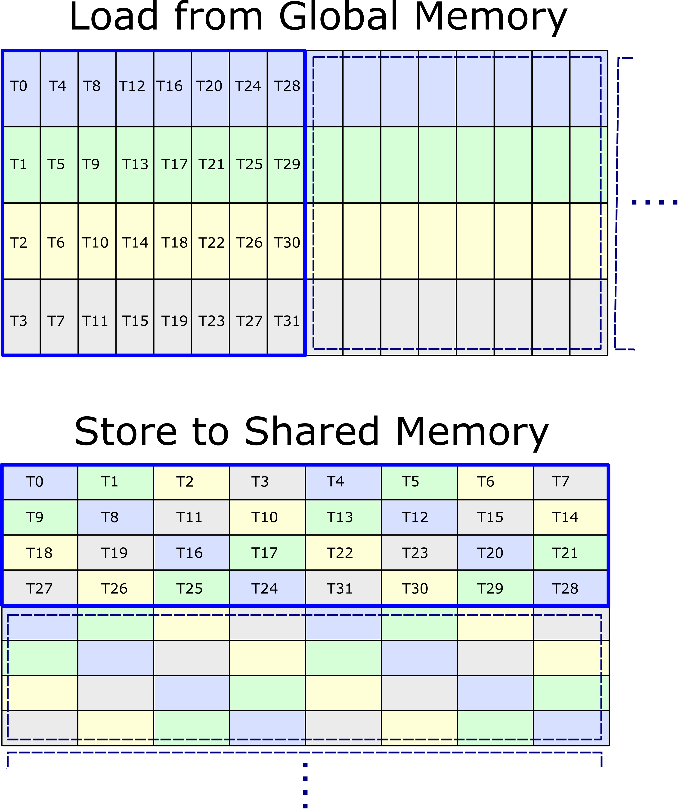
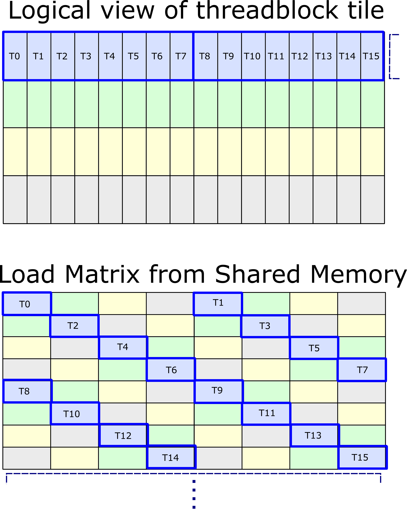
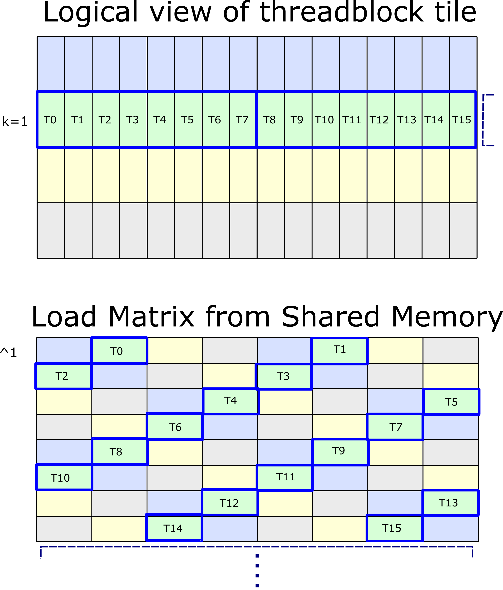

### [Shared Memory Layouts](https://docs.nvidia.com/cutlass/latest/media/docs/cpp#shared-memory-layouts)[](https://docs.nvidia.com/cutlass/latest/media/docs/cpp/#shared-memory-layouts "Permalink to this headline")

In the previous two sections, we have described how data may be loaded from activations and filters tensors
in global memory to compute convolution, and we have described a composition of `ldmatrix` and `mma.sync`
to fetch data from Shared Memory and issue Tensor Core operations.

To ensure this data movement is efficient, care must be taken to ensure bank conflicts are avoided. CUTLASS
uses a permuted Shared Memory layout to avoid bank conflicts when storing to Shared Memory and to efficiently
load from Shared Memory using `ldmatrix`. The following figure illustrates the thread mapping used for
the loading the activations and filters threadblock tiles from global memory and the permuted layout in
Shared Memory.



In the illustration, one warp-wide memory access is highlighted in blue, with individual threads
loading one 128-bit vector. The tile in global memory could correspond either to the activations
or filters and is assumed to be ‘strip-mined’ with four threads loading consecutive channels.

Shared Memory is visualized as a ‘row-major’ matrix with eight columns representing
the eight 128-bit banks.

As described in the CUTLASS GTC 2019 presentation [slides](https://developer.download.nvidia.com/video/gputechconf/gtc/2019/presentation/s9593-cutensor-high-performance-tensor-operations-in-cuda-v2.pdf),
[recording](https://developer.nvidia.com/gtc/2019/video/S9593), an access to Shared Memory will be conflict-free if
the following conditions are satisfied across each warp:

- {T0, T1, .., T7} do not access the same 128-bit bank
- {T8, T9, .., T15} do not access the same 128-bit bank
- {T16, T17, .., T23} do not access the same 128-bit bank
- {T24, T25, .., T31} do not access the same 128-bit bank

To achieve conflict-free stores, the Shared Memory layout remaps the strip-mined arrangement to transpose
the vectors and applies an XOR operation on the column index of each thread’s pointer. Specifically,

```c++
  int store_column = (lane_id % 8) ^ (lane_id / 8);
```

This transformation on the layout will be instrumental in reading slices of data from Shared Memory
to compute the warp-level matrix multiply using Tensor Cores.

The following figure shows how the first sixteen threads participating in an `ldmatrix` instruction
logically map to the c=0..31 slice of a matrix in Shared Memory. This slice is known as a “k-group”
within the code because it corresponds to the same K-index of a warp-level matrix multiply.



The lower half of the figure shows the physical arrangement in Shared Memory, with threads offset by row and column
according to the XOR function. By inspection, we can observe there are no bank conflicts, as _T0 … T7_ each access unique
banks, as do _T8 … T15_. and beyond.

To advance to the next “k-group” within Shared Memory, pointers are updated using an XOR operation according to
the following sequence:

- **^1** advances from _k=0_ to _k=1_
- **^3** advances from _k=1_ to _k=2_
- **^1** advances from _k=2_ to _k=3_
- **^3** advances from _k=3_ to _k=0_

The first of these transitions is shown below.


The [CUTLASS warp-level GEMM API](https://docs.nvidia.com/cutlass/latest/media/docs/cpp/gemm_api.html#warp-level-matrix-multiply-api) defines templates for
loading slices of data from permuted Shared Memory and issuing operations to Tensor Cores.
