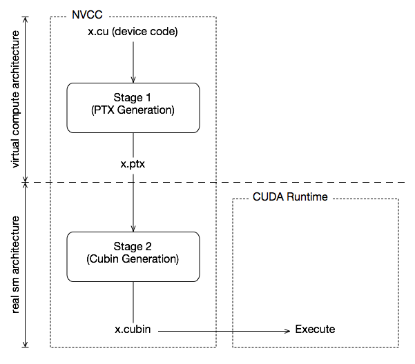
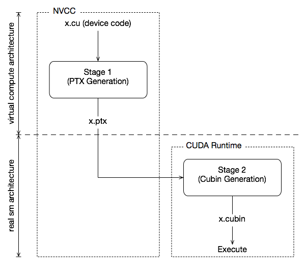

# [5. GPU Compilation](https://docs.nvidia.com/cuda/cuda-compiler-driver-nvcc#gpu-compilation)[](https://docs.nvidia.com/cuda/cuda-compiler-driver-nvcc/#gpu-compilation "Permalink to this headline")

This chapter describes the GPU compilation model that is maintained by `nvcc`, in cooperation with the CUDA driver. It goes through some technical sections, with concrete examples at the end.

## [5.1. GPU Generations](https://docs.nvidia.com/cuda/cuda-compiler-driver-nvcc#gpu-generations)[](https://docs.nvidia.com/cuda/cuda-compiler-driver-nvcc/#gpu-generations "Permalink to this headline")

In order to allow for architectural evolution, NVIDIA GPUs are released in different generations. New generations introduce major improvements in functionality and/or chip architecture, while GPU models within the same generation show minor configuration differences that _moderately_ affect functionality, performance, or both.

All NVIDIA GPUs have a compute capability (CC) which is a two part identifier in the form `major.minor` The major version identifies the GPU generation, while the minor number identifies the version within that generation. For example, compute capability 8.6 is part of CC 8.x generation. While GPUs generations are often refered to by product names such as Hopper or Blackwell, these don’t always have a direct correspondence to major compute capability version.

Binary compatibility of GPU applications is not guaranteed across different major compute capabilities. For example, a CUDA application that has been compiled for a CC 9.0 GPU will not run on a CC 10.0 GPU (and vice versa). This is because the instruction set and instruction encodings are different between different major compute capabilities.

Binary compatibility within a major compute capability can be guaranteed under certain conditions. This is the case when two GPU versions do not show functional differences (for instance when one version is a scaled down version of the other), or when one version is functionally included in the other. An example of the latter is that code compiled for the target `sm_80` will run on all other CC 8.x GPUs, such as `sm_86` or `sm_89`.

## [5.2. GPU Feature List](https://docs.nvidia.com/cuda/cuda-compiler-driver-nvcc#gpu-feature-list)[](https://docs.nvidia.com/cuda/cuda-compiler-driver-nvcc/#gpu-feature-list "Permalink to this headline")

The following table lists the names of the current GPU architectures, annotated with the functional capabilities that they provide. There are other differences, such as amounts of register and processor clusters, that only affect execution performance.

In NVCC, GPUs are named `sm_xy`, where `x` denotes the major compute capability, and `y` the minor compute capability. Additionally, to facilitate comparing GPU capabilities, CUDA attempts to choose its GPU names such that if `x1y1` <= `x2y2` then all non-ISA related capabilities of `sm_x1y1` are included in `sm_x2y2`.

| `sm_75` | Turing support |
| --- | --- |
| `sm_80`, `sm_86` and `sm_87`, `sm_88` | NVIDIA Ampere GPU architecture support |
| `sm_89` | Ada support |
| `sm_90`, `sm_90a` | Hopper support |
| `sm_100`, `sm_100f`, `sm_100a`, `sm_103`, `sm_103f`, `sm_103a`, `sm_110`, `sm_110f`, `sm_110a`, `sm_120`, `sm_120f`, `sm_120a`, `sm_121`, `sm_121f`, `sm_121a` | Blackwell support |

## [5.3. Application Compatibility](https://docs.nvidia.com/cuda/cuda-compiler-driver-nvcc#application-compatibility)[](https://docs.nvidia.com/cuda/cuda-compiler-driver-nvcc/#application-compatibility "Permalink to this headline")

Binary code compatibility over CPU generations, together with a published instruction set architecture is the usual mechanism for ensuring that distributed applications _out there in the field_ will continue to run on newer versions of the CPU when these become mainstream.

This situation is different for GPUs, because NVIDIA cannot guarantee binary compatibility without sacrificing regular opportunities for GPU improvements. Rather, as is already conventional in the graphics programming domain, `nvcc` relies on a two stage compilation model for ensuring application compatibility with future GPU generations.

## [5.4. Virtual Architectures](https://docs.nvidia.com/cuda/cuda-compiler-driver-nvcc#virtual-architectures)[](https://docs.nvidia.com/cuda/cuda-compiler-driver-nvcc/#virtual-architectures "Permalink to this headline")

GPU compilation is performed via an intermediate representation, PTX, which can be considered as assembly for a virtual GPU architecture. Contrary to an actual graphics processor, such a virtual GPU is defined entirely by the set of capabilities, or features, that it provides to the application. In particular, a virtual GPU architecture provides a (largely) generic instruction set, and binary instruction encoding is a non-issue because PTX programs are always represented in text format.

Hence, a `nvcc` compilation command always uses two architectures: a _virtual_ intermediate architecture, plus a _real_ GPU architecture to specify the intended processor to execute on. For such an `nvcc` command to be valid, the _real_ architecture must be an implementation of the _virtual_ architecture. This is further explained below.

The chosen virtual architecture is more of a statement on the GPU capabilities that the application requires: using a _smaller_ virtual architecture still allows a _wider_ range of actual architectures for the second `nvcc` stage. Conversely, specifying a virtual architecture that provides features unused by the application unnecessarily restricts the set of possible GPUs that can be specified in the second `nvcc` stage.

From this it follows that the virtual architecture should always be chosen as _low_ as possible, thereby maximizing the actual GPUs to run on. The _real_ architecture should be chosen as _high_ as possible (assuming that this always generates better code), but this is only possible with knowledge of the actual GPUs on which the application is expected to run on. As we will see later in the situation of just-in-time compilation, where the driver has this exact knowledge, the runtime GPU is the one on which the program is about to be launched/executed.



Two-Staged Compilation with Virtual and Real Architectures

## [5.5. Virtual Architecture Feature List](https://docs.nvidia.com/cuda/cuda-compiler-driver-nvcc#virtual-architecture-feature-list)[](https://docs.nvidia.com/cuda/cuda-compiler-driver-nvcc/#virtual-architecture-feature-list "Permalink to this headline")

| `compute_75` | Turing support |
| --- | --- |
| `compute_80`, `compute_86` and `compute_87`, `compute_88` | NVIDIA Ampere GPU architecture support |
| `compute_89` | Ada support |
| `compute_90`, `compute_90a` | Hopper support |
| `compute_100`, `compute_100f`, `compute_100a`, `compute_103`, `compute_103f`, `compute_103a`, `compute_110`, `compute_110f`, `compute_110a`, `compute_120`, `compute_120f`, `compute_120a`, `compute_121`, `compute_121f`, `compute_121a` | Blackwell support |

The above table lists the currently defined virtual architectures. The virtual architecture naming scheme is the same as the real architecture naming scheme shown in Section [GPU Feature List](https://docs.nvidia.com/cuda/cuda-compiler-driver-nvcc/#gpu-feature-list).

## [5.6. Further Mechanisms](https://docs.nvidia.com/cuda/cuda-compiler-driver-nvcc#further-mechanisms)[](https://docs.nvidia.com/cuda/cuda-compiler-driver-nvcc/#further-mechanisms "Permalink to this headline")

Clearly, compilation staging in itself does not help towards the goal of application compatibility with future GPUs. For this we need two other mechanisms: just-in-time compilation (JIT) and fatbinaries.

### [5.6.1. Just-in-Time Compilation](https://docs.nvidia.com/cuda/cuda-compiler-driver-nvcc#just-in-time-compilation)[](https://docs.nvidia.com/cuda/cuda-compiler-driver-nvcc/#just-in-time-compilation "Permalink to this headline")

The compilation step to an actual GPU binds the code to one generation of GPUs. Within that generation, it involves a choice between GPU _coverage_ and possible performance. For example, compiling to `sm_80` allows the code to run on all NVIDIA Ampere and Ada generation GPUs, but compiling to `sm_89` would probably yield better code if Ada generation GPUs are the only targets.



Just-in-Time Compilation of Device Code

By specifying a virtual code architecture instead of a _real_ GPU, `nvcc` postpones the assembly of PTX code until application runtime, at which time the target GPU is exactly known. For instance, the command below allows generation of exactly matching GPU binary code, when the application is launched on an `sm_90` or later architecture.

```text
nvcc x.cu --gpu-architecture=compute_90 --gpu-code=compute_90
```

The disadvantage of just-in-time compilation is increased application startup delay, but this can be alleviated by letting the CUDA driver use a compilation cache (refer to “Section 3.1.1.2. Just-in-Time Compilation” of [CUDA C++ Programming Guide](https://docs.nvidia.com/cuda/cuda-programming-guide/index.html)) which is persistent over multiple runs of the applications.

### [5.6.2. Fatbinaries](https://docs.nvidia.com/cuda/cuda-compiler-driver-nvcc#fatbinaries)[](https://docs.nvidia.com/cuda/cuda-compiler-driver-nvcc/#fatbinaries "Permalink to this headline")

A different solution to overcome startup delay by JIT while still allowing execution on newer GPUs is to specify multiple code instances, as in

```text
nvcc x.cu --gpu-architecture=compute_80 --gpu-code=compute_80,sm_86,sm_89
```

This command generates exact code for two architectures, plus PTX code for use by JIT in case a next-generation GPU is encountered. `nvcc` organizes its device code in fatbinaries, which are able to hold multiple translations of the same GPU source code. At runtime, the CUDA driver will select the most appropriate translation when the device function is launched.

## [5.7. NVCC Examples](https://docs.nvidia.com/cuda/cuda-compiler-driver-nvcc#nvcc-examples)[](https://docs.nvidia.com/cuda/cuda-compiler-driver-nvcc/#nvcc-examples "Permalink to this headline")

### [5.7.1. Base Notation](https://docs.nvidia.com/cuda/cuda-compiler-driver-nvcc#base-notation)[](https://docs.nvidia.com/cuda/cuda-compiler-driver-nvcc/#base-notation "Permalink to this headline")

`nvcc` provides the options `--gpu-architecture` and `--gpu-code` for specifying the target architectures for both translation stages. Except for allowed short hands described below, the `--gpu-architecture` option takes a single value, which must be the name of a virtual compute architecture, while option `--gpu-code` takes a list of values which must all be the names of actual GPUs. `nvcc` performs a stage 2 translation for each of these GPUs, and will embed the result in the result of compilation (which usually is a host object file or executable).

**Example**

```text
nvcc x.cu --gpu-architecture=compute_80 --gpu-code=sm_80,sm_86
```

### [5.7.2. Shorthand](https://docs.nvidia.com/cuda/cuda-compiler-driver-nvcc#shorthand)[](https://docs.nvidia.com/cuda/cuda-compiler-driver-nvcc/#shorthand "Permalink to this headline")

`nvcc` allows a number of shorthands for simple cases.

#### [5.7.2.1. Shorthand 1](https://docs.nvidia.com/cuda/cuda-compiler-driver-nvcc#shorthand-1)[](https://docs.nvidia.com/cuda/cuda-compiler-driver-nvcc/#shorthand-1 "Permalink to this headline")

`--gpu-code` arguments can be virtual architectures. In this case the stage 2 translation will be omitted for such virtual architecture, and the stage 1 PTX result will be embedded instead. At application launch, and in case the driver does not find a better alternative, the stage 2 compilation will be invoked by the driver with the PTX as input.

**Example**

```text
nvcc x.cu --gpu-architecture=compute_80 --gpu-code=compute_80,sm_80,sm_86
```

#### [5.7.2.2. Shorthand 2](https://docs.nvidia.com/cuda/cuda-compiler-driver-nvcc#shorthand-2)[](https://docs.nvidia.com/cuda/cuda-compiler-driver-nvcc/#shorthand-2 "Permalink to this headline")

The `--gpu-code` option can be omitted. Only in this case, the `--gpu-architecture` value can be a non-virtual architecture. The `--gpu-code` values default to the _closest_ virtual architecture that is implemented by the GPU specified with `--gpu-architecture`, plus the `--gpu-architecture`, value itself. The _closest_ virtual architecture is used as the effective `--gpu-architecture`, value. If the `--gpu-architecture` value is a virtual architecture, it is also used as the effective `--gpu-code` value.

**Example**

```text
nvcc x.cu --gpu-architecture=sm_86
nvcc x.cu --gpu-architecture=compute_80
```

are equivalent to

```text
nvcc x.cu --gpu-architecture=compute_86 --gpu-code=sm_86,compute_86
nvcc x.cu --gpu-architecture=compute_80 --gpu-code=compute_80
```

#### [5.7.2.3. Shorthand 3](https://docs.nvidia.com/cuda/cuda-compiler-driver-nvcc#shorthand-3)[](https://docs.nvidia.com/cuda/cuda-compiler-driver-nvcc/#shorthand-3 "Permalink to this headline")

Both `--gpu-architecture` and `--gpu-code` options can be omitted.

**Example**

```text
nvcc x.cu
```

is equivalent to

```text
nvcc x.cu --gpu-architecture=compute_75 --gpu-code=sm_75,compute_75
```

### [5.7.3. GPU Code Generation in CUDA](https://docs.nvidia.com/cuda/cuda-compiler-driver-nvcc#gpu-code-generation-in-cuda)[](https://docs.nvidia.com/cuda/cuda-compiler-driver-nvcc/#gpu-code-generation-in-cuda "Permalink to this headline")

#### [5.7.3.1. List of Supported GPU Codes](https://docs.nvidia.com/cuda/cuda-compiler-driver-nvcc#list-of-supported-gpu-codes)[](https://docs.nvidia.com/cuda/cuda-compiler-driver-nvcc/#list-of-supported-gpu-codes "Permalink to this headline")

Below are the recognized GPU code values for compilation and optimization:

**Compute Capability Targets**

| `compute_75` | `compute_80` | `compute_86` | `compute_87` |
| --- | --- | --- | --- |
| `compute_88` | `compute_89` | `compute_90` | `compute_90a` |
| `compute_100` | `compute_100f` | `compute_100a` | `compute_103` |
| `compute_103f` | `compute_103a` | `compute_110` | `compute_110f` |
| `compute_110a` | `compute_120` | `compute_120f` | `compute_120a` |
| `compute_121` | `compute_121f` | `compute_121a` |  |

**Link-Time Optimization (LTO) Targets**

| `lto_75` | `lto_80` | `lto_86` | `lto_87` |
| --- | --- | --- | --- |
| `lto_88` | `lto_89` | `lto_90` | `lto_90a` |
| `lto_100` | `lto_100f` | `lto_100a` | `lto_103` |
| `lto_103f` | `lto_103a` | `lto_110` | `lto_110f` |
| `lto_110a` | `lto_120` | `lto_120f` | `lto_120a` |
| `lto_121` | `lto_121f` | `lto_121a` |  |

**Streaming Multiprocessor (SM) Architectures**

| `sm_75` | `sm_80` | `sm_86` | `sm_87` |
| --- | --- | --- | --- |
| `sm_88` | `sm_89` | `sm_90` | `sm_90a` |
| `sm_100` | `sm_100f` | `sm_100a` | `sm_103` |
| `sm_103f` | `sm_103a` | `sm_110` | `sm_110f` |
| `sm_110a` | `sm_120` | `sm_120f` | `sm_120a` |
| `sm_121` | `sm_121f` | `sm_121a` |  |

#### [5.7.3.2. Extended Notation](https://docs.nvidia.com/cuda/cuda-compiler-driver-nvcc#id54)[](https://docs.nvidia.com/cuda/cuda-compiler-driver-nvcc/#id54 "Permalink to this headline")

The options `--gpu-architecture` and `--gpu-code` can be used in all cases where code is to be generated for one or more GPUs using a common virtual architecture. This will cause a single invocation of `nvcc` stage 1 (that is, preprocessing and generation of virtual PTX assembly code), followed by a compilation stage 2 (binary code generation) repeated for each specified GPU.

Using a common virtual architecture means that all assumed GPU features are fixed for the entire `nvcc` compilation. For instance, the following `nvcc` command assumes only the features available in compute capability 8.0 for both `sm_80` code and the `sm_86` code:

```text
nvcc x.cu --gpu-architecture=compute_80 --gpu-code=compute_80,sm_80,sm_86
```

Sometimes it is necessary to perform different GPU code generation steps, partitioned over different architectures. This is possible using `nvcc` option `--generate-code`, which then must be used instead of a `--gpu-architecture` and `--gpu-code` combination.

#### [5.7.3.3. Using Code Generation Options](https://docs.nvidia.com/cuda/cuda-compiler-driver-nvcc#using-code-generation-options)[](https://docs.nvidia.com/cuda/cuda-compiler-driver-nvcc/#using-code-generation-options "Permalink to this headline")

Unlike option `--gpu-architecture`, option `--generate-code` may be repeated on the `nvcc` command line. It takes sub-options `arch` and `code`, which must not be confused with their main option equivalents, but behave similarly. If repeated architecture compilation is used, then the device code must use conditional compilation based on the value of the architecture identification macro `__CUDA_ARCH__`, which is described in the next section.

For example, the following assumes only the features available in compute capability 8.0 for the `sm_80` and `sm_86` code, but all features available in compute capability 9.0 support on `sm_90`:

```text
nvcc x.cu \
    --generate-code arch=compute_80,code=sm_80 \
    --generate-code arch=compute_80,code=sm_86 \
    --generate-code arch=compute_90,code=sm_90
```

Or, leaving actual GPU code generation to the JIT compiler in the CUDA driver:

```text
nvcc x.cu \
    --generate-code arch=compute_80,code=compute_80 \
    --generate-code arch=compute_90,code=compute_90
```

The code sub-options can be combined with a slightly more complex syntax:

```text
nvcc x.cu \
    --generate-code arch=compute_80,code=[sm_80,sm_86] \
    --generate-code arch=compute_90,code=sm_90
```

### [5.7.4. Virtual Architecture Macros](https://docs.nvidia.com/cuda/cuda-compiler-driver-nvcc#virtual-architecture-macros)[](https://docs.nvidia.com/cuda/cuda-compiler-driver-nvcc/#virtual-architecture-macros "Permalink to this headline")

The architecture identification macro `__CUDA_ARCH__` is assigned a three-digit value string `xy0` (ending in a literal `0`) for each stage 1 `nvcc` compilation that compiles for `compute_xy`.

This macro can be used in the implementation of GPU functions for determining the virtual architecture for which it is currently being compiled. The host code (the non-GPU code) must _not_ depend on it.

The architecture list macro `__CUDA_ARCH_LIST__` is a list of comma-separated `__CUDA_ARCH__` values for each of the virtual architectures specified in the compiler invocation. The list is sorted in numerically ascending order.

The macro `__CUDA_ARCH_LIST__` is defined when compiling C, C++ and CUDA source files.

For example, the following nvcc compilation command line will define `__CUDA_ARCH_LIST__` as `800,860,900` :

```text
nvcc x.cu \
--generate-code arch=compute_90,code=sm_90 \
--generate-code arch=compute_80,code=sm_80 \
--generate-code arch=compute_86,code=sm_86 \
--generate-code arch=compute_86,code=sm_89
```
