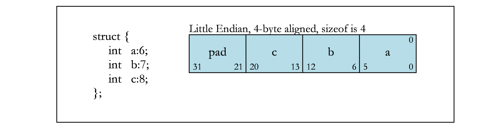
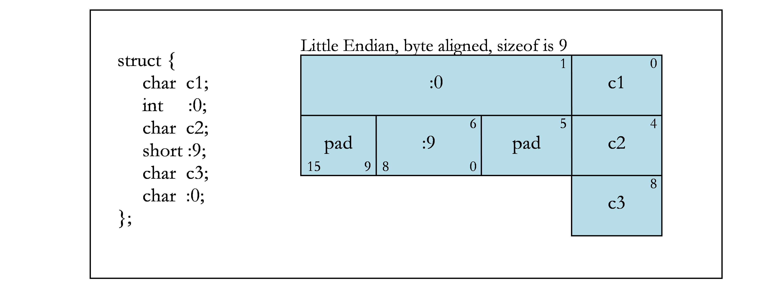

# [2. Data Representation](https://docs.nvidia.com/cuda/ptx-writers-guide-to-interoperability#data-representation)

## [2.1. Fundamental Types](https://docs.nvidia.com/cuda/ptx-writers-guide-to-interoperability#fundamental-types)

The below table shows the native scalar PTX types that are supported. Any PTX producer must use these sizes and alignments in order for its PTX to be compatible with PTX generated by other producers. PTX also supports native vector types, which are discussed in [Aggregates and Unions](https://docs.nvidia.com/cuda/ptx-writers-guide-to-interoperability/index.html#aggregates-unions).

The sizes of types are defined by the host. For example, pointer size and long int size are dictated by the hosts ABI. PTX has an .address_size directive that specifies the address size used throughout the PTX code. The size of pointers is 32 bits on a 32-bit host or 64 bits on a 64-bit host. However, addresses of the local and shared memory spaces are always 32 bits in size.

During separate compilation we store info about the host platform in each object file. The linker will fail to link object files generated for incompatible host platforms.

| PTX Type | Size (bytes) | Align (bytes) | Hardware Representation |
| --- | --- | --- | --- |
| .b8 | 1 | 1 | untyped byte |
| .b16 | 2 | 2 | untyped halfword |
| .b32 | 4 | 4 | untyped word |
| .b64 | 8 | 8 | untyped doubleword |
| .s8 | 1 | 1 | signed integral byte |
| .s16 | 2 | 2 | signed integral halfword |
| .s32 | 4 | 4 | signed integral word |
| .s64 | 8 | 8 | signed integral doubleword |
| .u8 | 1 | 1 | unsigned integral byte |
| .u16 | 2 | 2 | unsigned integral halfword |
| .u32 | 4 | 4 | unsigned integral word |
| .u64 | 8 | 8 | unsigned integral doubleword |
| .f16 | 2 | 2 | IEEE half precision |
| .f32 | 4 | 4 | IEEE single precision |
| .f64 | 8 | 8 | IEEE double precision |

## [2.2. Aggregates and Unions](https://docs.nvidia.com/cuda/ptx-writers-guide-to-interoperability#aggregates-and-unions)

Beyond the scalar types, PTX also supports native-vector types of these scalar types, with both its vector syntax and its byte-array syntax. For scalar types with a size no greater than four bytes, vector types with 1, 2, 3, and 4 elements exist; for all other types, only 1 and 2 element vector types exist.

All aggregates and unions can be supported in PTX with its byte-array syntax.

The following are the size-and-alignment rules for all aggregates and unions.

- For a non-native-vector type, an entire aggregate or union is aligned on the same boundary as its most strictly aligned member. This rule is not followed if the alignments are defined by the input language. For example, in OpenCL built-in vector data types have their alignment set to the size of the built-in data type in bytes.
- For a native vector type – discussed at the start of this section – the alignment is defined as follows. (For the definitions below, the native vector has n elements and has an element type t.)
  - For a vector with an odd number of elements, its alignment is the same as its member: alignof(t).
  - For a vector with an even number of elements, its alignment is set to number of elements times the alignment of its member: n*alignof(t).
- Each member is assigned to the lowest available offset with the appropriate alignment. This may require internal padding, depending on the previous member.
- The size of an aggregate or union, if necessary, is increased to make it a multiple of the alignment of the aggregate or union. This may require tail padding, depending on the last member.

## [2.3. Bit Fields](https://docs.nvidia.com/cuda/ptx-writers-guide-to-interoperability#bit-fields)

C structure and union definitions may have bit fields that define integral objects with a specified number of bits.

| Bit Field Type | Width w | Range |
| --- | --- | --- |
| signed char | 1 to 8 | -2w-1 to 2w-1 - 1 |
| unsigned char | 1 to 8 | 0 to 2w - 1 |
| signed short | 1 to 16 | -2w-1 to 2w-1 - 1 |
| unsigned short | 1 to 16 | 0 to 2w - 1 |
| signed int | 1 to 32 | -2w-1 to 2w-1 - 1 |
| unsigned int | 1 to 32 | 0 to 2w - 1 |
| signed long long | 1 to 64 | -2w-1 to 2w-1 - 1 |
| unsigned long long | 1 to 64 | 0 to 2w - 1 |

Current GPUs only support little-endian memory, so the below assumes little-endian layout.

The following are rules that apply to bit fields.

- Plain bit fields (neither signed nor unsigned is specified) are treated as signed.
- When no type is provided (e.g., signed : 6 is specified), the type defaults to int.

Bit fields obey the same size and alignment rules as other structure and union members, with the following modifications.

- Bit fields are allocated in memory from right to left (least to more significant) for little endian.
- A bit field must entirely reside in a storage unit appropriate for its declared type. A bit field should never cross its unit boundary.
- Bit fields may share a storage unit with other structure and union members, including members that are not bit fields, as long as there is enough space within the storage unit.
- Unnamed bit fields do not affect the alignment of a structure or union.
- Zero-length bit fields force the alignment of the following member of a structure to the next alignment boundary corresponding to the bit-field type. An unnamed, zero-length bit field will not force the external alignment of the structure to that boundary. If an unnamed, zero-length bit field has a stricter alignment than the external alignment, there is no guarantee that the stricter alignment will be maintained when the structure or union gets allocated to memory.

The following figures contain examples of bit fields. Figure 1 shows the byte offsets (upper corners) and the bit numbers (lower corners) that are used in the examples. The remaining figures show different bit-field examples.

Bit Numbering

Bit-field Allocation

Boundary Alignment

Storage Unit Sharing

Union Allocation

Unnamed Bit Fields

## [2.4. Texture, Sampler, and Surface Types](https://docs.nvidia.com/cuda/ptx-writers-guide-to-interoperability#texture-sampler-and-surface-types)

Texture, sampler and surface types are used to define references to texture and surface memory. The CUDA architecture provides hardware and instructions to efficiently read data from texture or surface memory as opposed to global memory.

References to textures are bound through runtime functions to device read-only regions of memory, called a texture memory, before they can be used by a kernel. A texture reference has several attributes e.g. normalized mode, addressing mode, and texture filtering etc. A sampler reference can be used to sample a texture when read in a kernel. A surface reference is used to read or write data from and to the surface memory. It also has various attributes similar to a texture.

At the PTX level objects that access texture or surface memory are referred to as opaque objects. Textures are expressed by either a .texref or .samplerref type and surfaces are expressed by the .surfref type. The data of opaque objects can be accessed by specific instructions (TEX for .texref/.samplerref and SULD/SUST for .surfref). The attributes of opaque objects are implemented by allocating a descriptor in memory which is populated by the driver. PTX TXQ/SUQ instructions get translated into memory reads of fields of the descriptor. The internal format of the descriptor varies with each architecture and should not be relied on by the user. The data and the attributes of an opaque object may be accessed directly if the texture or surface reference is known at compile time or indirectly. If the reference is not known during compile time all information required to read data and attributes is contained in a .b64 value called the handle. The handle can be used to pass and return oqaque object references to and from functions as well as to reference external textures, samplers and surfaces.
